# Lab: Exploiting an API endpoint using documentation

> Lab Objective: find the exposed API documentation and delete carlos.

- Login using provided credentials `wiener:peter`, while letting Burp Suite Crawl the lab in order to construct a sitemap

- After Burp constructed the sitemap, you'll that there's two API related endpoints.
  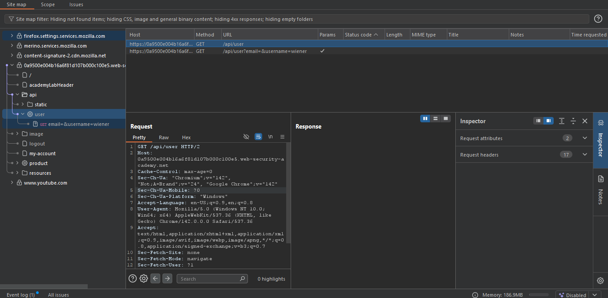
  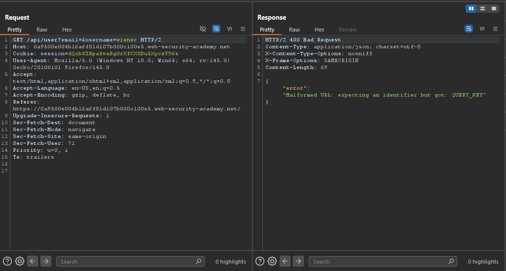
  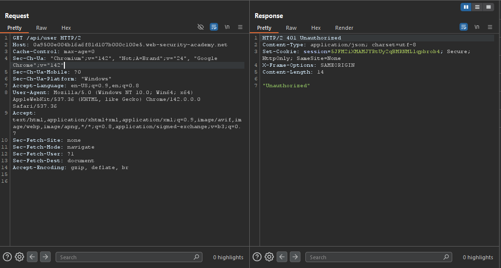

- Try changing the endpoint to `/api`.
  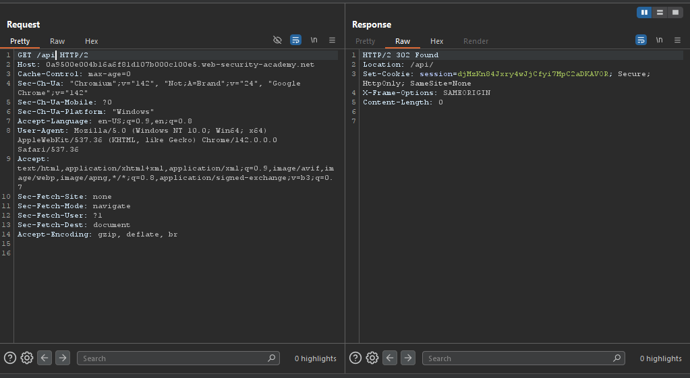

- Then follow redirection to `/api/`, you'll notice that you've access to the API documentation.
  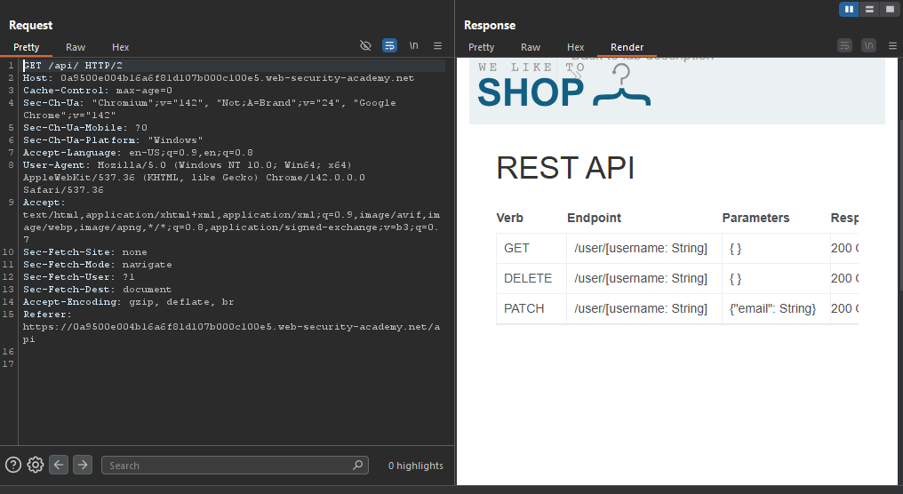

- When observing User Documentation endpoint `/api/doc/User` from API Documentation, you'll notice that the User object has two parameters: Username & Email.
  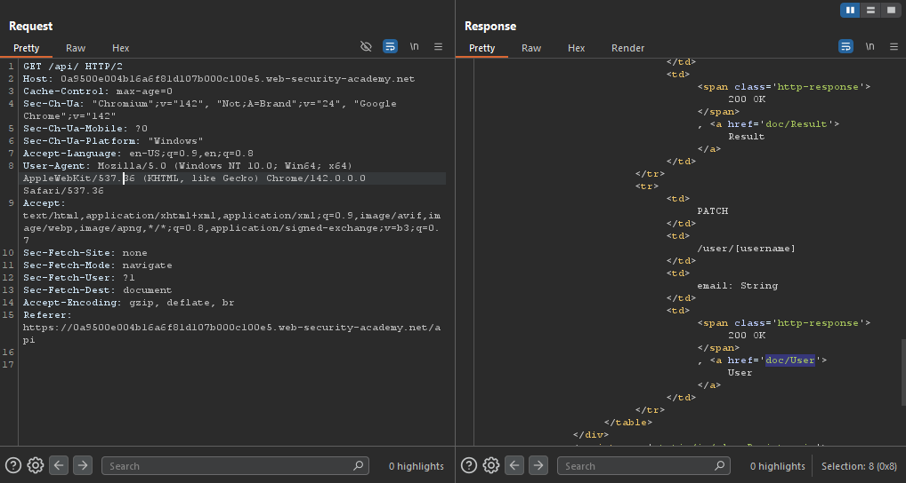
  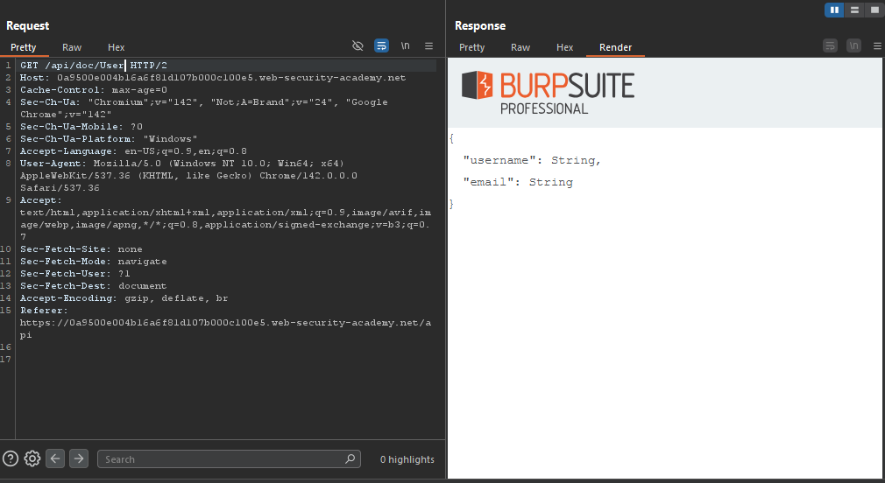

- You'll notice that when trying to GET the user object of Wiener (which is my account), I;m not authorized to do so.
  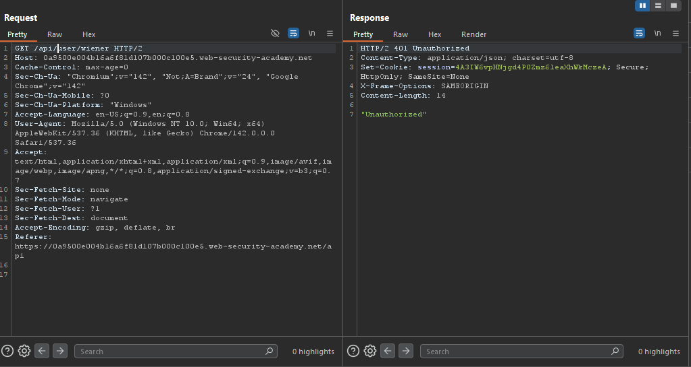

- Change your email.
  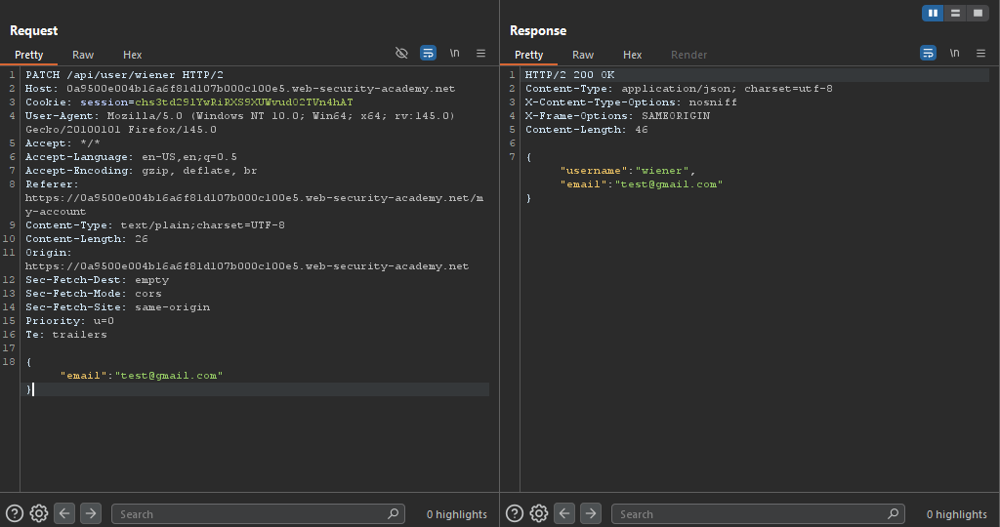

- If you changed the HTTP request verb to DELETE, and removed the request body, you'll notice that you're able to delete users (you've deleted your account).
  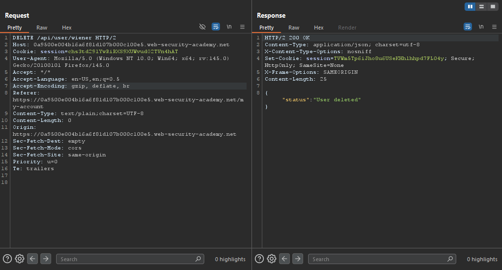

- Therefore, restart the lab and repeat the same steps, but don't delete your account and replace your username with `carlos`, you'll notice that the user carlos is deleted.
  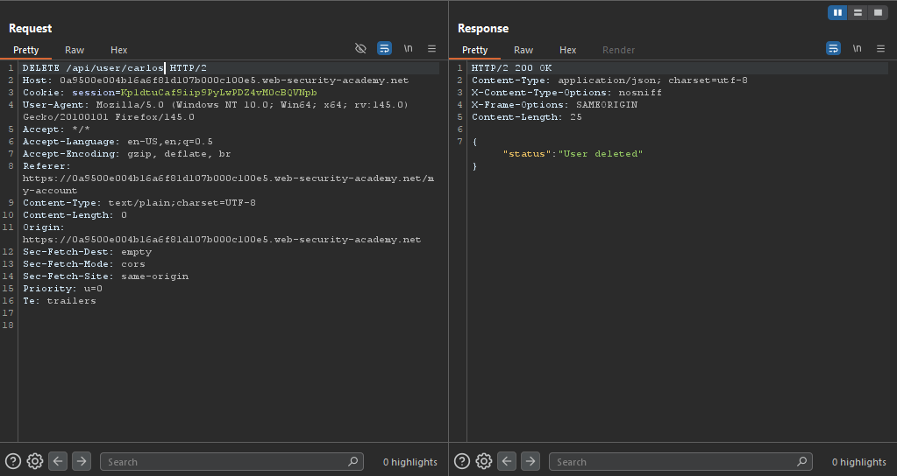

- The lab is solved.
  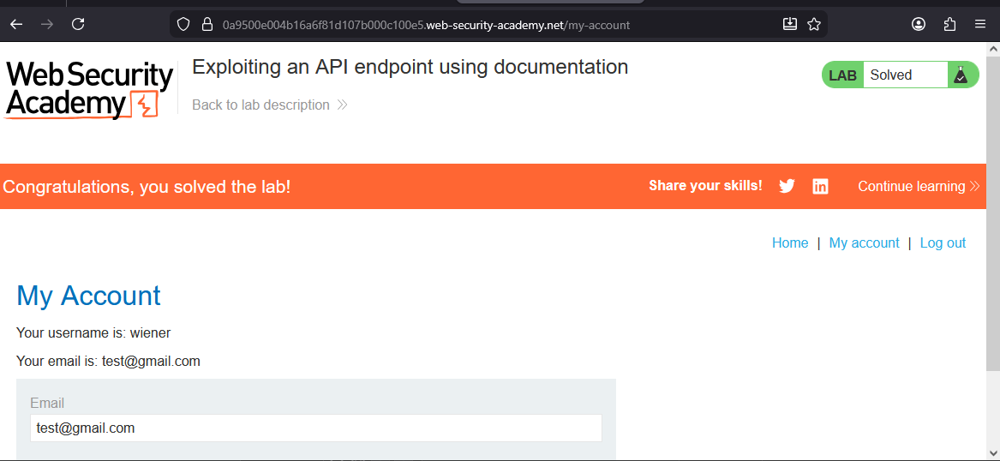

---
