# Lab: Exploiting server-side parameter pollution in a query string

> lab objective: log in as the administrator and delete carlos.

- Capture the forget password request, you'll notice that `wiener` is not a valid username.
  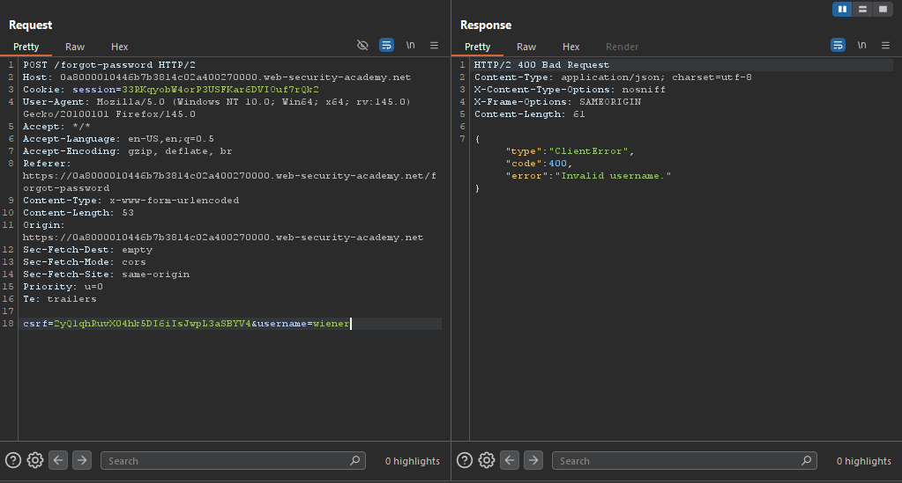

- But `administrator` is a valid username, and something is sent via administrator's email in order to complete the forget password process.
  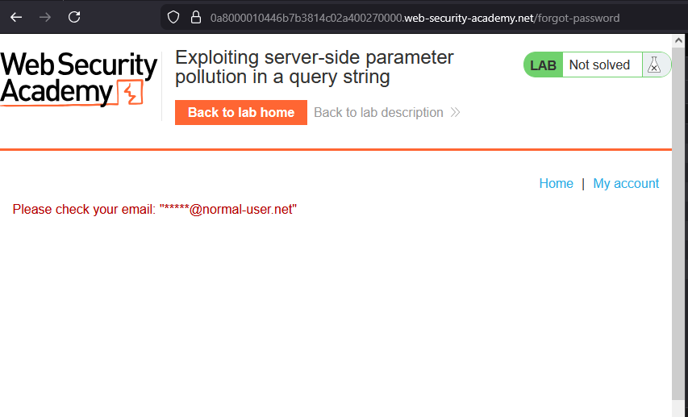
  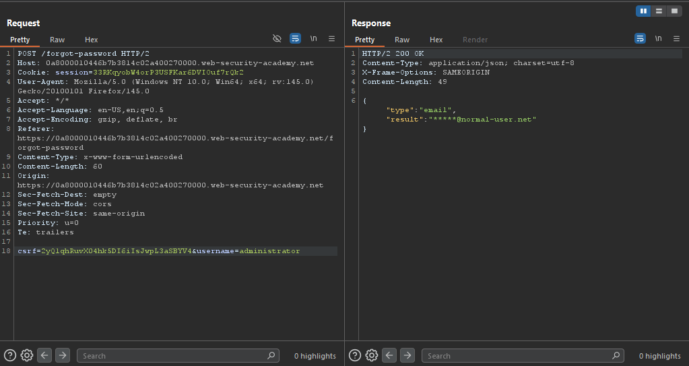

- If you repeated this request while monitoring requests made through network tab, you'll notice a request made to `forgotPassword.js`.

- While investigating this JS file, you'll notice that there's a potential parameter for `/forgot-password` endpoint which is `reset-token`.
  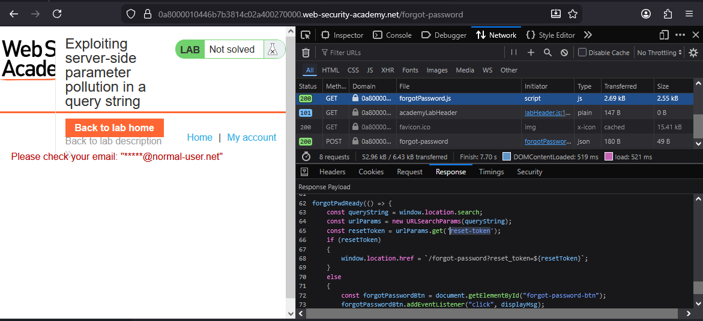

- Send a GET request to `/forgot-password` while specifying a test reset token.
  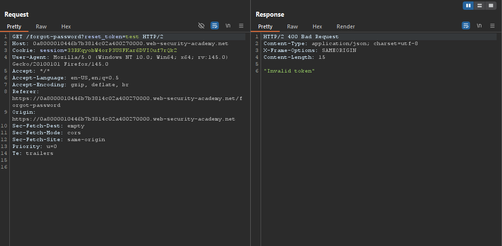

- Therefore, I can conclude that the reset token is used to reset the password.

- Back to forget password request again, If I tried to add an additional parameter, you'll receive the response normally.
  

- But if you url-encoded the `&` sign, You'll receive a `Parameter is not supported.` response.
  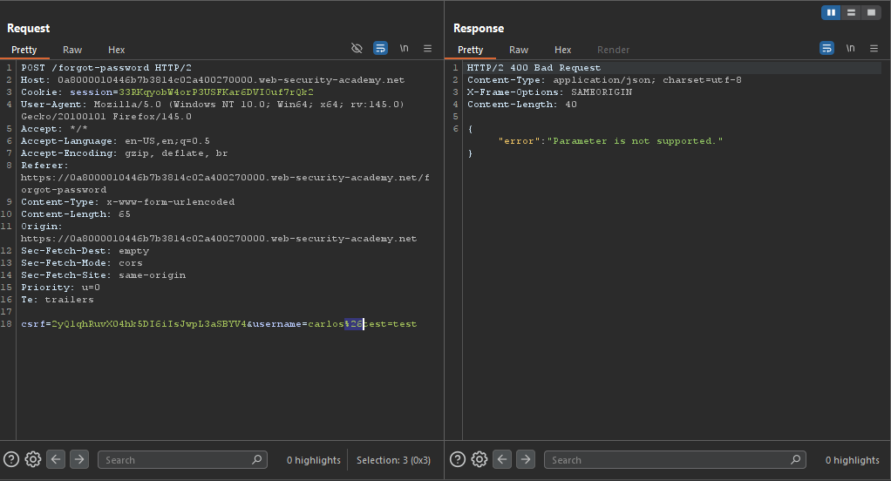

- If you changed the `&` to `#` then url-encoded it, you'll receive a `Field not specified.` indicating the there's a `field` parameter that can be specified in the forget password POST request.
  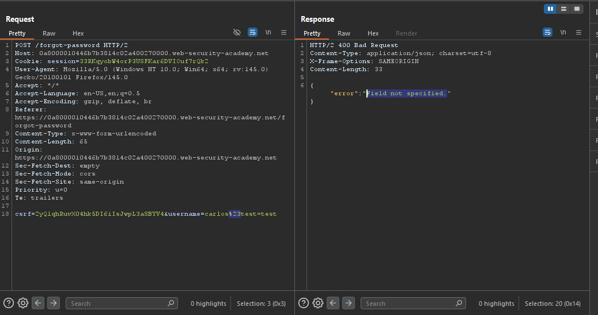

- If you added the field parameter after the `#` sign you'll receive an error.
  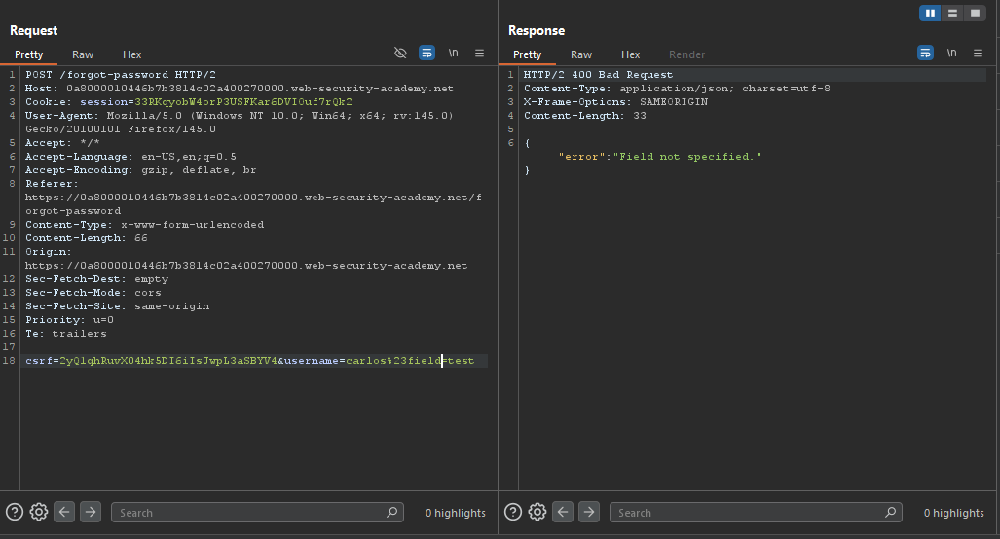

- But if you place it before the has sign, you'll notice that it's accepted, but you concluded that the field parameter controls what is returned in the response body.
  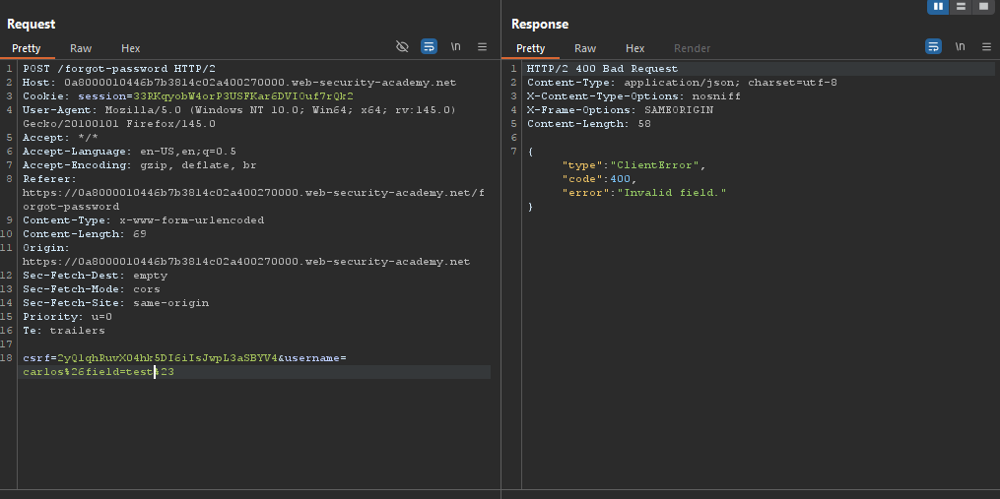

- If you changed the field parameter to email, the email value is returned in the response.
  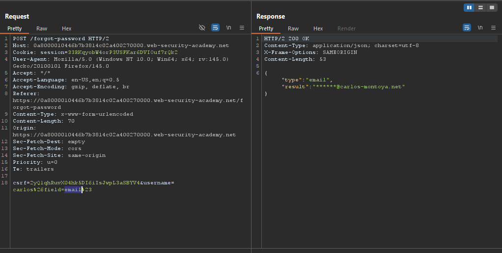

- The same happens if you stated the `username` as the value for `field` parameter.
  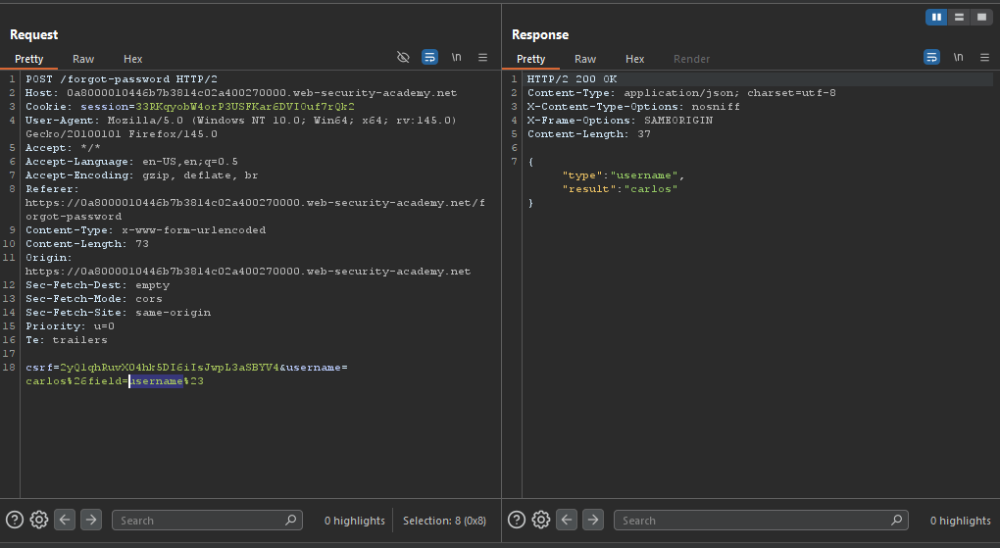

- Same for `reset_token` specified in the `forgotPassword.js` file.
  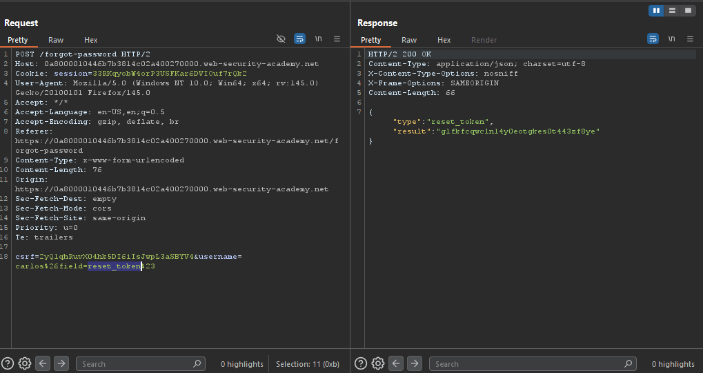

- But since that I want to reset the administrator's password, I'll change the username to `administrator`, and retrieve his `reset_token`.
  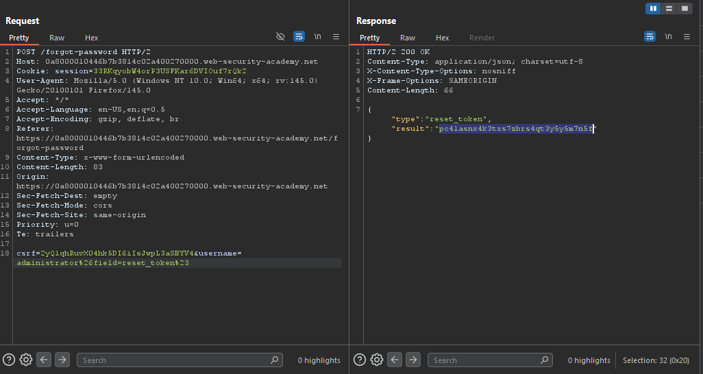

- Place the retrieved reset token as the parameter for `/forgot-password` endpoint, and you're prompted to enter the new password.
  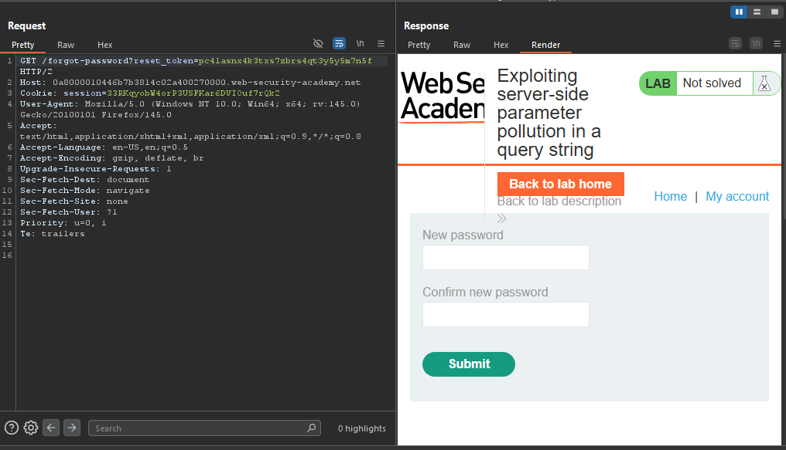

- The request was accepted.
  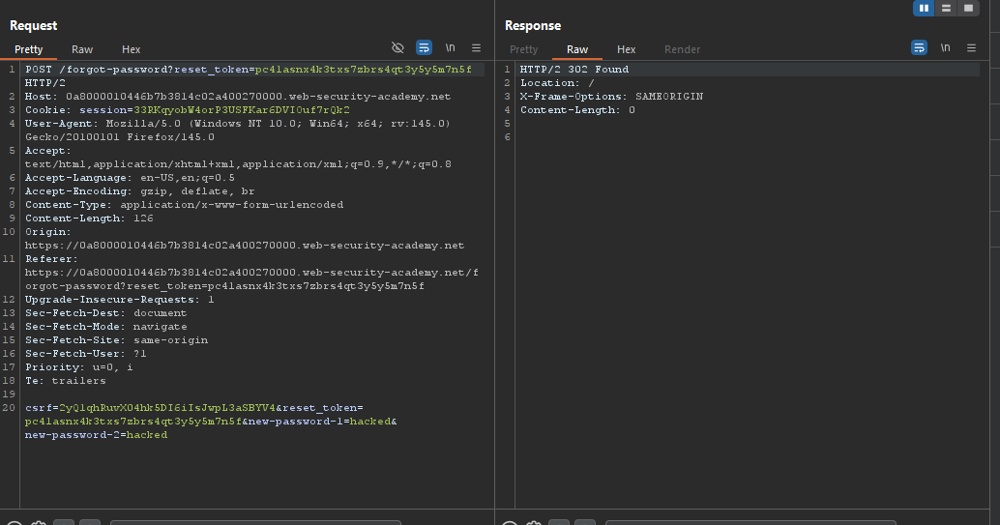

- If you logged in as administrator using those credentials `administrator:hacked`, you'll notice that you've logged in as administrator successfully.
  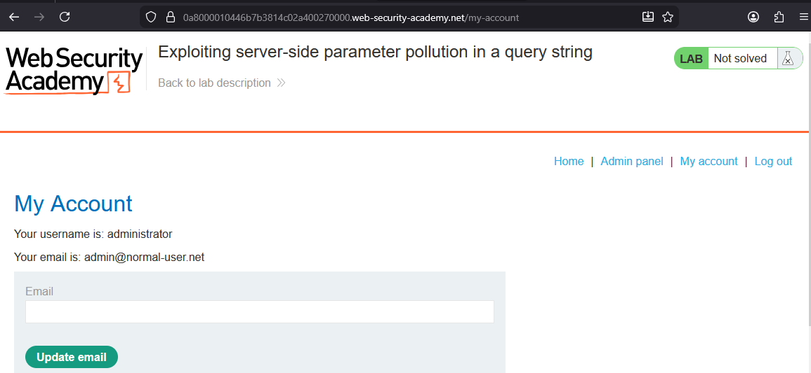

- Access the admin panel.
  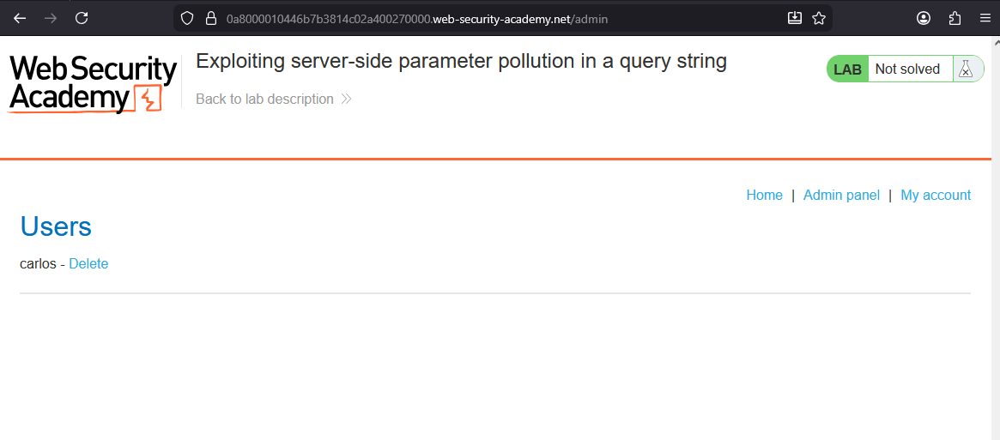

- Then delete the user `carlos`, and the lab is solved.
  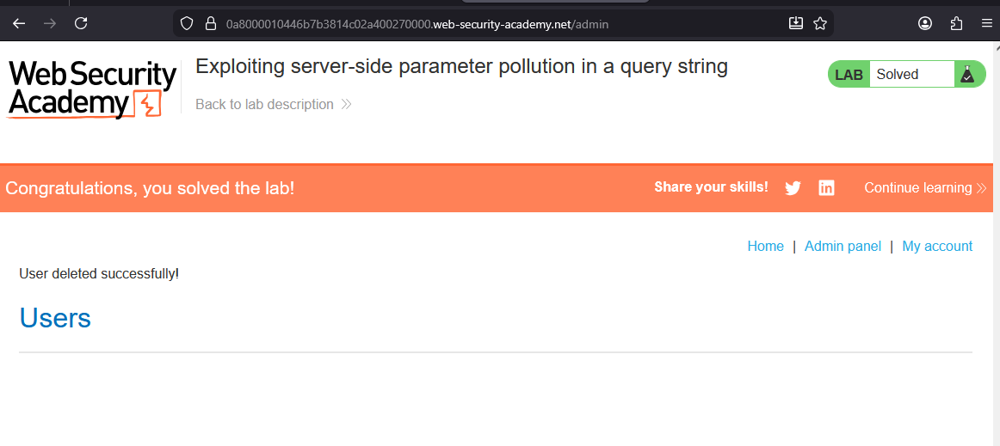

---
