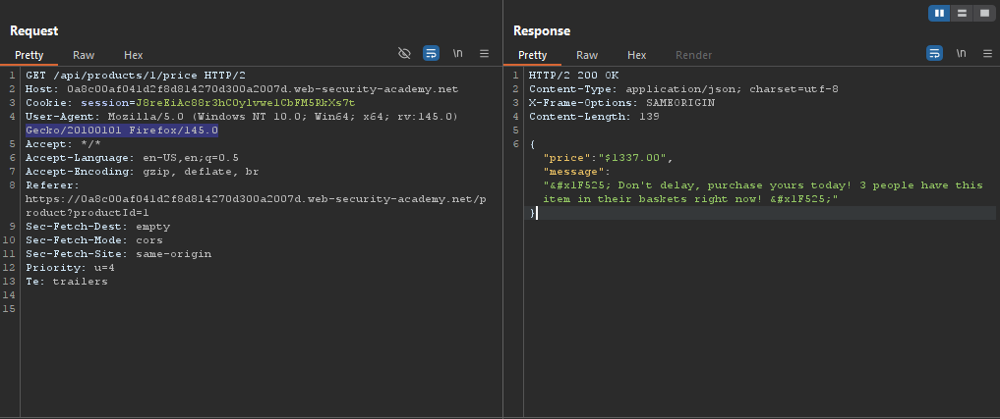
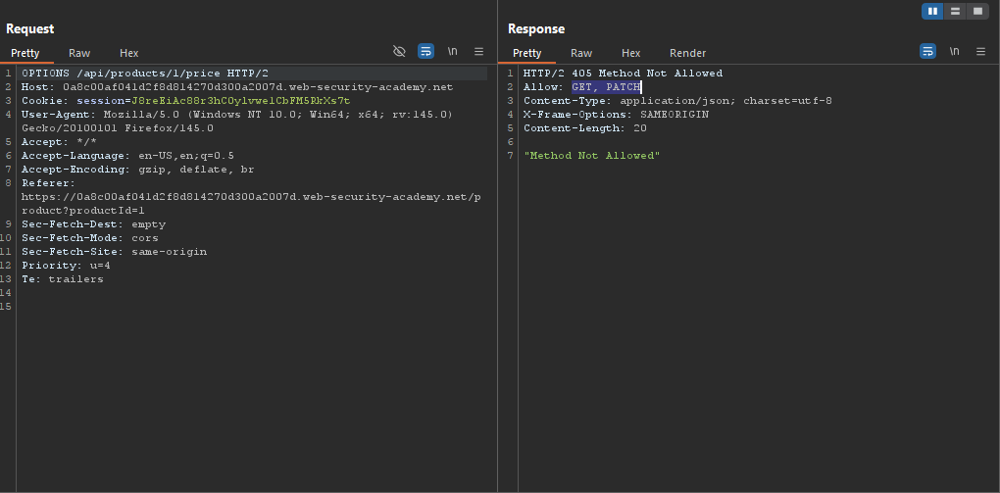
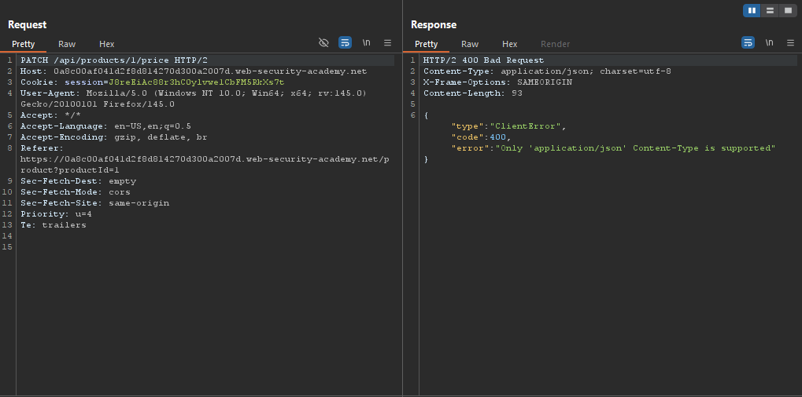
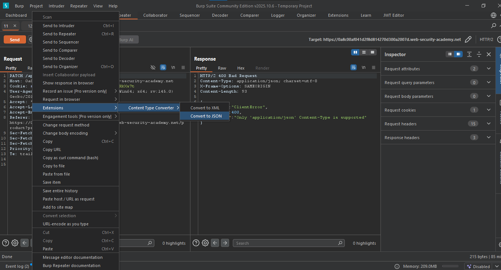
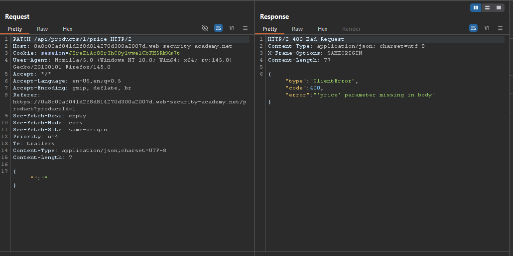
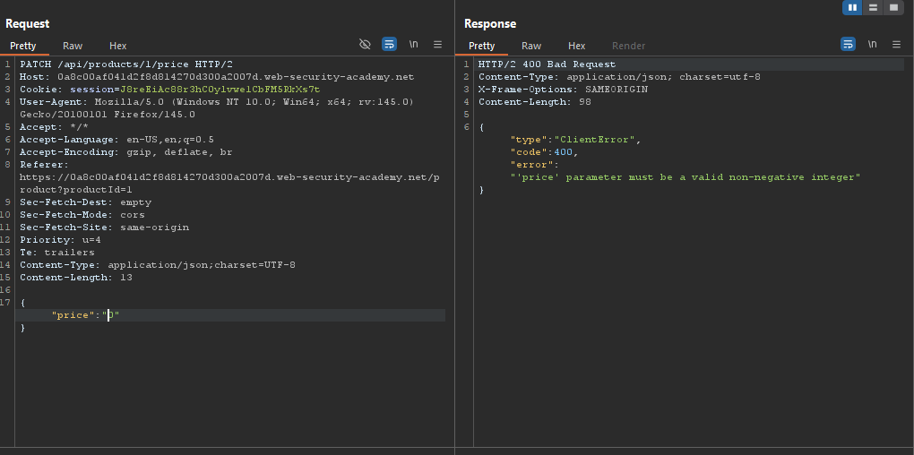
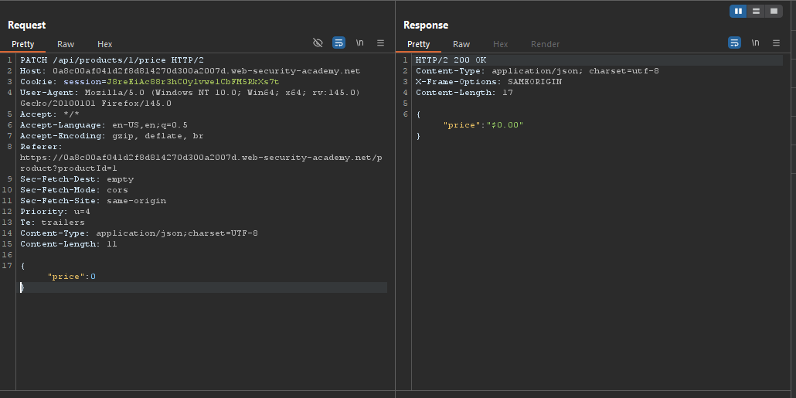
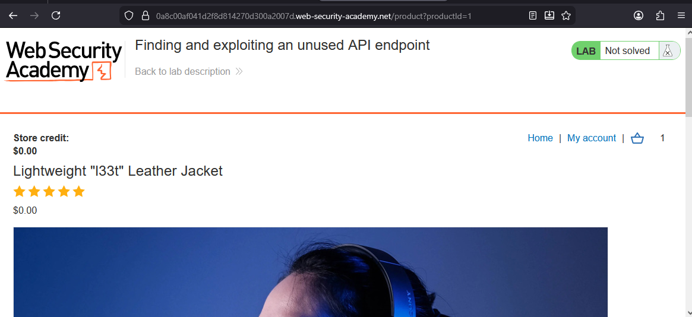
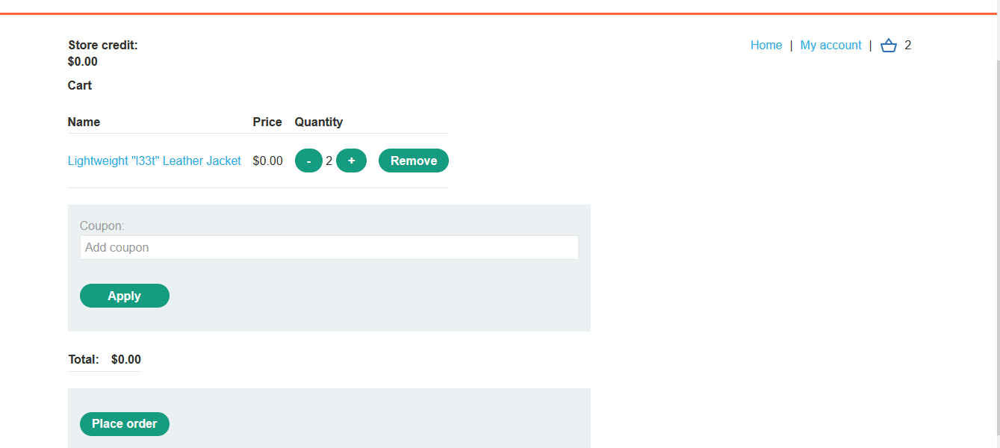
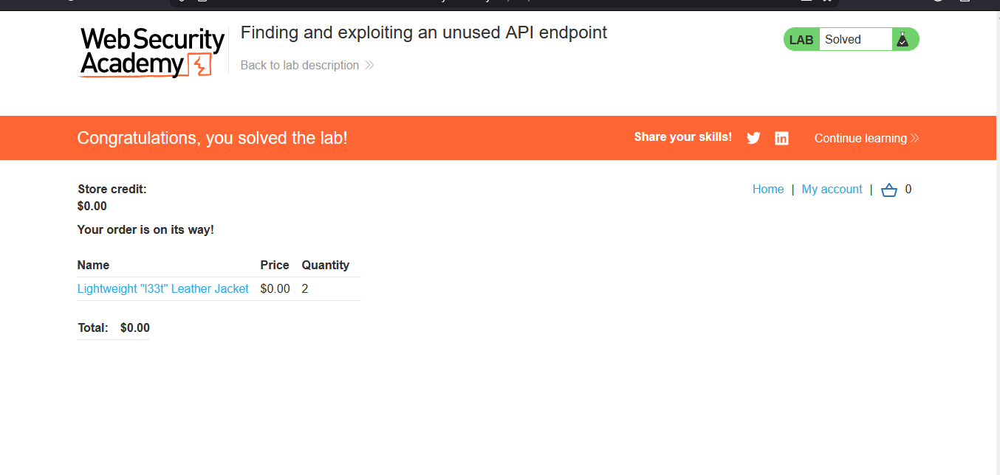

# Lab : Finding and exploiting an unused API endpoint

> Lab objective: exploit a hidden API endpoint to buy a Lightweight l33t Leather Jacket.

- Login using provided credentials `wiener:peter`, then add a Lightweight l33t Leather Jacket to your cart and inspect the request made.
  

- Send the request to repeater and change the HTTP request verb to OPTIONS, you'll notice that GET and PATCH methods are allowed.
  

- Change the HTTP request verb to PATCH, then send the request, in order to know how to send a proper PATCH request.
  

- Using 'Content Type Converter' extension, convert the content type to JSON.
  

- Send the converted request, and you'll notice that `price` parameter is required.
  

- The value for price must be non-negative integer.
  

- State the value of price to 0, and you'll notice that the request is accepted.
  

- And the price of the product has been changed to 0 on the website's product page.
  

- Try adding the product again to cart, and our modification has taken place.
  

- Place an order, and it's accepted, and the lab is solved.
  

---
