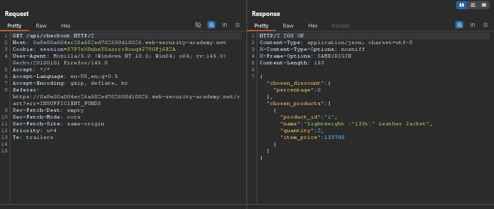
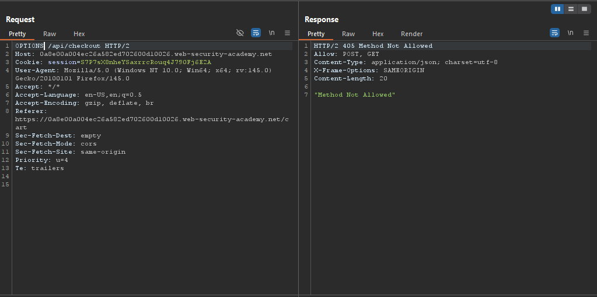
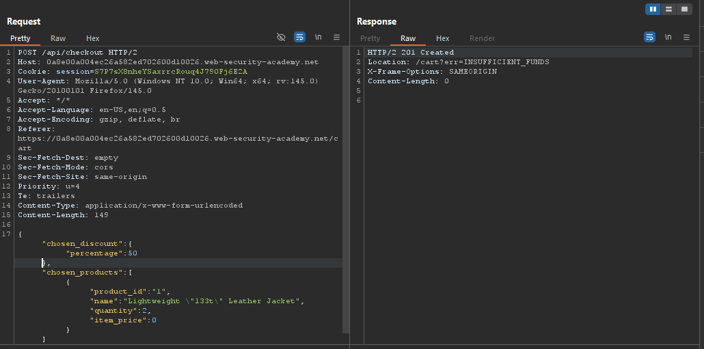
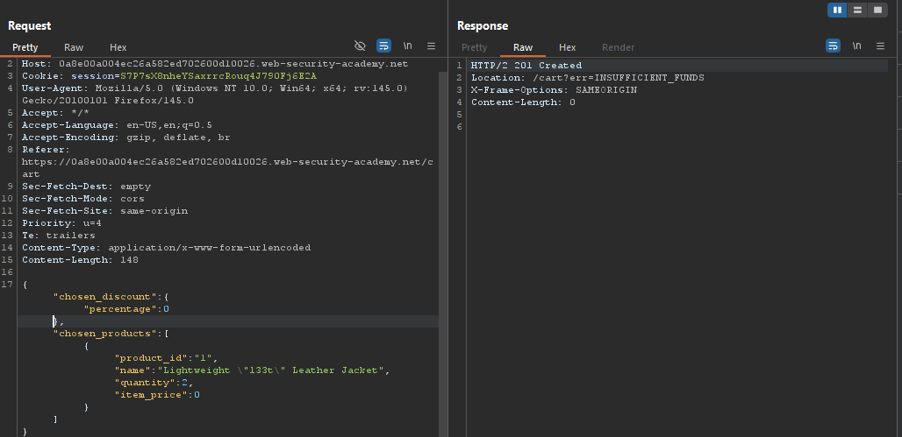
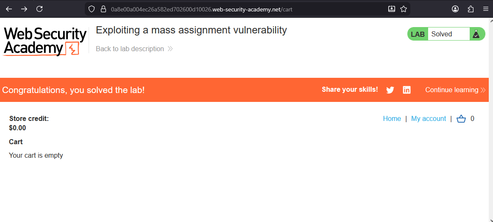

# Lab: Exploiting a mass assignment vulnerability

> Lab Objective: find and exploit a mass assignment vulnerability to buy a Lightweight l33t Leather Jacket.

- Login using provided credentials `wiener:peter`, then add a Lightweight l33t Leather Jacket to your cart, then inspect the request made.
  

- Send the request to repeater, then change HTTP Request verb to OPTIONS, and you'll notice that POST & GET verbs are allowed.
  

- Depending on the GET request sent to `/api/checkout` endpoint, take the Response body (the JSON Object), and send it using a POST request to the same endpoint.

- If you kept percentage at 0, or changed it to 50 (for instance), you'll notice that the response indicates insufficient funds, indicating that the value for percentage is processed by the back-end server.
  
  

- But in case you changed the percentage value to 100, the response indicates the order is confirmed successfully, therefore you've bought the product with 100% discount (for free).
  

- And the lab is solved.
  

---
