# Lab: Exploiting server-side parameter pollution in a REST URL

> Lab Objective: log in as the administrator and delete carlos.

- Capture the request made to `/forgot-password` to endpoint.
  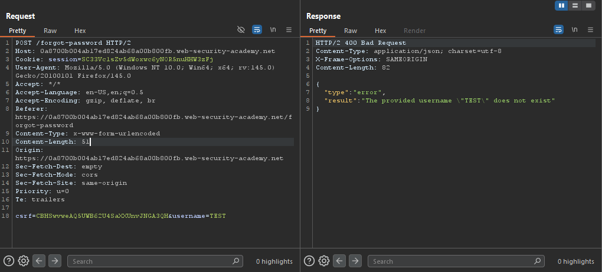

- If you added `#` to the end of the username, you'll notice that the response indicates an invalid route and to check the API definition for further information.
  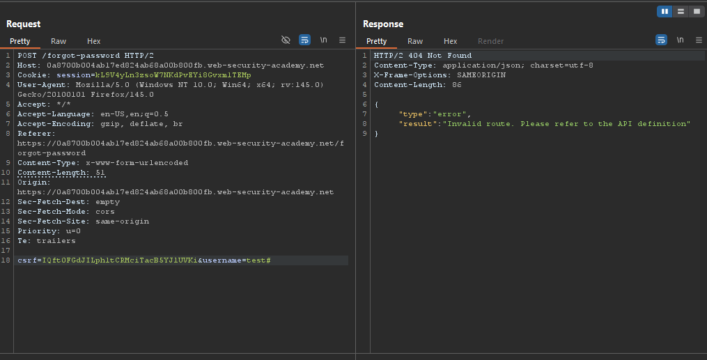

- Which is an indication of path traversal vulnerability to access API Documentation.

- If you added `./` before a valid username (`administrator`, for instance), you'll notice that the response is valid with no errors, indicating that I can traverse through the file system.
  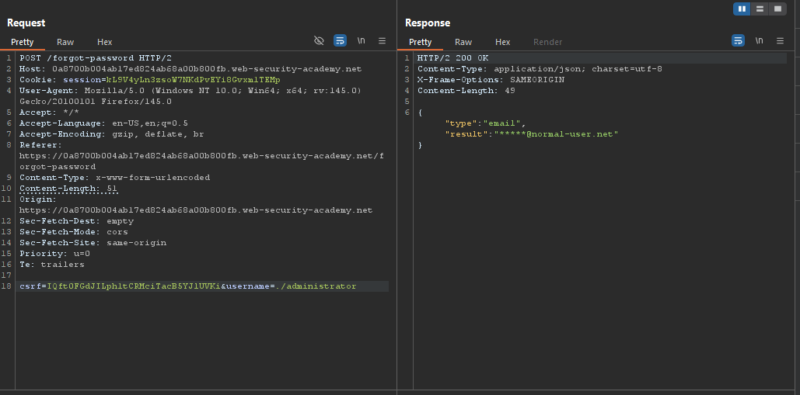

- For instance, I'm going to search for `openapi.json` which is an endpoint that might point to the API documentation.
  
  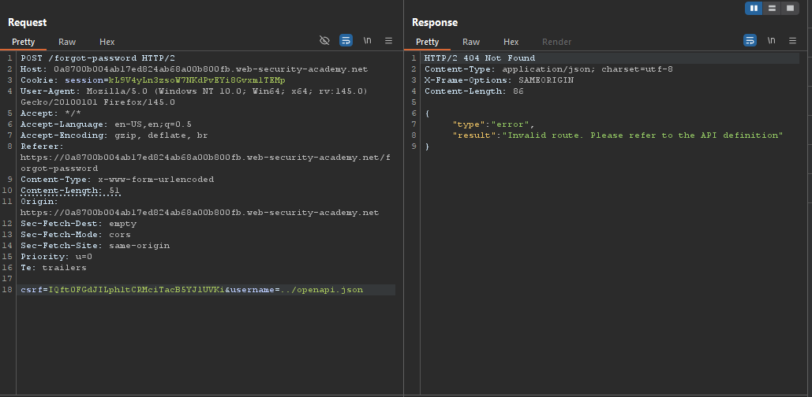
  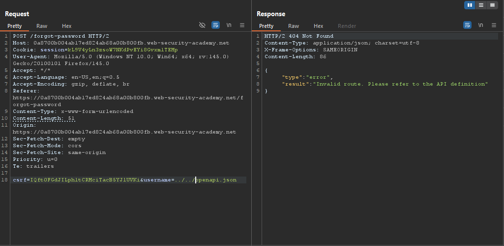

- After several failed trials, this path `../../../../openapi.json` results in an error.
  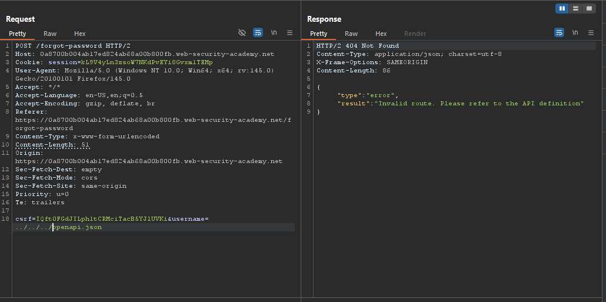

- But since the back-end server, builds the API URL internally, therefore using `#` (in the url-encoded form) at the end of the path, will result in the revealing of API Definition.
  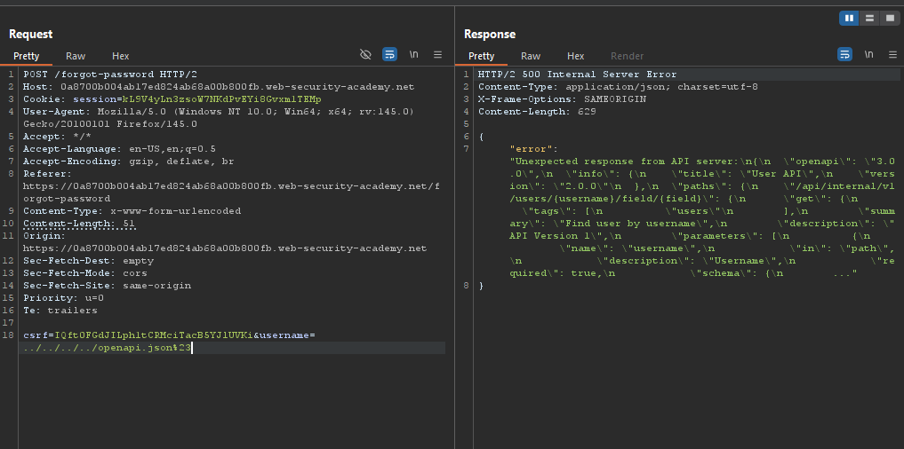

```json
{
  "openapi": "3.0.0",
  "info": {
    "title": "User API",
    "version": "2.0.0"
  },
  "paths": {
    "/api/internal/v1/users/{username}/field/{field}": {
      "get": {
        "tags": ["users"],
        "summary": "Find user by username",
        "description": "API Version 1",
        "parameters": [
          {
            "name": "username",
            "in": "path",
            "description": "Username",
            "required": true,
            "schema": {}
          }
        ]
      }
    }
  }
}
```

- Since this `/api/internal/v1/users/{username}/field/{field}` is the path, therefore placing `administrator/field/test%23` as the username, results in an error in the response indicating that the only allowed field is `email`.
  

- When specifying the email as the field, it returns the normal request as if specifying a valid username within the username parameter.
  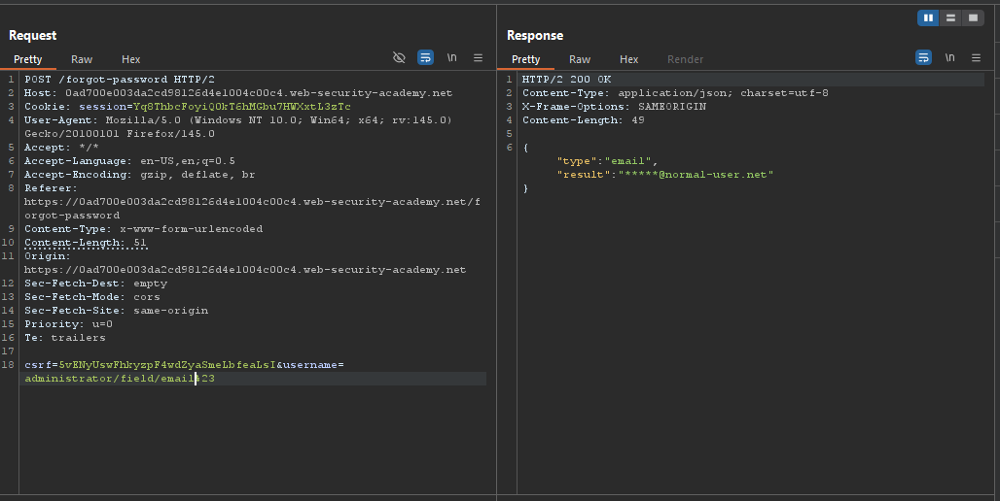

- But when changing the API version to `v1` through this path `../../v1/users/administrator/field/test%23`, the error message in the response changed, indicating that there might be another fields I'm able to retrieve through field parameter.
  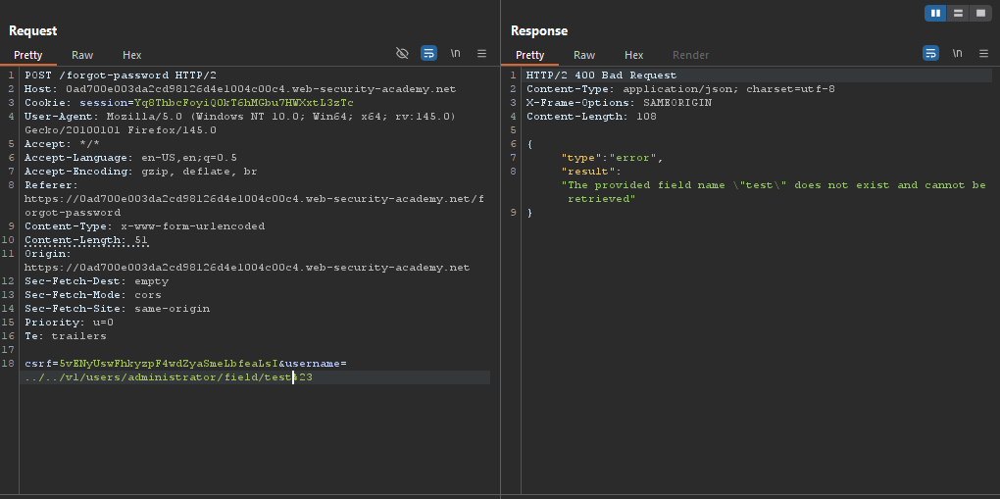

- Inspect requests made when loading forget password page from Network Tab, you'll notice that there a js file called `forgotPassword.js` which contains the parameter name for the reset token called `passwordResetToken`.

- Include it in the field, and you'll be able to retrieve the password reset token for the administrator.
  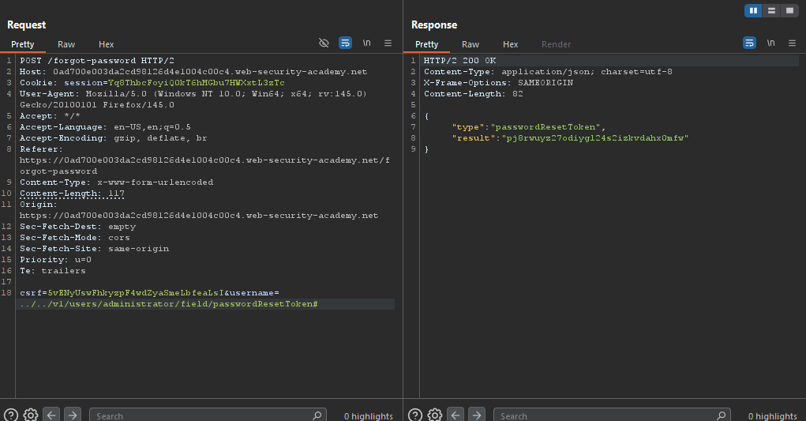

- Use this token to change the administrator's password.
  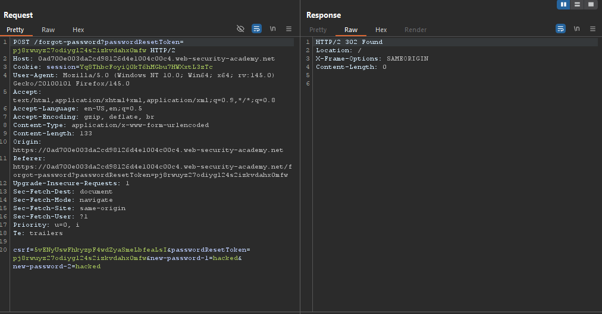

- Login as the admin, and access the admin panek.
  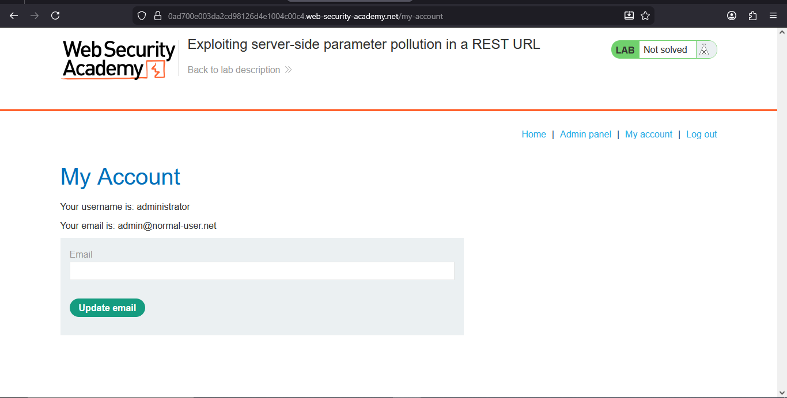
  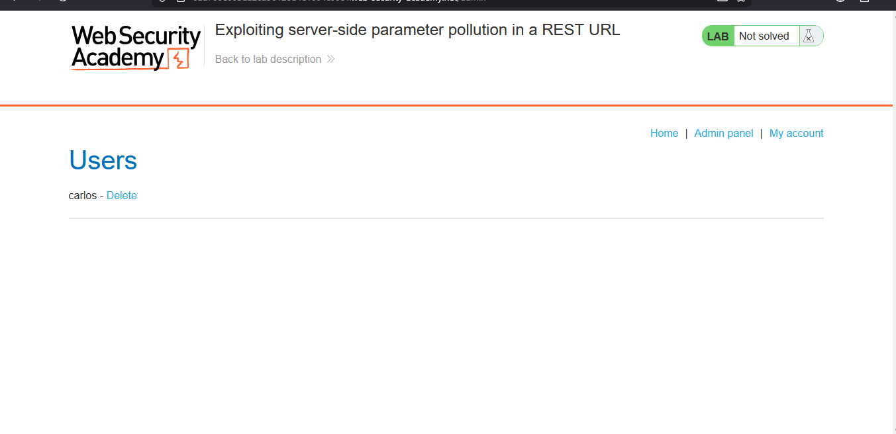

- Delete the user carlos and the lab is solved.
  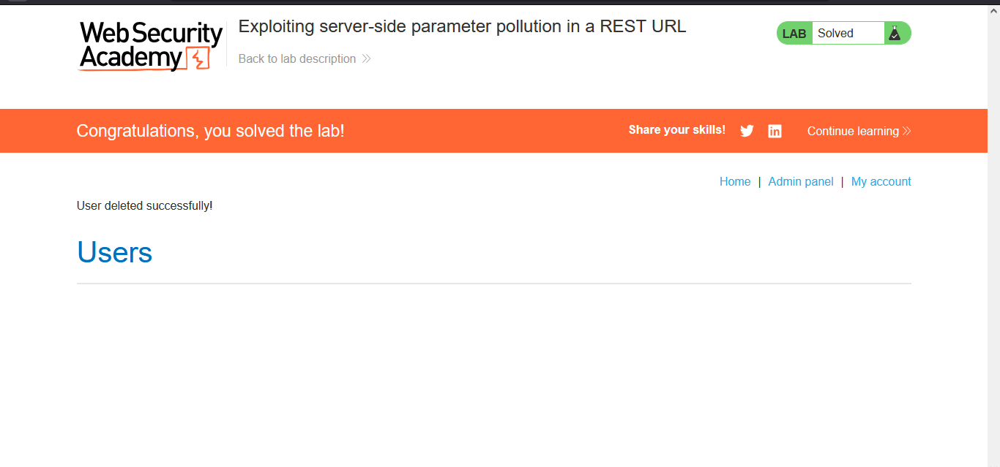

---
