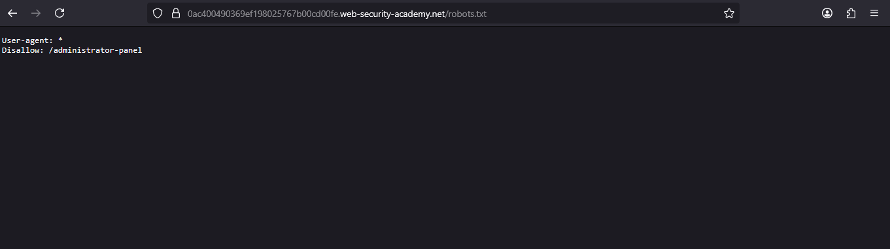
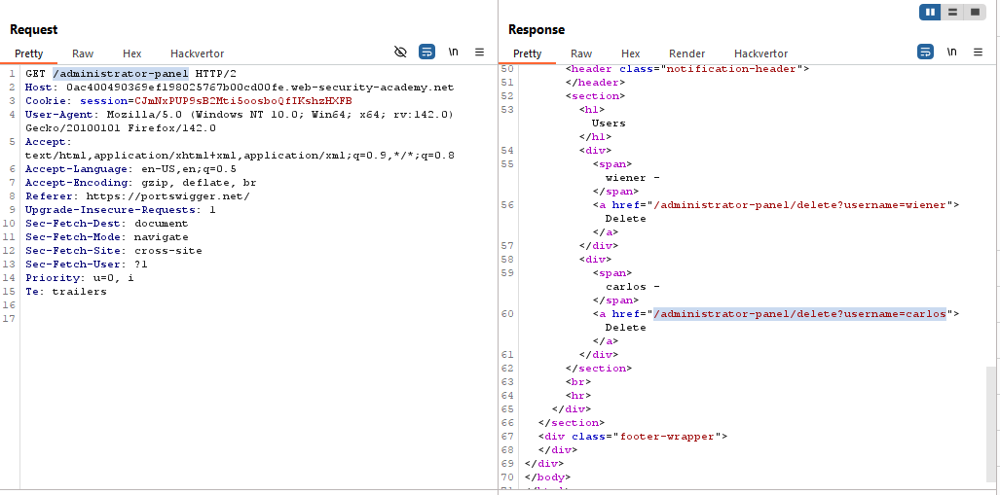
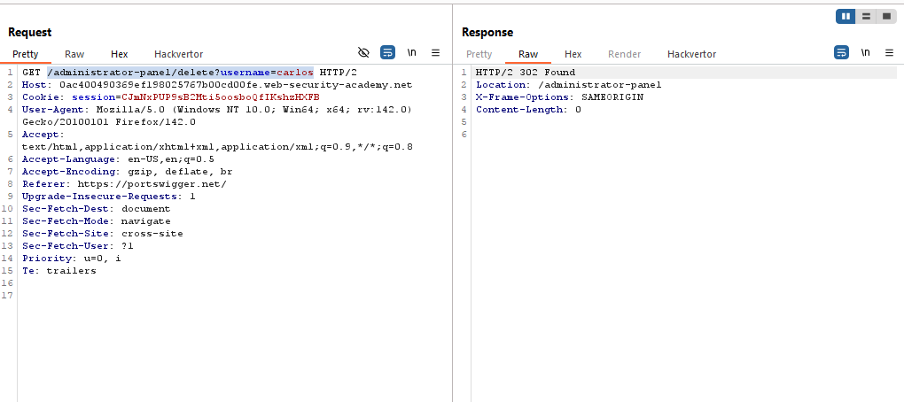
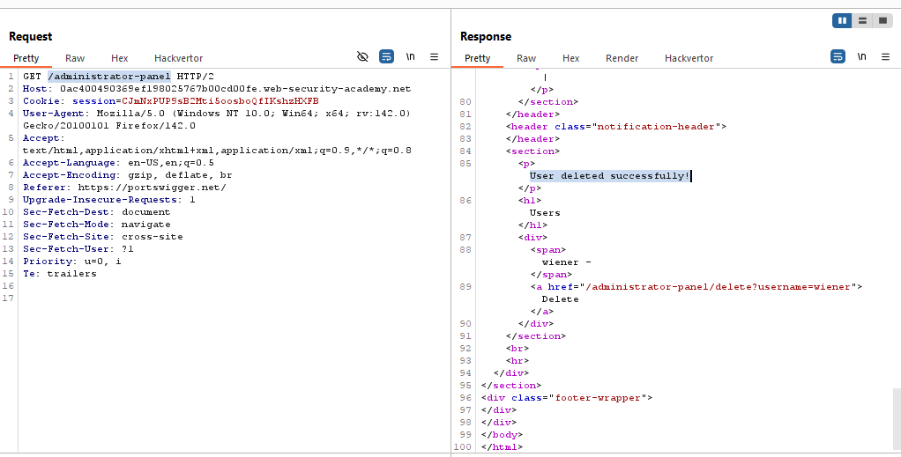
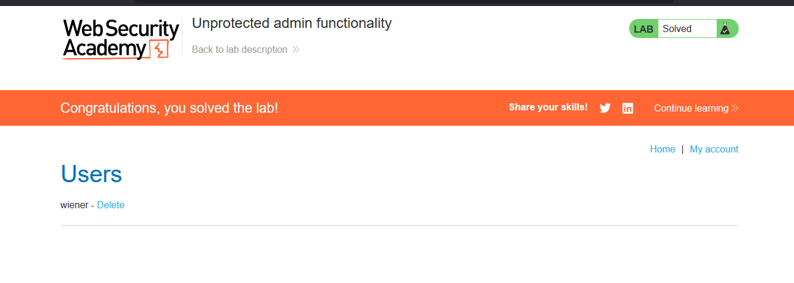

# Lab: Unprotected admin functionality

> Lab Objective: Solve the lab by deleting the user carlos.

- Firstly, visit `robots.txt`, and you'll find Admin Panel path which is `/administrator-panel`
  

- Send a request to `/administrator-panel`, and you'll be able to access Admin Panel, also you'll be able to delete the user carlos via sending a `GET` request to `/administrator-panel/delete?username=carlos`.
  

- Send a `GET` Request to `/administrator-panel/delete?username=carlos`.
  

- Follow redirection to `/administrator-panel` and you'll find that the user has deleted successfully.
  

- And the lab is solved.
  

---
