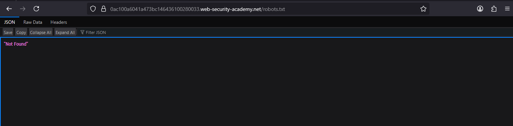
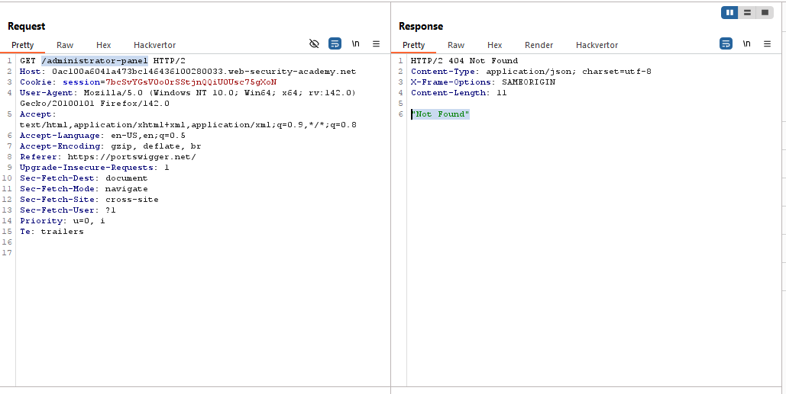
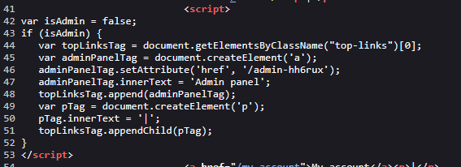
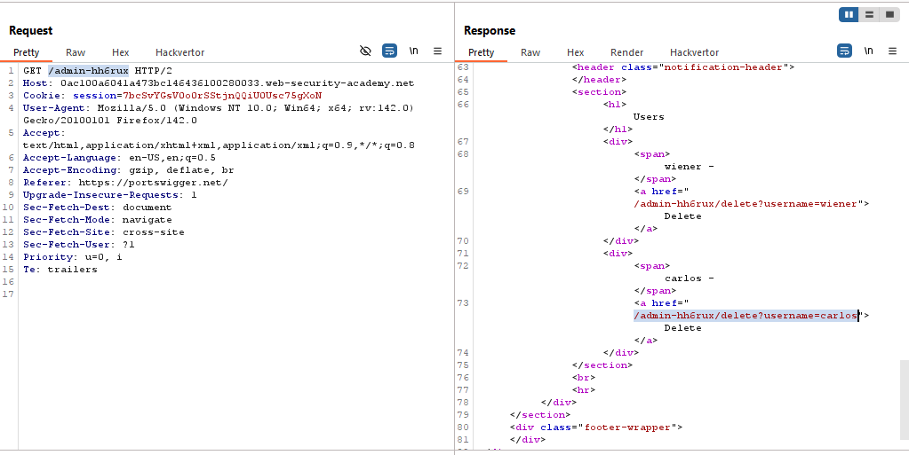
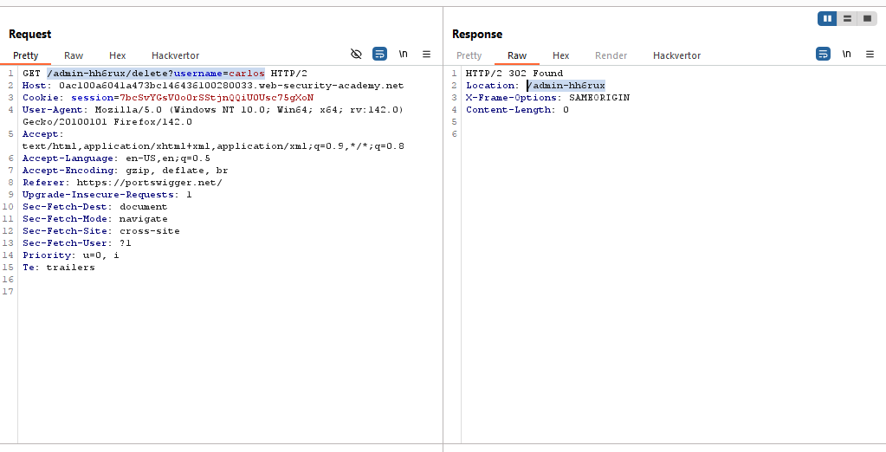
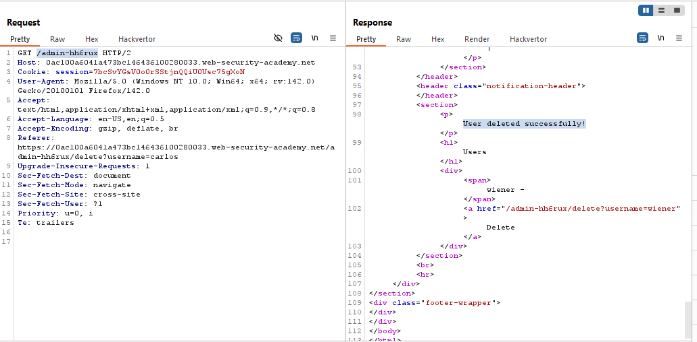
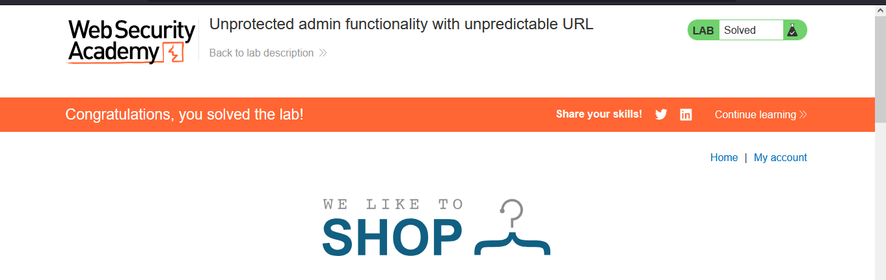

# Lab: Unprotected admin functionality with unpredictable URL

> Lab Objective: Solve the lab by accessing the admin panel, and using it to delete the user carlos.

- `robots.txt` file is not found.
  

- Same as trying to access `admin` or `administrator-panel` endpoints.
  

- But when viewing source code, you'll a JS code the identifies the path to the admin panel as `/admin-hh6rux`
  

- When accessing this path you will be able to access the admin panel and deleting the user carlos via sending a `GET` request to `/admin-hh6rux/delete?username=carlos`.
  

- Send a `GET` request to `/admin-hh6rux/delete?username=carlos`, then follow redirection to `/admin-hh6rux` and you'll notice that the user is successfully deleted.
  
  

- And the lab is solved.
  

---
