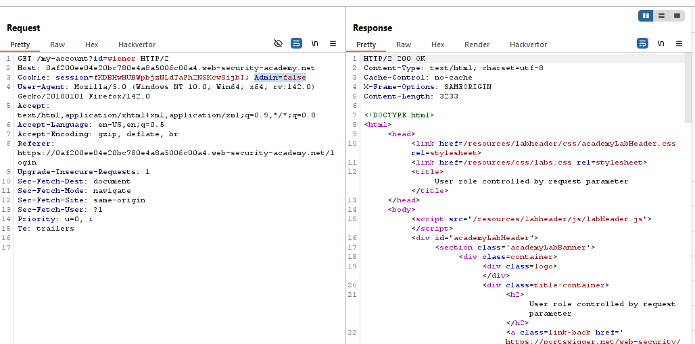
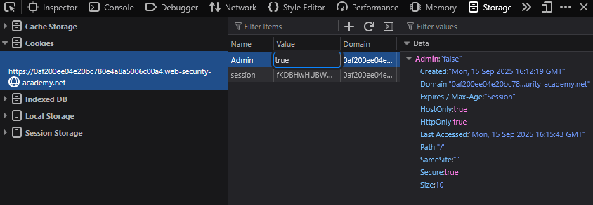
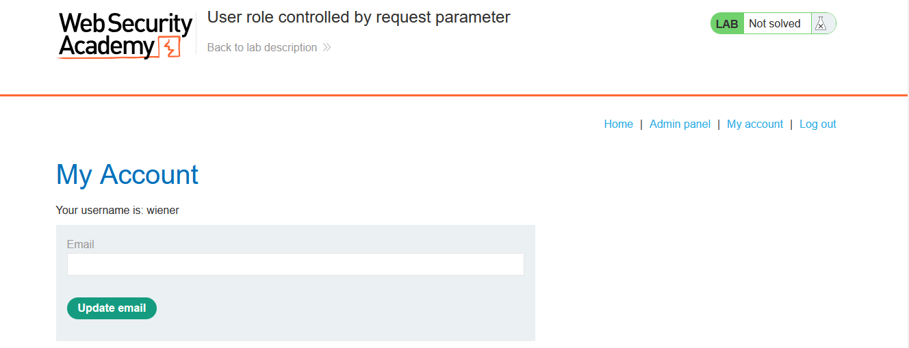
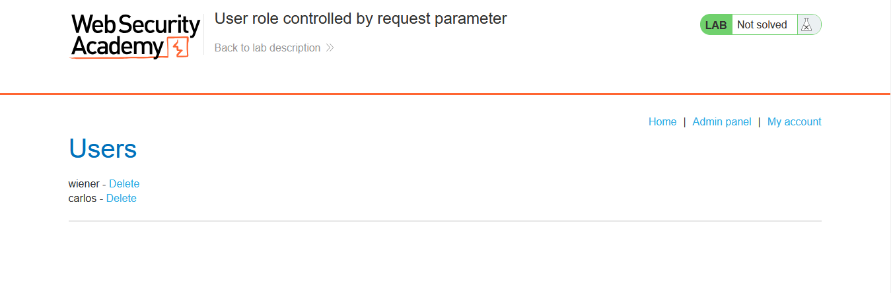

# Lab: User role controlled by request parameter

> Lab Objective: Solve the lab by accessing the admin panel and using it to delete the user carlos.

- Login using provided credentials `wiener:peter`, then inspect requests made.

- You'll notice that the request made to retrieve wiener home page includes a cookie with this key-value pair: `Admin=false`
  

- Change the value to true in your browser, then access your home page again.
  

- You'll notice that the Admin Panel has appeared and you can have access to it.
  
  

- Delete the user carlos, and the lab is solved.
  

---
