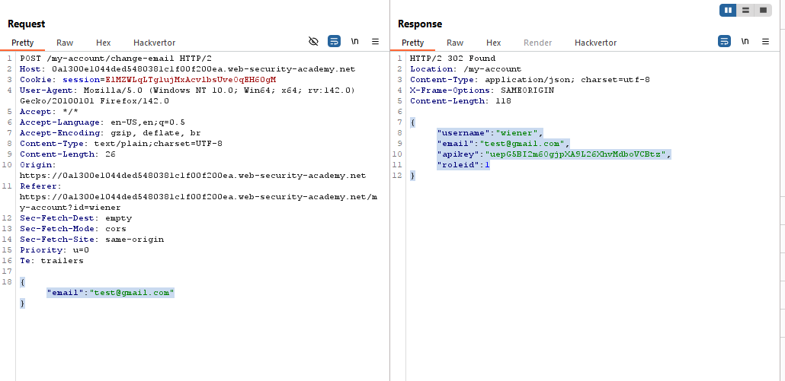
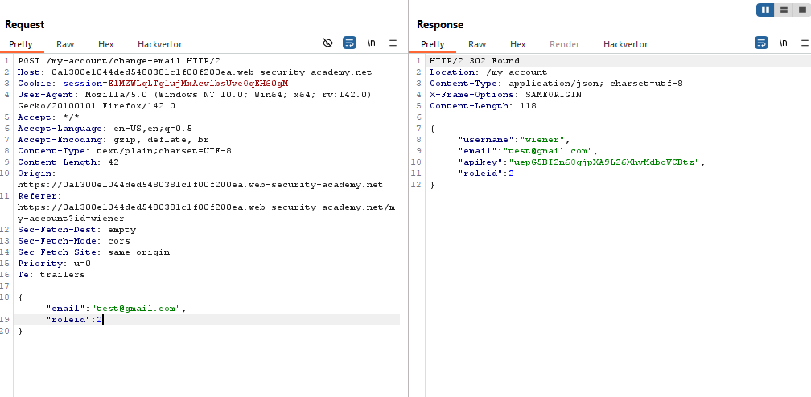
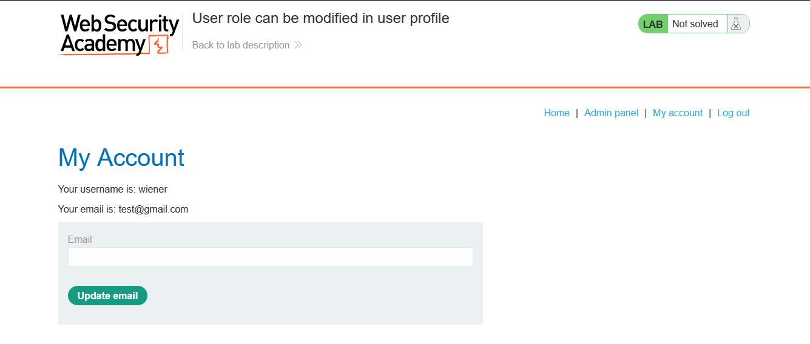
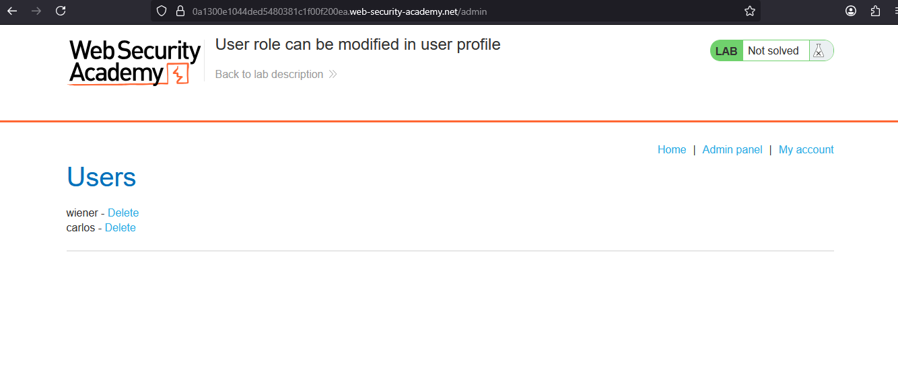
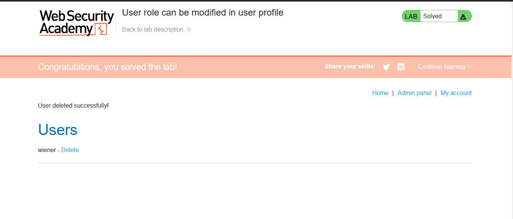

# Lab: User role can be modified in user profile

> Lab Objective: Solve the lab by accessing the admin panel and using it to delete the user carlos.

- Login using provided credentials `wiener:peter`, then inspect the requests made.

- You'll notice that there is nothing you can change to access the admin panel.

- But when changing the email, you'll notice that the response includes a `roleid`.
  

- Try changing it in the change email request to `2`.
  

- Visit your home page, you'll notice that you have access to admin panel.
  
  

- Delete the user carlos and the lab is solved.
  

---
