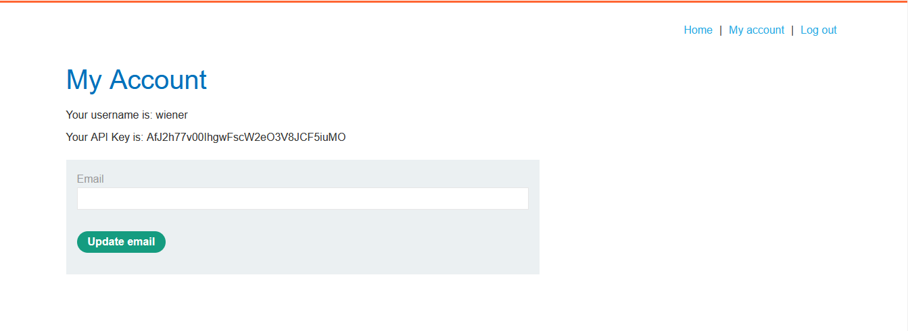
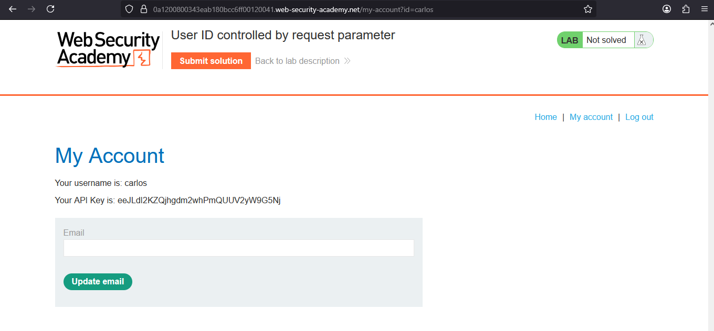
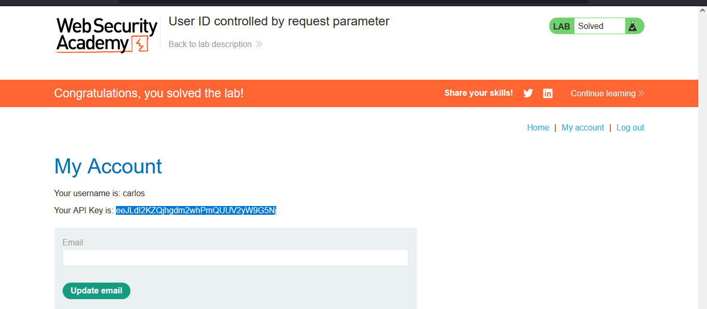

# Lab: User ID controlled by request parameter

> Lab Objective: obtain the API key for the user carlos and submit it as the solution.

- Login using provided credentials `wiener:peter`

- View your Account, and you'll find an API KEY.
  

- When inspecting the requests made when logging in, you'll notice that there is a request made to account home page through `/my-account?id=wiener`, which retrieves the account page related to the user with `id=wiener`.

- When changing the value of id parameter to carlos, you'll retrieve the account page related to the user carlos.
  

- Therefore, submit API Key of the user carlos, and the lab is solved.
  

---
