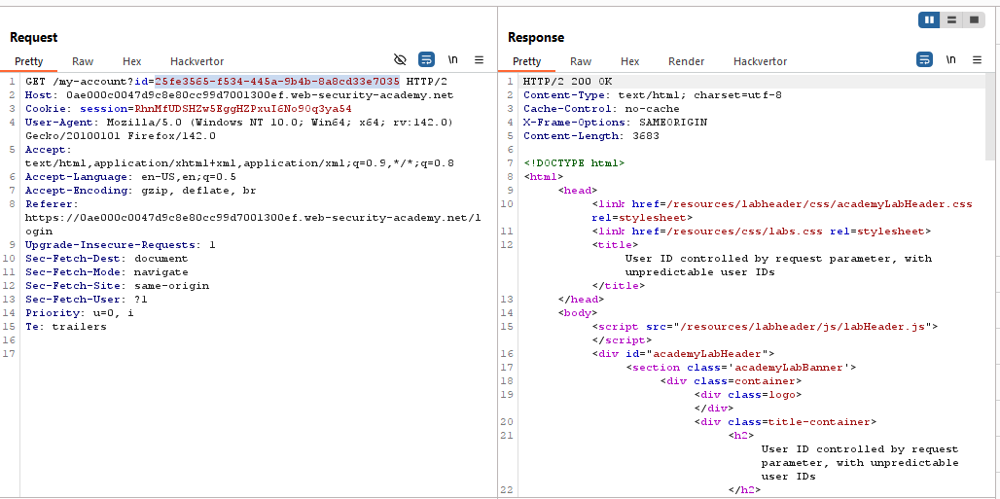
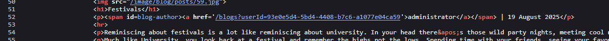
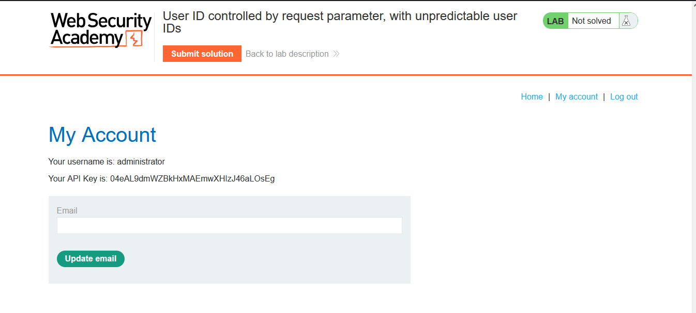
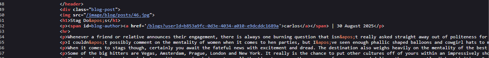
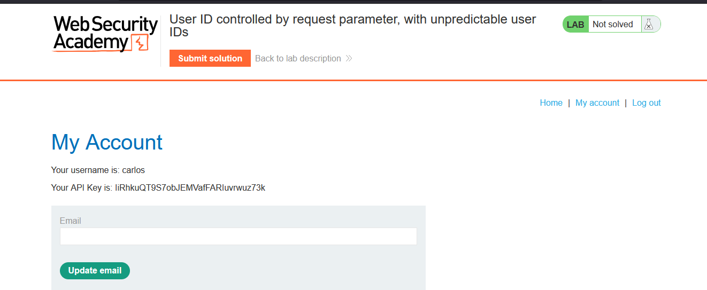
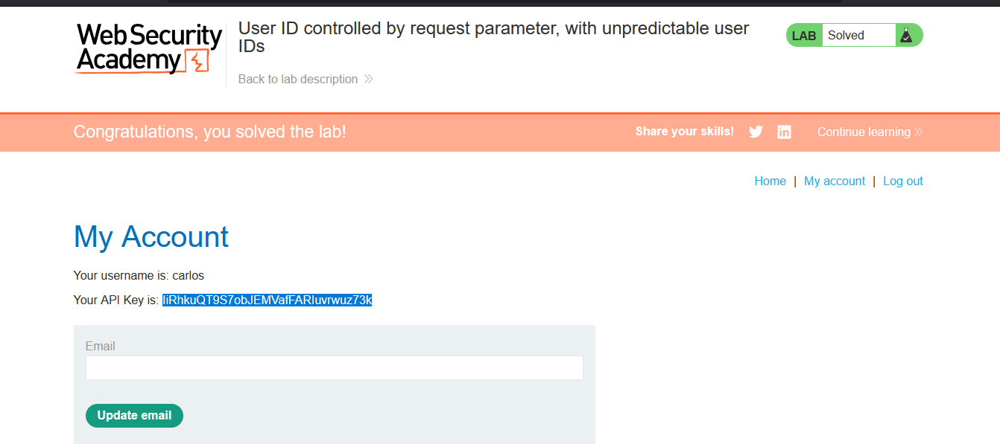

# Lab: User ID controlled by request parameter, with unpredictable user IDs

> Lab Objective: find the GUID for carlos, then submit his API key as the solution.

- Login using provided credentials `wiener:peter`

- When inspecting the requests made, you'll notice that the request made to retrieve the account home made related to the user wiener (my account), is retrieved via GUID.
  

- Therefore, trying to guess the GUID value related to the user carlos may be inapplicable.

- But when viewing any post and viewing the source code, you'll notice that the GUID of the post publisher exist within the source code, for instance the following post is published by the administrator.
  

- When accessing the account page of the administrator, I couldn't access the API Key for the user carlos.
  

- Therefore, Search for any post published by carlos.
  

- therefore, access carlos' account page via his GUID.
  

- Finally, submit the API Key and the lab is solved.
  

---
