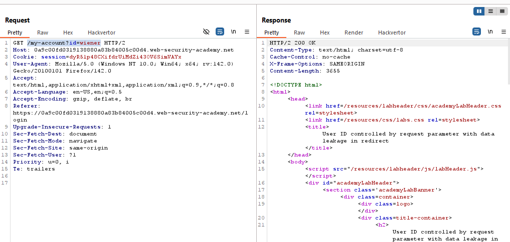
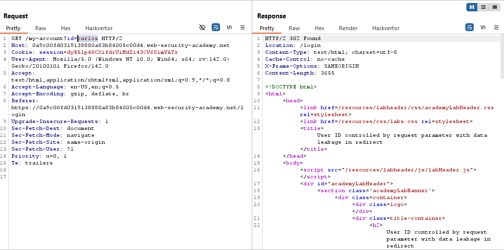
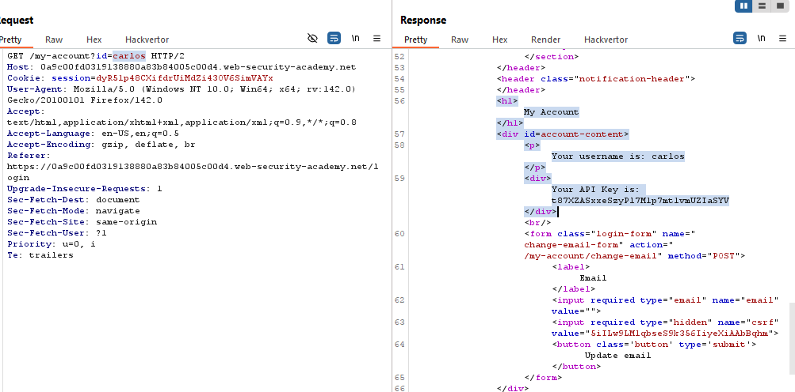
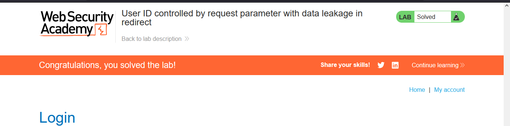

# Lab: User ID controlled by request parameter with data leakage in redirect

> Lab Objective: obtain the API key for the user carlos and submit it as the solution.

- Login using the provided credentials `wiener:peter`, then inspect the requests made.

- You'll notice that there's a request made to retrieve the account page for the user with id=wiener (my account) through this path `/my-account?id=wiener`.
  

- When changing the value of the id parameter to carlos, you'll be redirected to the login page.
  

- But when viewing the source code before following the redirection, you'll notice that you have the API Key of carlos.
  

- Therefore, submit the api key of the user carlos and the lab is solved.
  

---
