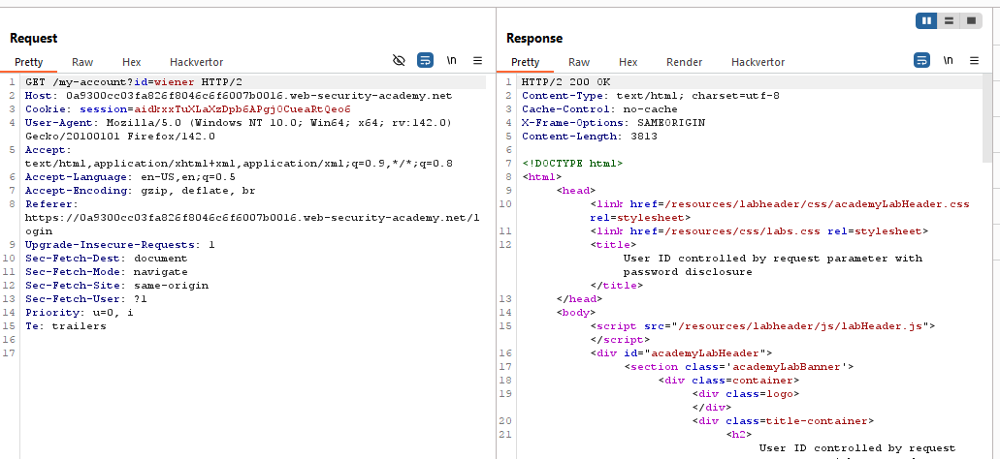
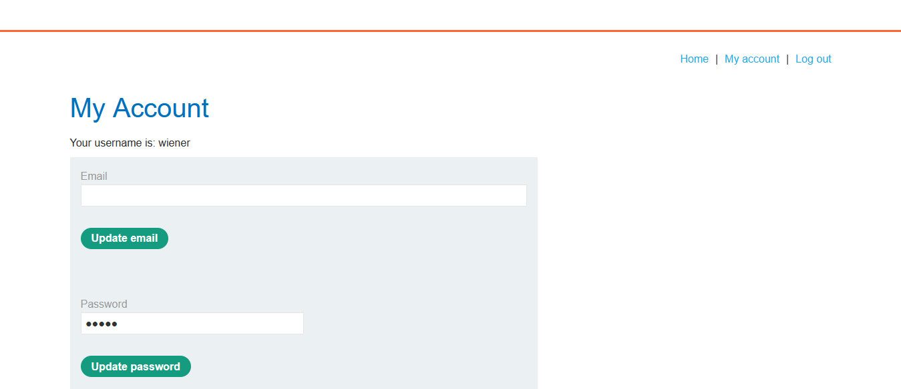
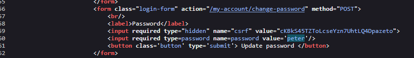
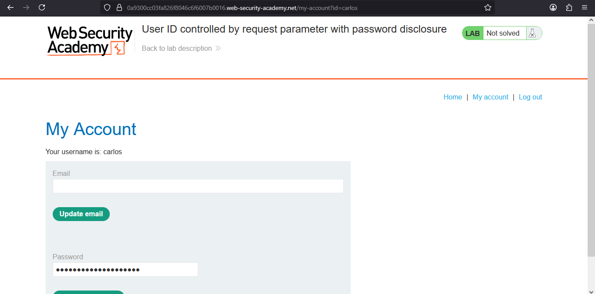
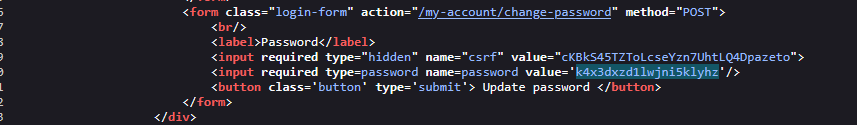
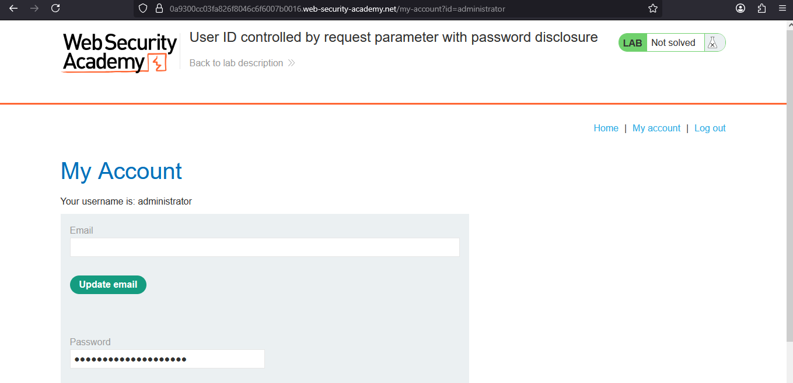
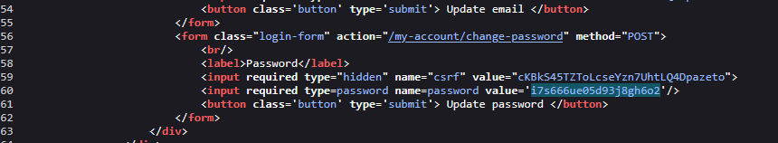
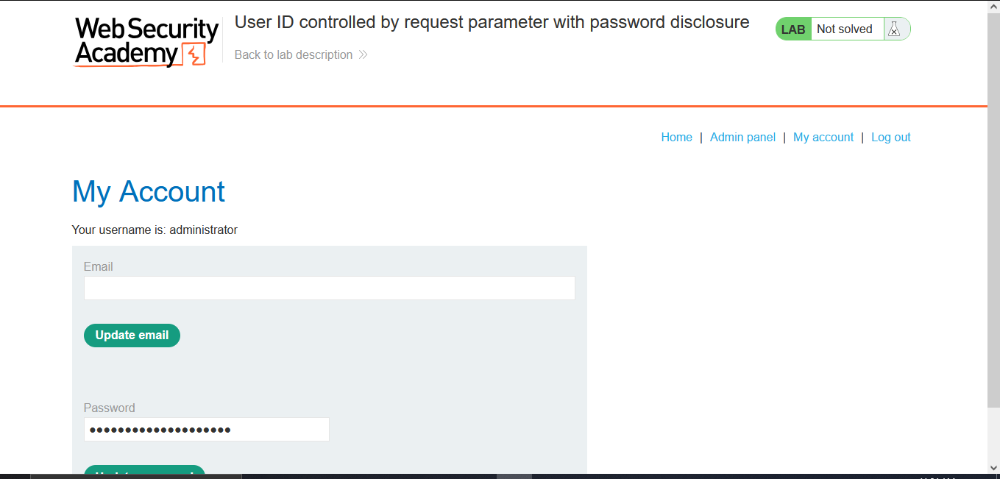
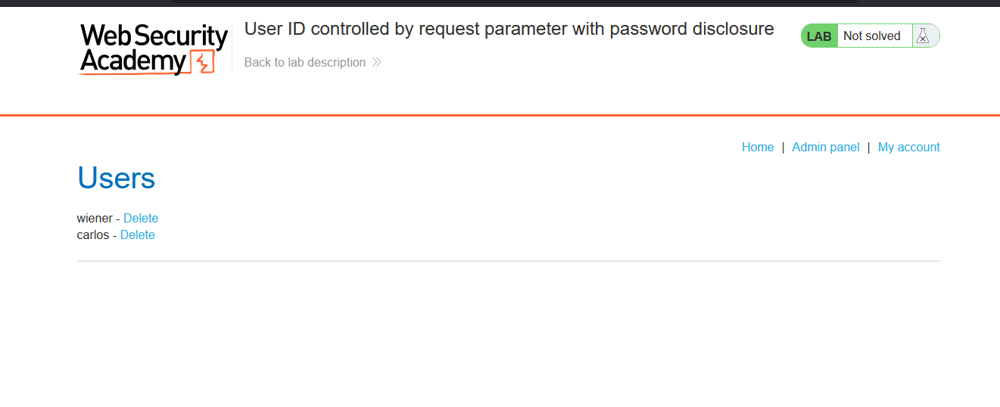
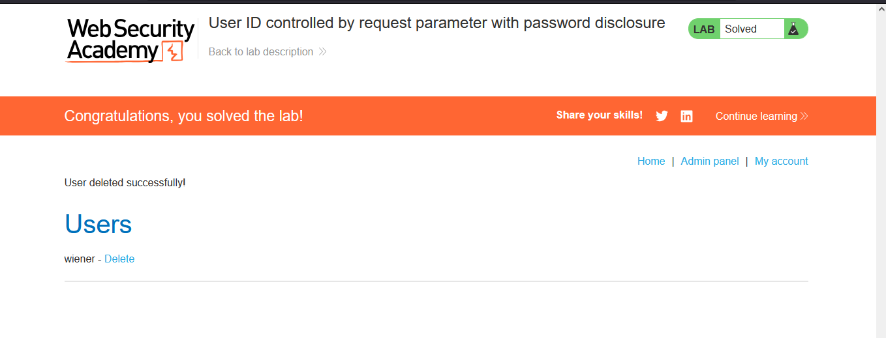

# Lab: User ID controlled by request parameter with password disclosure

> Lab Objective: User ID controlled by request parameter with password disclosure.

- Login using the provide credentials `wiener:peter`, then inspect the requests.

- You'll notice that there is a request made to retrieve the account page related to the user with `id=wiener` (my account page).
  

- When viewing my account page, you'll notice that there is a functionality to change your password with the old password stated in the input field.
  
  

- When changing the value of the `id` parameter to `carlos`, I'll be able to access the account page for that user.
  

- Therefore, I'll be able to retrieve his password.
  

- In order to delete the user carlos, therefore I must retrieve the Administrator password and login as the administrator.

- Therefore, change the value of the `id` parameter to `administrator`.
  

- Then get his password.
  

- Then login using the administrator's credentials `administrator:i7s666ue05d93j8gh6o2`, and access the admin panel.
  
  

- Then delete the user carlos, and the lab is solved.
  

---
