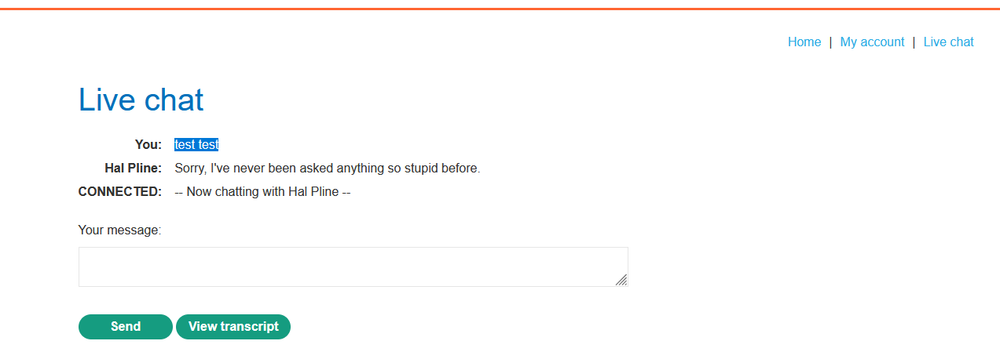
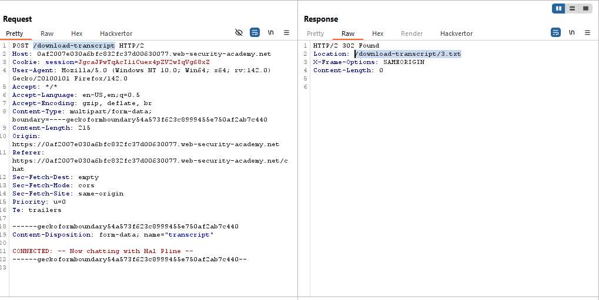
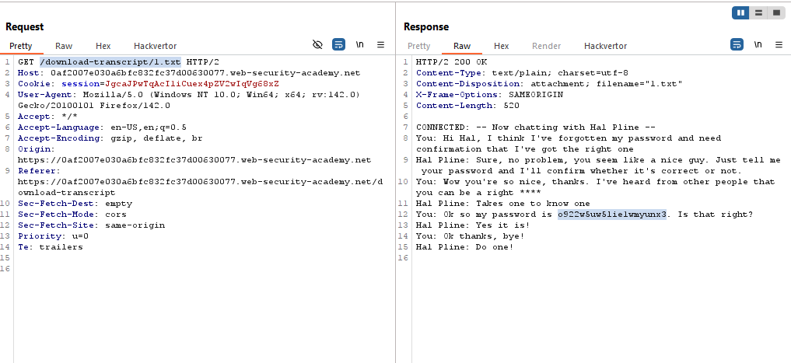
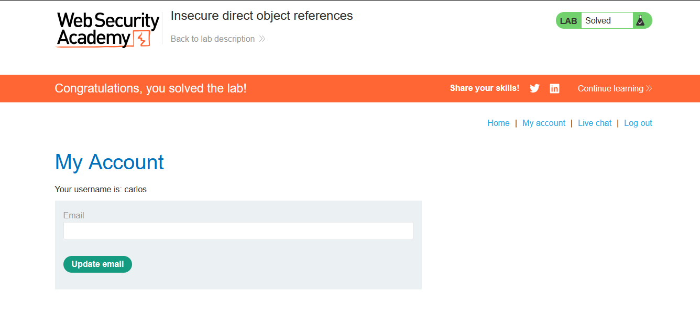

# Lab: Insecure direct object references

> Lab Objective: Solve the lab by finding the password for the user carlos, and logging into their account.

- Go to Live Chat via `/chat`, then submit a message and View the transcript and inspect the requests made.
  

- You'll notice that a transcript for your messages has been downloaded.

- Firstly, you request `/download-transcript`, which redirects you to `/download-transcript/3.txt` to download `3.txt` file which is your transcript.
  

- Follow redirection and try to download `1.txt` file.

- You'll notice that there is a password sent via the chat.
  

- Therefore, login using those credentials `carlos:o922w5uw5lie1wmyunx3`, and the lab is solved.
  

---
