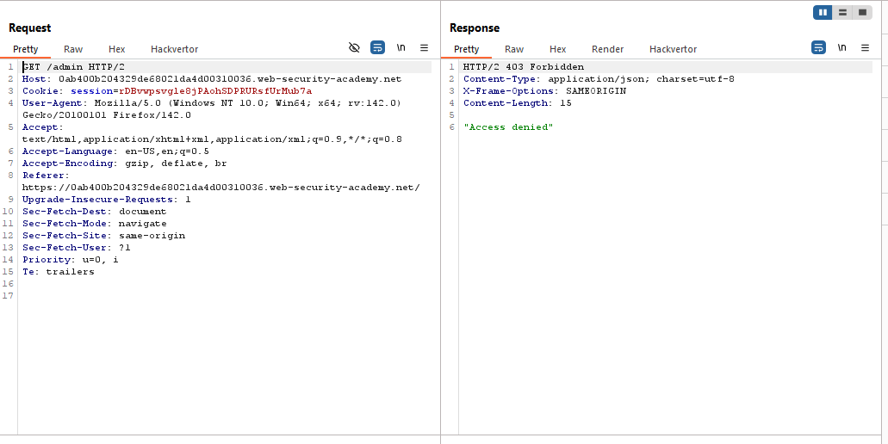

# Lab: URL-based access control can be circumvented

> Lab Objective: access the admin panel and delete the user carlos.

- You'll notice that there is an Admin Panel accessible from the home page via `/admin`, but access is denied, the response returns `403 Forbidden`.
  
  

- When using `X-Original-Url: /admin`, and the path in the first line of the HTTP Request is set to `/`, I was able to access the admin panel
  

- And You'll be able to delete the User Carlos via sending a GET request to `/admin/delete?username=carlos`.

- In order to do so:

  - Place the value `/admin/delete` to the `X-Original-Url`.
  - `?username=carlos` to the original query string.
    

- The user carlos has been deleted and the lab is solved.
  

---
