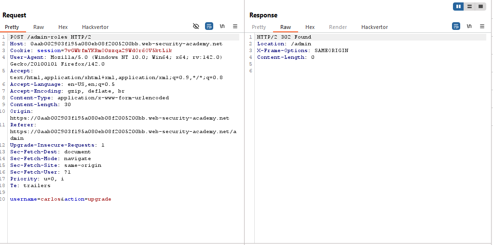
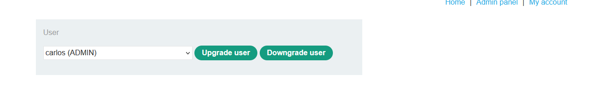
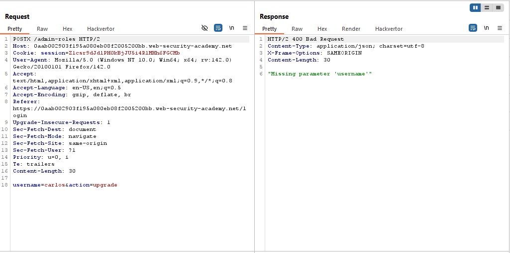
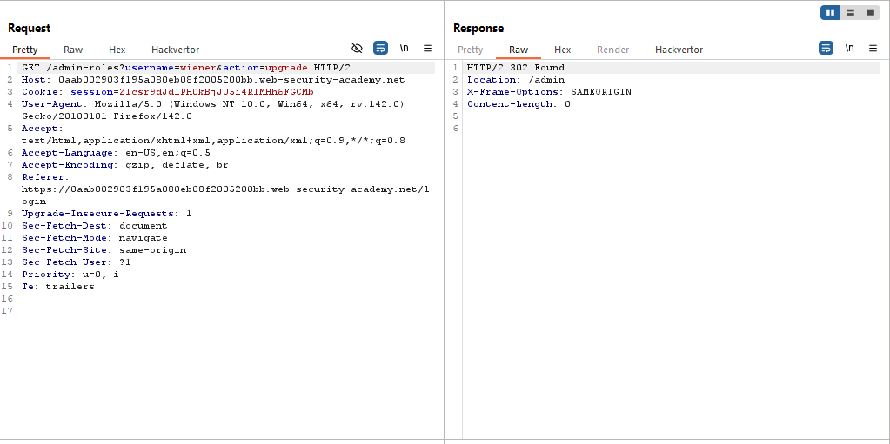
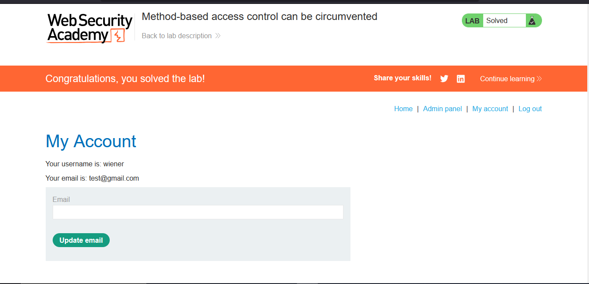
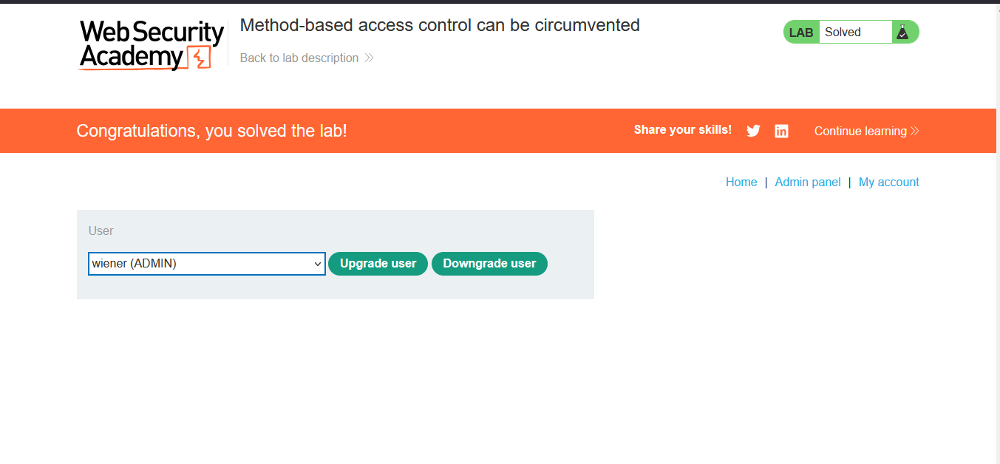

# Lab: Method-based access control can be circumvented

> Lab Objective: log in using the credentials wiener:peter and exploit the flawed access controls to promote yourself to become an administrator.

- Login using the provided credentials `administrator:admin`.

- Access Admin Panel and upgrade the user carlos to Admin, and inspect the request.
  
  

- Logout from the Admin Account and login as a normal user `wiener:peter`, through a private window and copy the issued cookie.

- And try to send the same request, paste the issued request in the cookie parameter.

- Issue the request and You'll notice that you're not authorized
  

- Change the HTTP Request Method to `POSTX` and you'll notice that the request passed but returned `"Missing parameter 'username'"`.
  

- Therefore, try to change the request method to `GET`, then issue the request.
  

- Login using your normal account `wiener:peter`, you'll notice that you have access to Admin Panel and your role is upgraded to admin, and the lab is solved.
  
  

---
