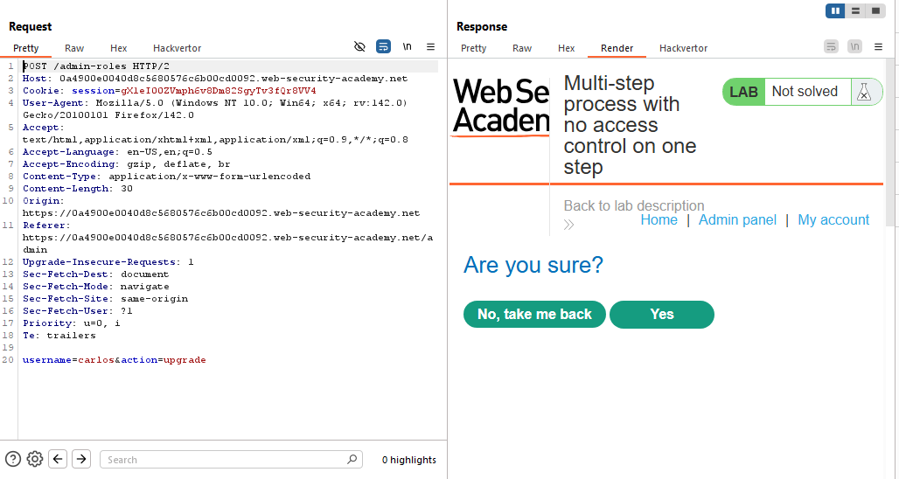
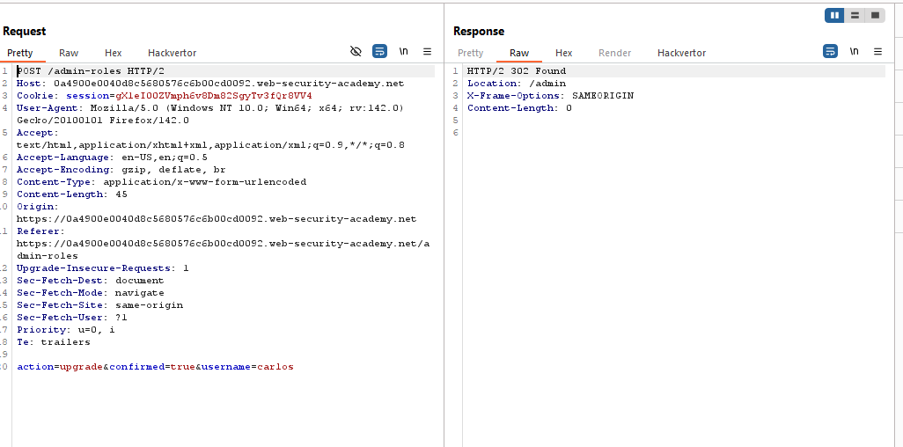
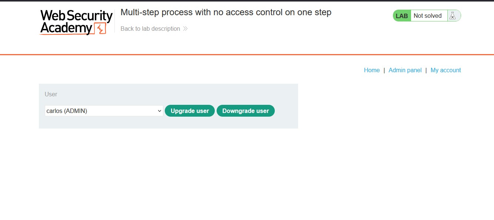
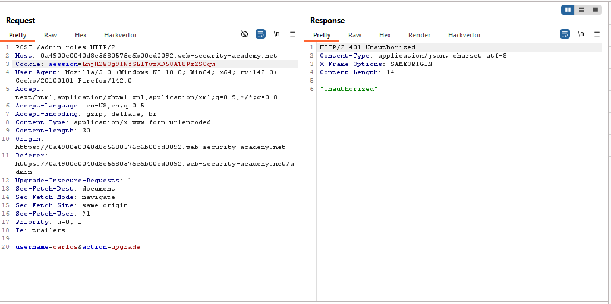
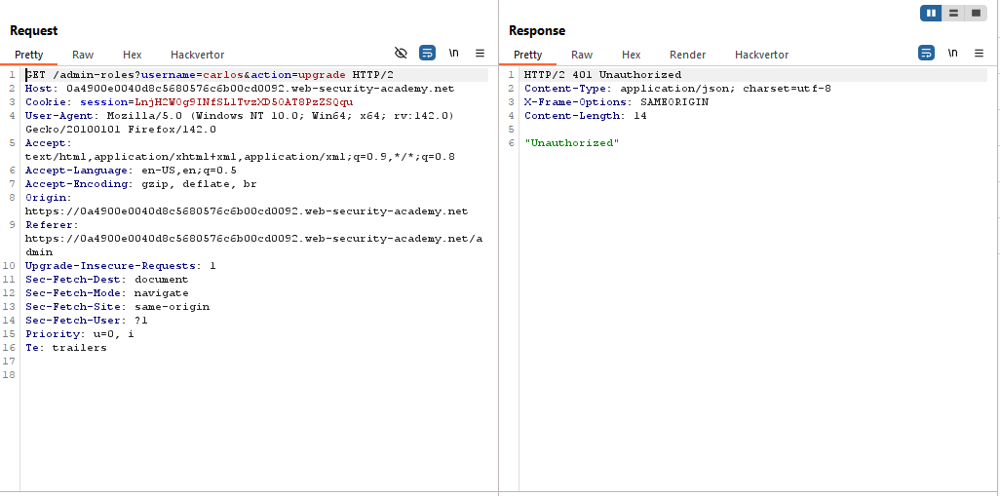
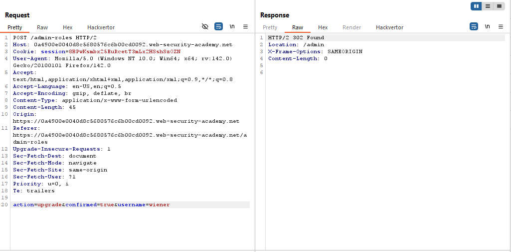
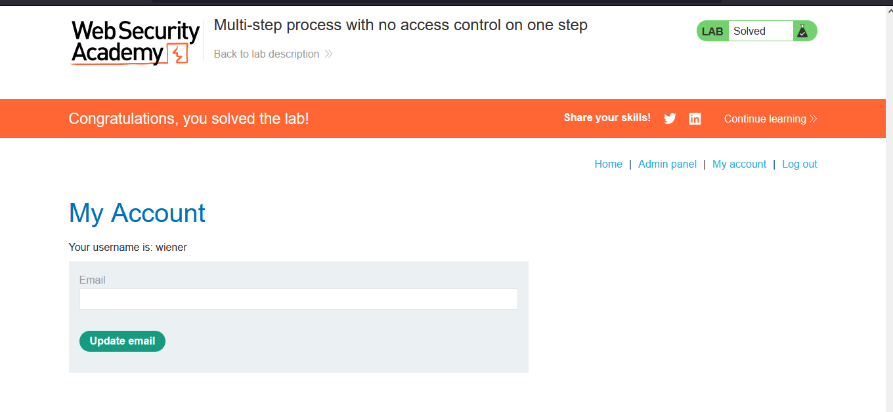
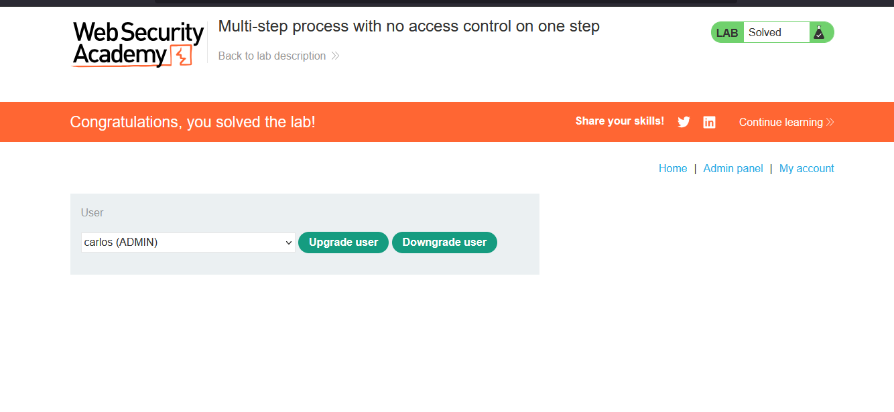

# Lab: Multi-step process with no access control on one step

> Lab Objective: log in using the credentials wiener:peter and exploit the flawed access controls to promote yourself to become an administrator.

- Login as an Administrator using provided credentials `administrator:admin, then access the admin panel, and upgrade carlos to an Administrator.

- You'll notice that the Process is Multi-Step (2 steps only):

  1. Send the request which indicates the specified user and the action (upgrade or downgrade).
     
  2. Then you're prompted to confirm the action taken.
  3. If Yes (or confirmed), the following request will be sent with `confirmed=true`.
     
  4. After confirmation, the user carlos became an admin.
     

- Logout from administrator account and login as a normal user using provided credentials `wiener:peter`.

- Copy the issued cookie to the normal account and paste it in the first step to upgrading a user to admin, you'll notice that you're not authorized.
  

- Try changing the request method to `POSTX` or the whole request to a `GET` request, and you'll get the same result `"Unauthorized"`
  

- But in the 2nd step of the upgrading process, after replacing the cookie of the admin with your cookie as a normal user and place your username in the `username` parameter, if you issued this request it's accepted normally.
  

- And you became an administrator and the lab is solved.
  
  

---
