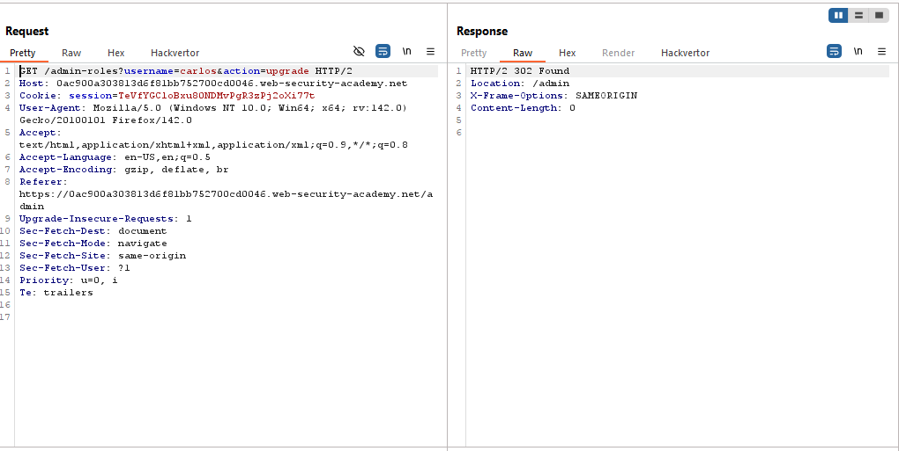
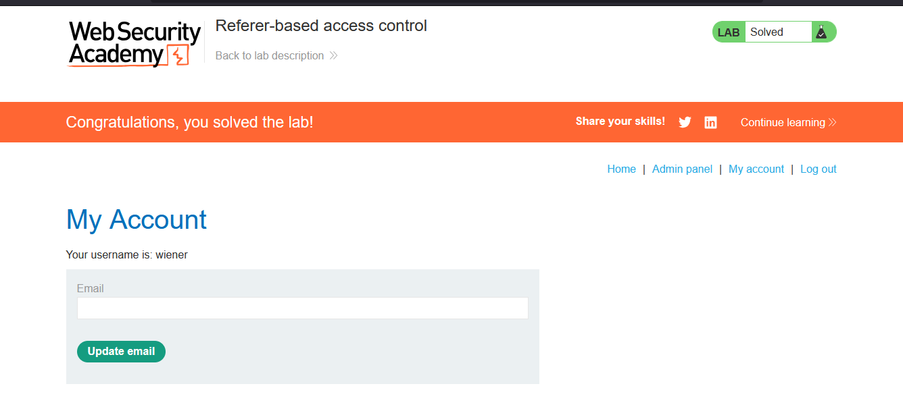
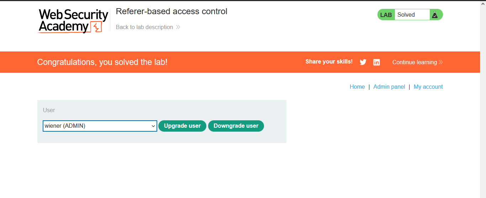

# Lab: Referer-based access control

> Lab Objective: log in using the credentials wiener:peter and exploit the flawed access controls to promote yourself to become an administrator.

- Login as an administrator through the provided credentials `administrator:admin`, access the admin panel and upgrade the user carlos to an administrator, then inspect the requests made.

- You'll notice that a single `GET` request is made, indicating the username and action.
  

- Login as a normal user using provided credentials `wiener:peter` through a private window, copy issued cookie, and place it as the cookie value in the request to upgrade a user.

- Replace the admin's cookie with your cookie, and replace the existing username with your username, then issue the request.

- You'll notice that the action has been accepted, and you're upgraded to admin and have access to the admin panel, and the lab is solved.
  
  

---
