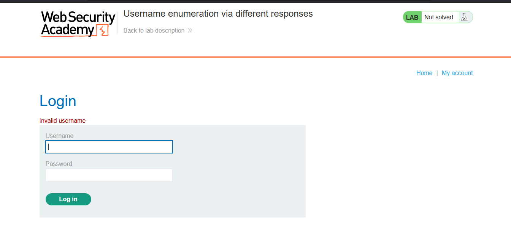
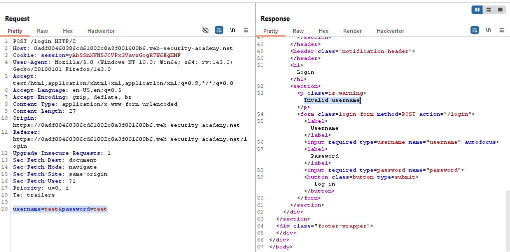
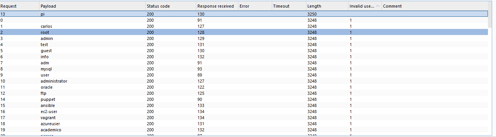
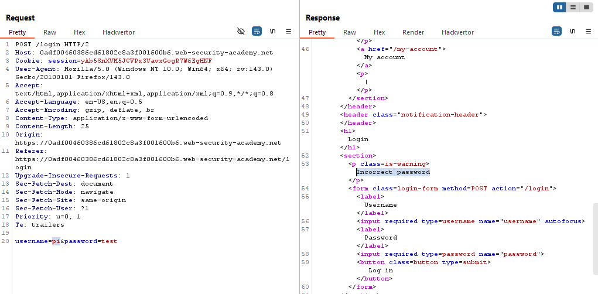
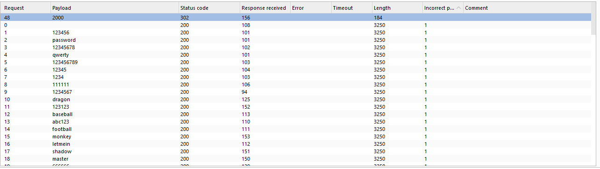
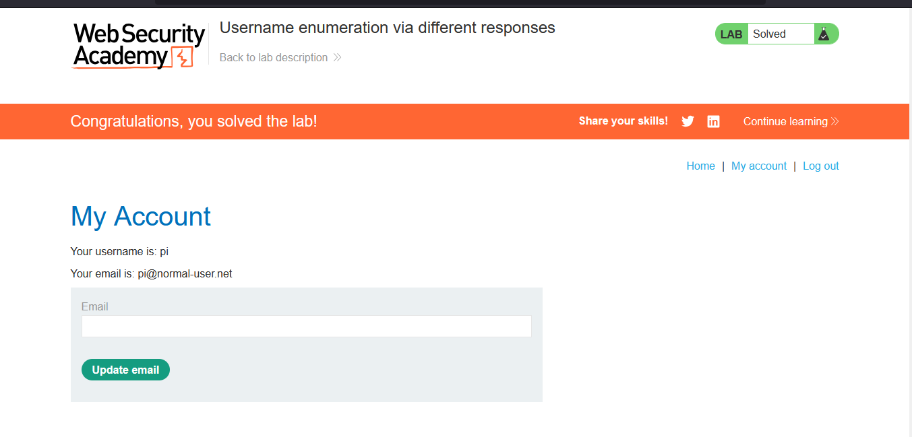

# Lab: Username enumeration via different responses

> Lab Objective: enumerate a valid username, brute-force this user's password, then access their account page.

- Try to login with these test credentials `test:test`, you'll get an `Invalid Username`.
  
  

- Therefore, try to enumerate a set of valid usernames, by doing the following:

  - Send the login request to Burp Intruder.
  - Select the `username` parameter value as the payload.
  - Then use the simple list of usernames (provided by portswigger).
  - Start the attack, then monitor a response that doesn't include `Invalid Username`.

- You'll notice that the response for the username `pi` doesn't include `Invalid Username`.
  
  

- After that, brute-force on the password for the account with username `pi` doing the same steps for enumerating usernames.

- You'll notice that the only request that doesn't include `Invalid password` was the one with password `2000`
  

- Therefore, login using those credentials `pi:2000`, and you'll be able to access his home page, and the lab is solved.
  

---
