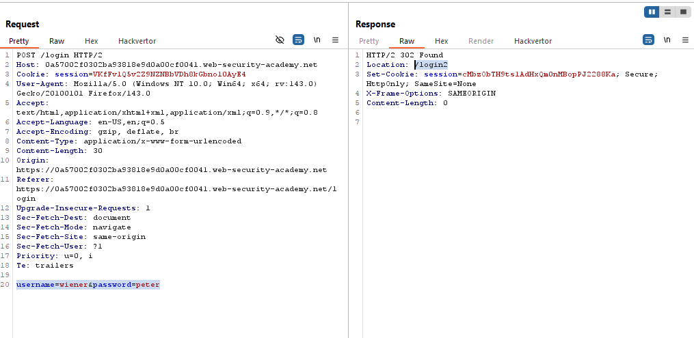
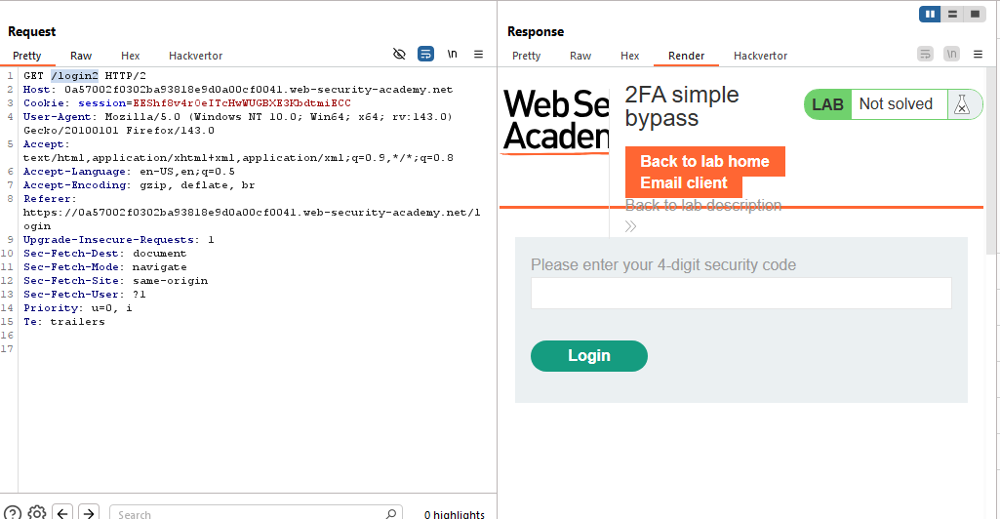
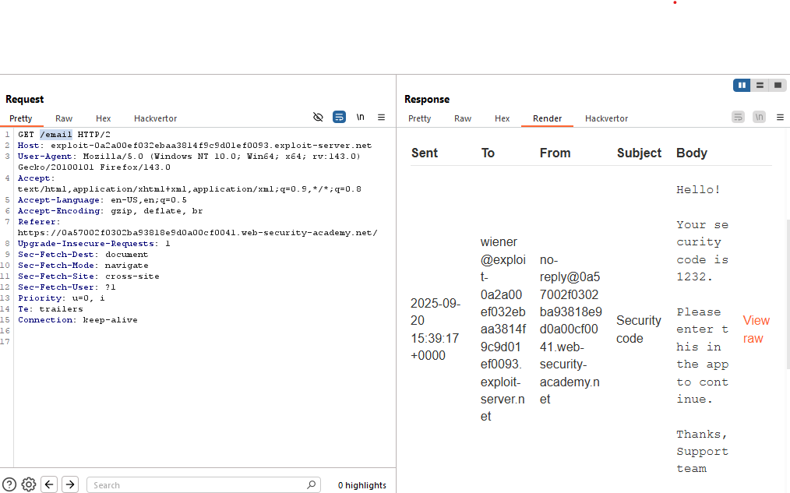
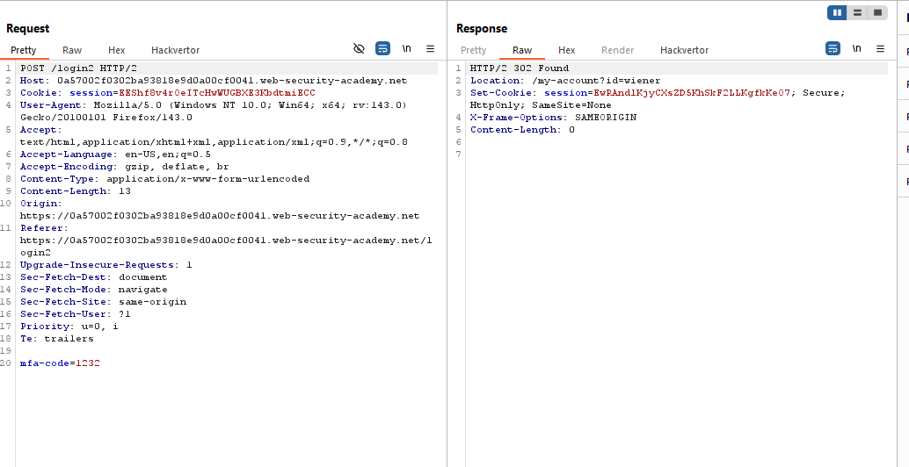
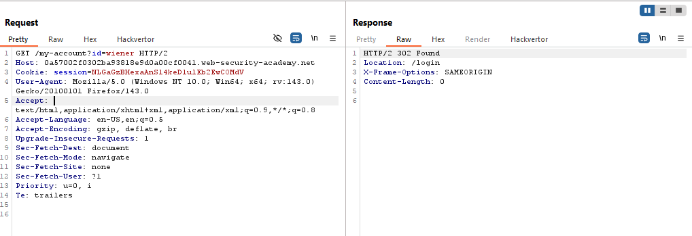
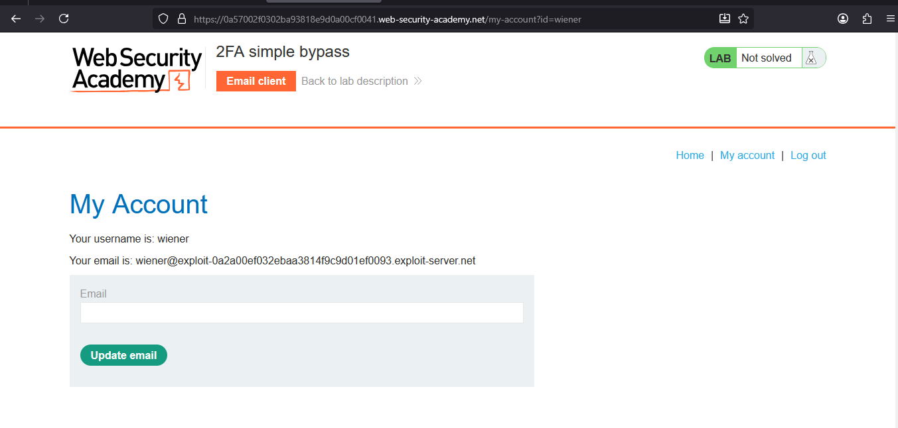
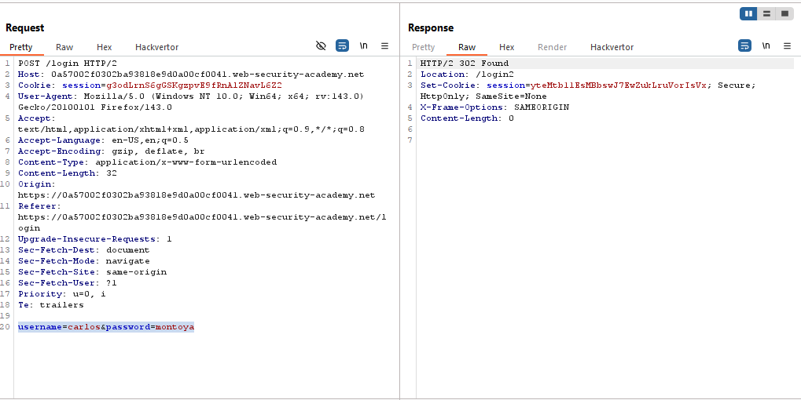
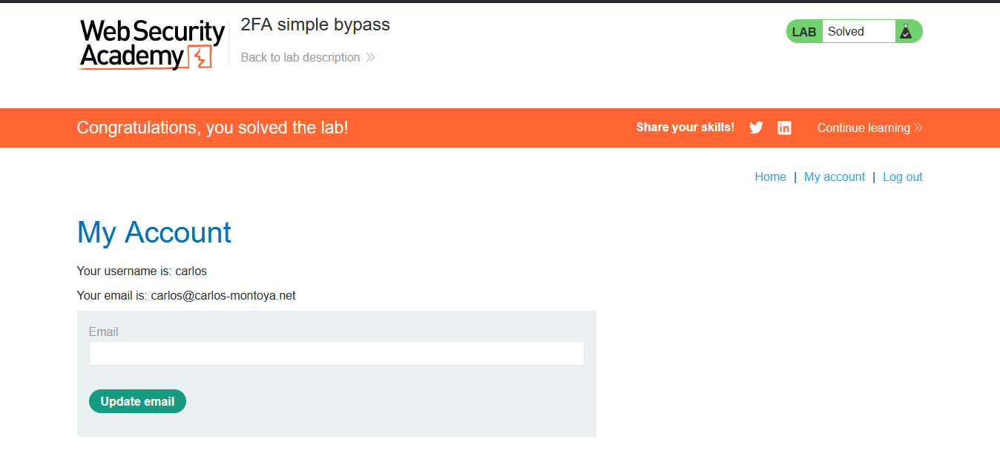

# Lab: 2FA simple bypass

> Lab Objective: access Carlos's account page.

- Login using provided credentials `wiener:peter`, then inspect the requests made through the login process.

- The Login process:

  1. You login using username and password in `/login` endpoint.
     
  2. then redirected to `/login2`, where you're prompted to enter a 4-digit security code.
     
  3. Then you've to access the email client to be able to retrieve the 4-digit security code.
     
  4. Finally, you enter the retrieved security code, and you're redirected to your account home page
     

- A Quick Note:

  - After successfully logging, I have access to this endpoint `/my-account?id=wiener`, which is my account home page.

- I'll try to logout from my account and access this endpoint, which will redirect me to the login page.
  

- But with only completing the first step of logging in (which is entering valid credentials), then accessing this endpoint `/my-account?id=wiener`, I'll be able to access it directly.
  

- I've obtained a victim's credentials `carlos:montoya`, therefore in order to obtain his account home page without 2FA, I'll simply do the same.

- Firstly, login using obtained credentials `carlos:montoya`.
  

- Then try to access this endpoint `/my-account?id=carlos` without the 2FA Step.

- I was able to access Carlos's account home page, and the lab is solved.
  

---
