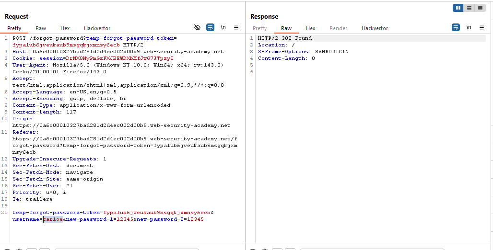

# Lab: Password reset broken logic

> Lab Objective: reset Carlos's password then log in and access his "My account" page.

- The processes for `Forgot Password?` functionality:

  1. Submit a `POST` request to `/forgot-password` endpoint with your username or email.
     
  2. Access the client email, you'll find a reset password link in the following form:

  ```url
  https://LAB-URL/forgot-password?temp-forgot-password-token=fypalub6jveukaub9msgqkjxmnsy6ecb
  ```

  3. You'll be prompted to enter the new password twice.
     
  4. The following request will be sent and your password is reset successfully.
     

- When changing the username from `wiener` (my valid username) to `carlos` (the victim's username) the request is accepted with no errors.
  

- When trying to login using the new password for the user carlos `12345`, I've logged in successfully and accessed Carlos's account home page, and the lab is solved.
  

---
