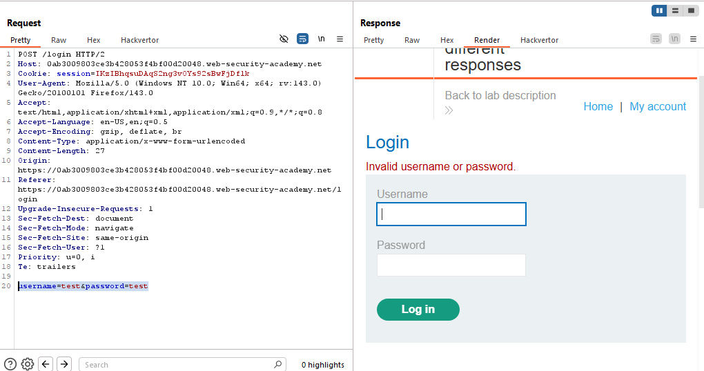
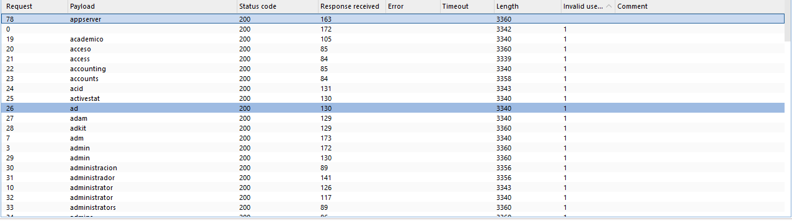
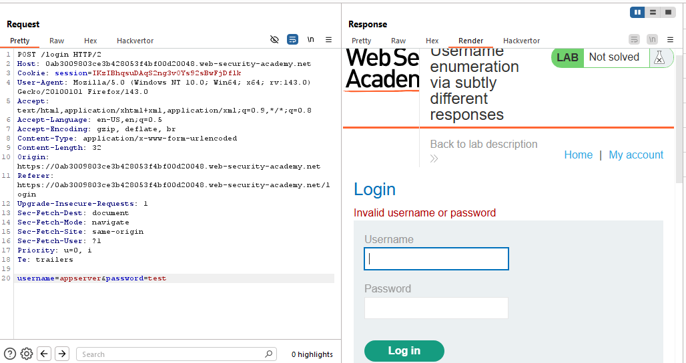
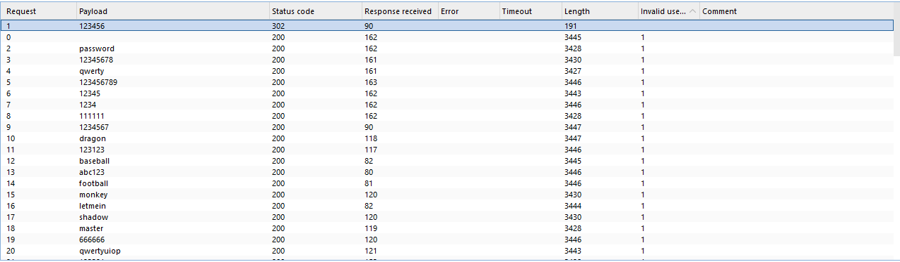
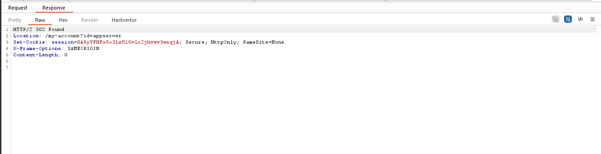
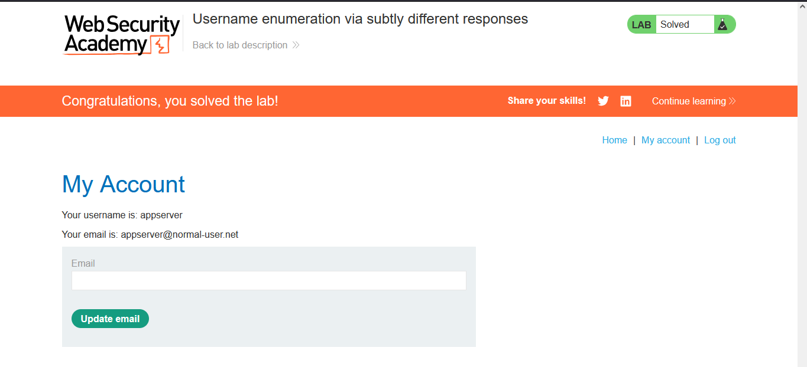

# Lab: Username enumeration via subtly different responses

> Lab Objective: enumerate a valid username, brute-force this user's password, then access their account page.

- Login using test credentials `test:test`, you'll get an `Invalid username or password.`.
  

- Try to enumerate usernames to find a set of valid usernames, through the following steps:

  - Send the login request to the intruder.
  - Add the username parameter value as the payload.
  - Then add a list of known usernames (provided by portswigger).
  - Add the returned statement from the invalid request `Invalid username or password.` to Grep - Match section in order to know which response doesn't include this statement.
  - Start Attack.

- After the attack has finished, you'll notice that the `appserver` username is the only request with no `Invalid username or password.` statement.
  

- But instead, we get this statement `Invalid username or password`, which differs from the first one in the trailing dot `.`, since there's a difference, therefore the username is right.
  

- The next step is to brute-force on the passwords with `appserver` username used, using the same processes used when enumerating usernames.

- The only request that doesn't include this `Invalid username or password` statement, is with the password `123456`.
  
  

- Therefore, try logging in using the obtained credentials `appserver:123456`.

- I've gained access to appserver account home page, and the lab is solved.
  

---
