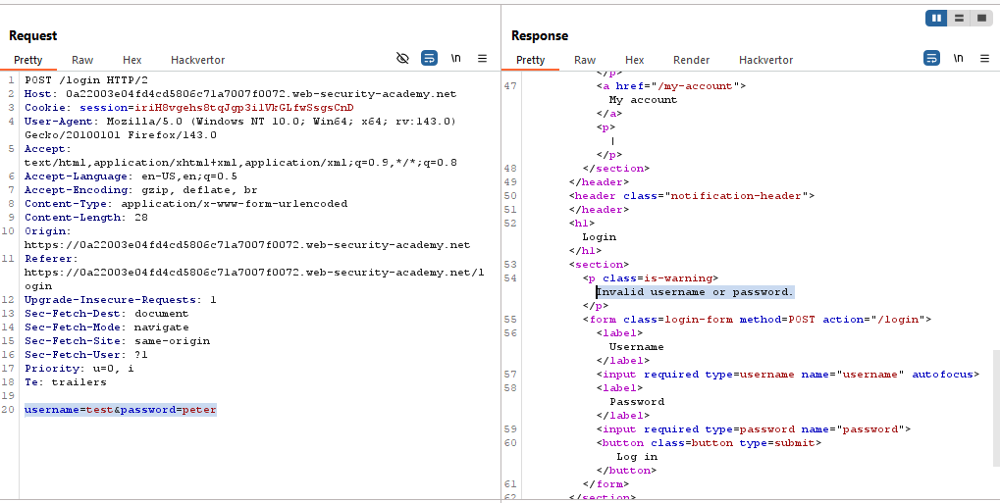
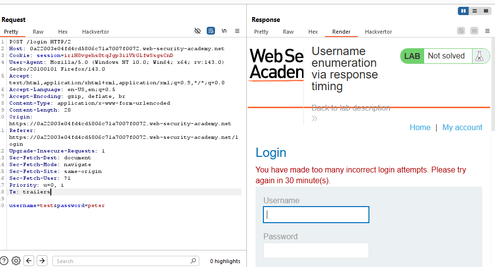
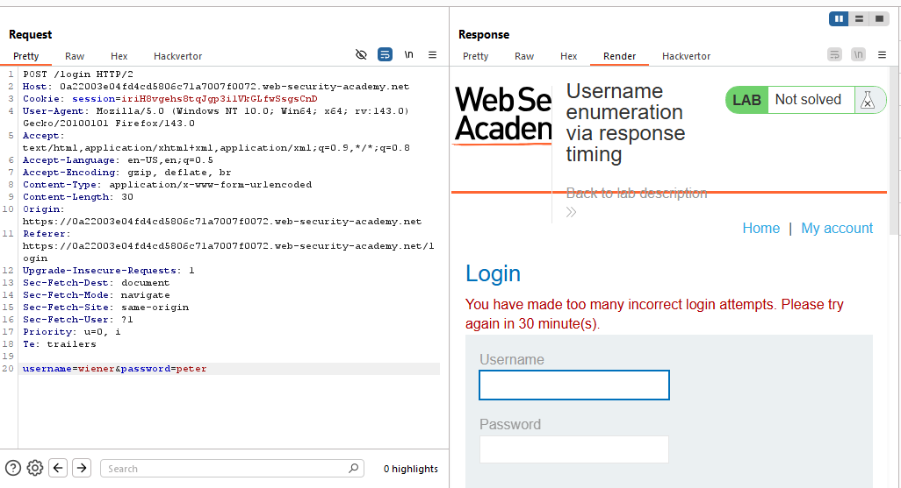
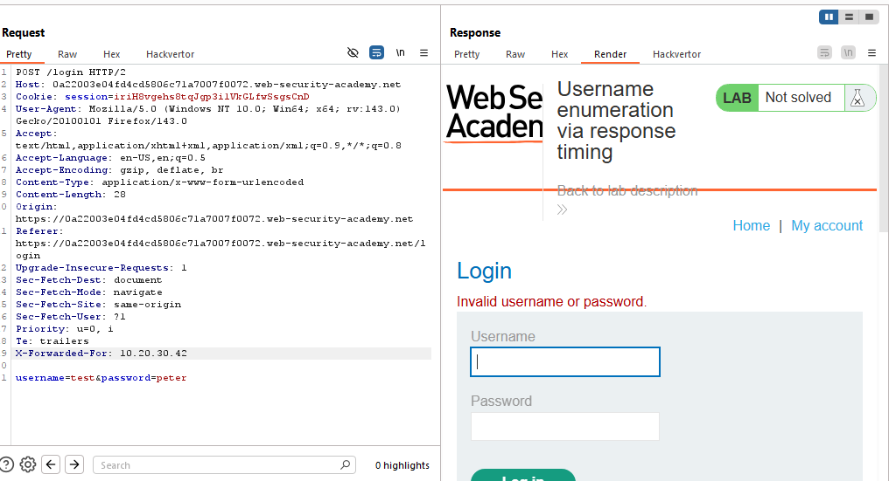
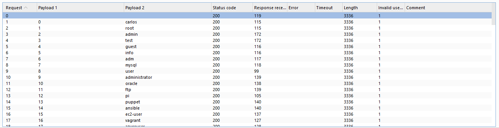
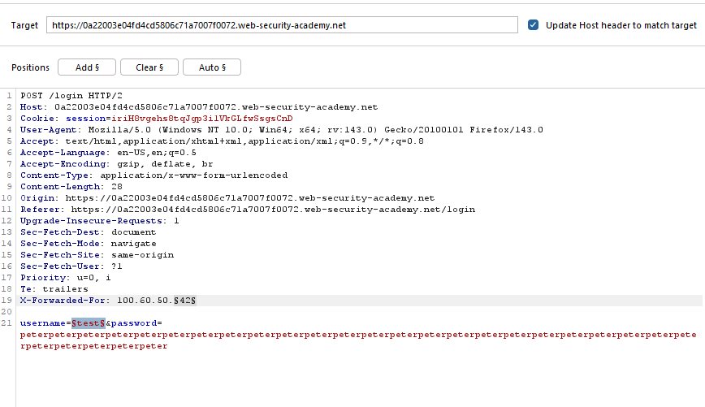
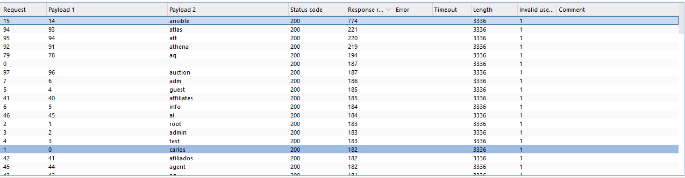
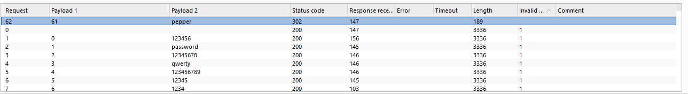
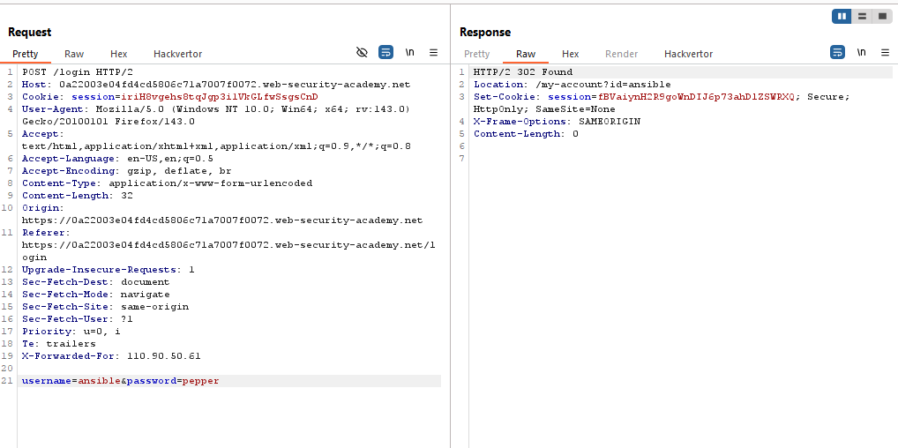
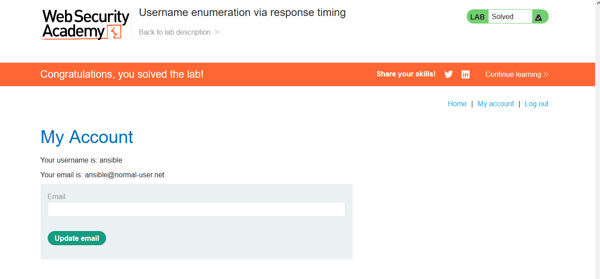

# Lab: Username enumeration via response timing

> Lab Objective: enumerate a valid username, brute-force this user's password, then access their account page.

- Firstly, try logging in using test credentials `test:test`, then capture the login request.

- You'll get `Invalid username or password.` in the response.
  

- Repeat this trial 3 times, the 4th time you'll be blocked from logging in.
  

- Even if you entered your valid credentials `wiener:peter`, you still be blocked.
  

- But when changing your IP using `X-Forwarded-For` header, for instance: `X-Forwarded-For: 10.20.30.40`.

- You'll notice that your request is submitted and not blocked.
  

- Therefore, in order to enumerate usernames, you need to do two things:

  1. Change your IP with every request using this header `X-Forwarded-For`.
  2. Enumerate usernames using a wordlist of well-known usernames.

- You'll notice that all requests were invalid, and returned the same statement `Invalid username or password.`.
  

- I'll try the same attack again, but in the password parameter value I'll place a long password, therefore if the username is right the application will take a slightly longer time to check the password (the operation of transform the password to hash and compares it with the password related to the right usernames retrieved from the Database).
  

- You'll notice that there is a request that toke more time than other requests.
  

- Therefore, the valid usernames is `ansible`.

- Repeat the same attack but:

  - With the right username.
  - Brute-force on passwords.

- You'll notice the only request that doesn't include the `Invalid username or password.`, with the following credentials `ansible:pepper`.
  
  

- Login using those credentials `ansible:pepper`, and the lab is solved.
  

---
