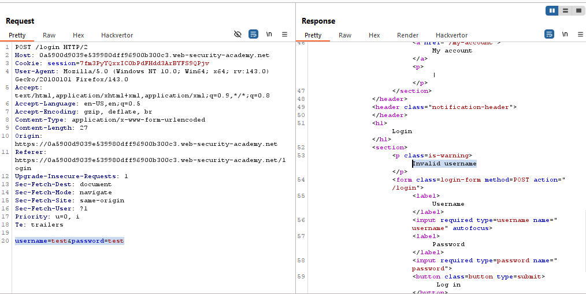
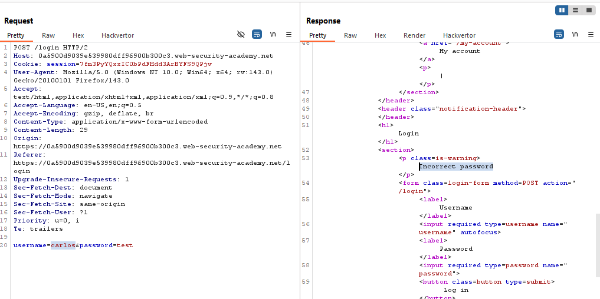
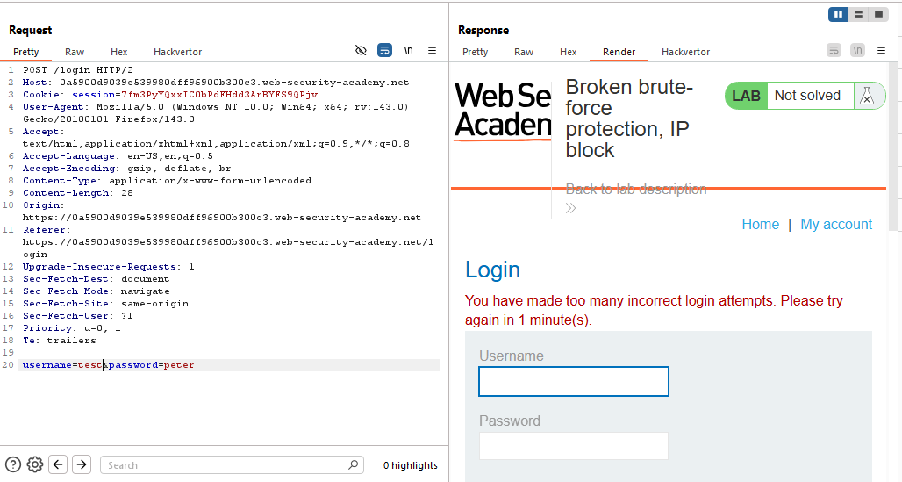
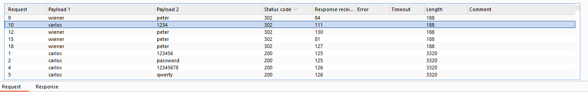
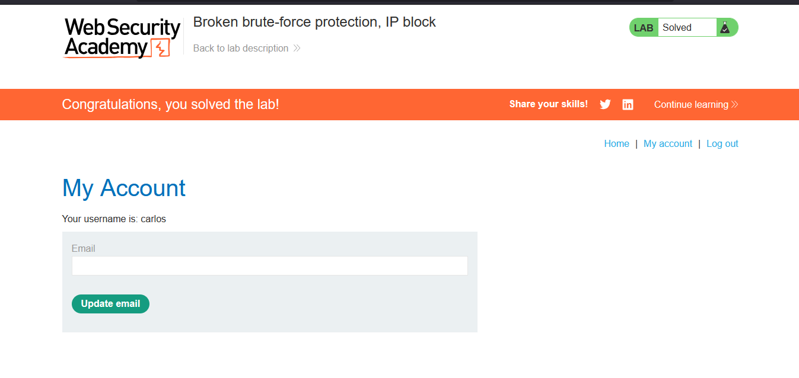

# Lab: Broken brute-force protection, IP block

> Lab Objective: brute-force the victim's password, then log in and access their account page.

- Login using test credentials `test:test`, capture the request, you'll notice that the response returns `Invalid username` statement.
  

- But when using a valid username `carlos`, the response returns `Incorrect password` statement.
  

- When you submit 3 requests with invalid credentials, your 4th request will be blocked for 1 minute.
  

- But if you tried 2 subsequent requests with invalid credentials but the third request is with valid credentials your 4th request will not be blocked.

- Therefore, use the intruder for such an attack, get a wordlist of known passwords then embed valid credentials `wiener:peter` after each two passwords using the following script.

- Do the same with username, you'll the two files with this report.

- You'll notice the only request that return `302` response code and not with the valid credentials `wiener:peter`, is with those credentials `carlos:1234`.
  

- Therefore, login using those credentials `carlos:1234`, and you'll be able to access Carlos's home page and the lab is solved.
  

---
