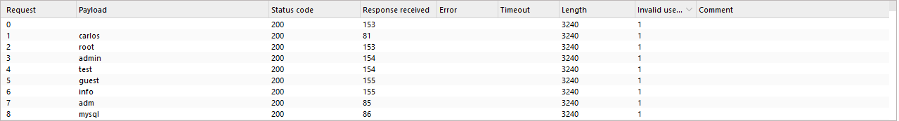

# Lab: Username enumeration via account lock

> Lab Objective: enumerate a valid username, brute-force this user's password, then access their account page.

- Login using test credentials `username:test`, then capture the login request.

- I've sent the request with invalid credentials (received `Invalid username or password.`), and I'm not blocked.
  

- Therefore, enumerate usernames (using burp intruder for instance).

- You'll notice that all requests include `Invalid username or password.` statement, therefore I'm not able to deduce which is the valid username.
  

- Therefore, I'll try to use each username with all passwords (both of them from wrodlists provided by Portswigger).

- You'll notice that some requests are blocked.
  

- When I sent the request multiple times using a non-valid username (like `test`) the request wasn't blocked, but when using a valid username (like `apache`, deduced from the intruder attack) the request was blocked after the 3rd invalid request.

- Therefore, I'll brute-force passwords on `apache` username, but with extracting both `Invalid username or password.` and `Invalid username or password.` and `You have made too many incorrect login attempts. Please try again in 1 minute(s).`.

- You'll notice that there is a single request that doesn't include both statements.

- Try to login using these credentials `apache:777777`
  

- You've logged in and accessed `apache` account page, and the lab is solved.
  

---
