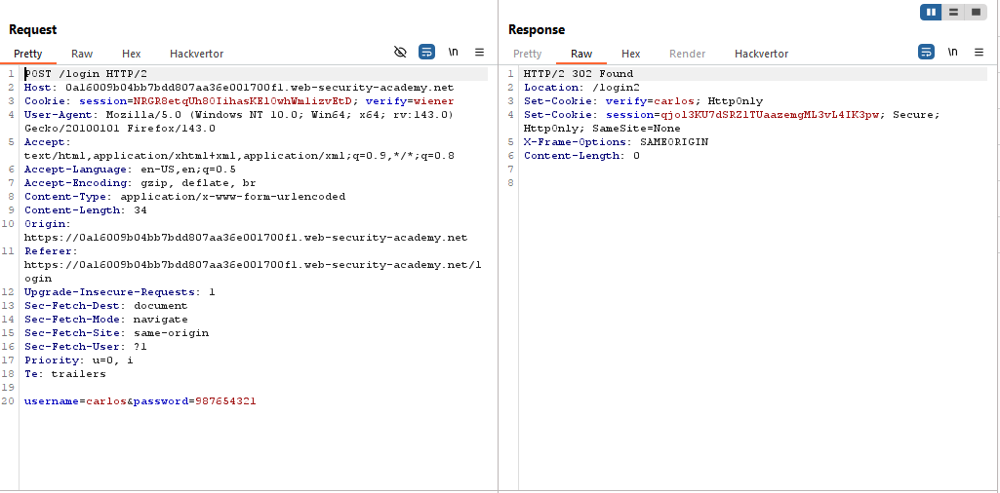

# Lab: 2FA broken logic

> Lab Objective: access Carlos's account page.

- Login using provided credentials `wiener:peter`, then inspect the requests made to notice the login process:

  1. Login using usernames & password.
     
  2. Redirected to `/login2`, where you're prompted to enter a 4-digit security code.
     
  3. Visit your Email, where you'll find the 4-digit security code, and submit it.
     
  4. After submitting it, if it's correct you'll be redirected to you account page `/my-account?id=wiener`.
     

- If you tried to use the same Security Number, your request will be blocked.
  

- Firstly, I've the victim's username which is `carlos`, therefore Brute-Force on the password, you'll notice that you was able to retrieve it.
  
  

- Login using retrieved credentials `carlos:987654321`, and you're prompted to enter a 4-digit security code.

- I'll try to brute-force on the security code from `0000` to `9999`.

- Note:

  - Python Script and Sequence of numbers included with the report to this lab.

- After the attack is done, you'll notice that there is a request that didn't include `Incorrect security code`, and redirected to `/my-account?id=carlos`.
  

- Therefore, take the cookie from the response to that request, and paste it into your browser.
  

- Then type `/my-account?id=carlos` this path into the URL, and you're able to access Carlos's account page, and the lab is solved.
  

---
