# Lab: Brute-forcing a stay-logged-in cookie

> Lab Objective: brute-force Carlos's cookie to gain access to his My account page.

- Login using provided credentials `wiener:peter`, then inspect the login process.

- The Login Process without `Stay Logged in` Option enabled:

  1. Enter valid Username & Password.
     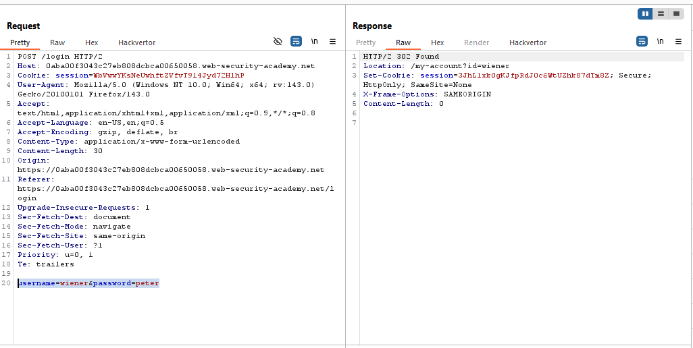
  2. If valid, you'll be redirected to your account page.
     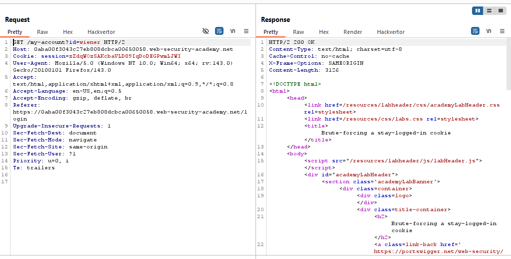

- The Login Process with `Stay Logged in` Option enabled:

  1. Enter valid Username & Password, if valid you'll be issued a `stay-logged-in` cookie.
     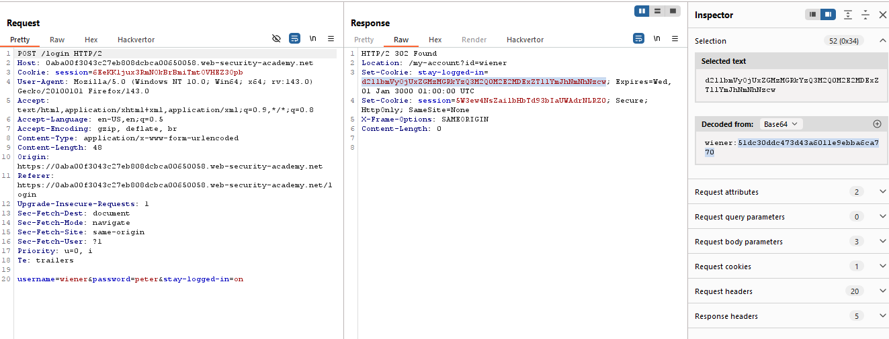
  2. If valid, you'll be redirected to your account page.
     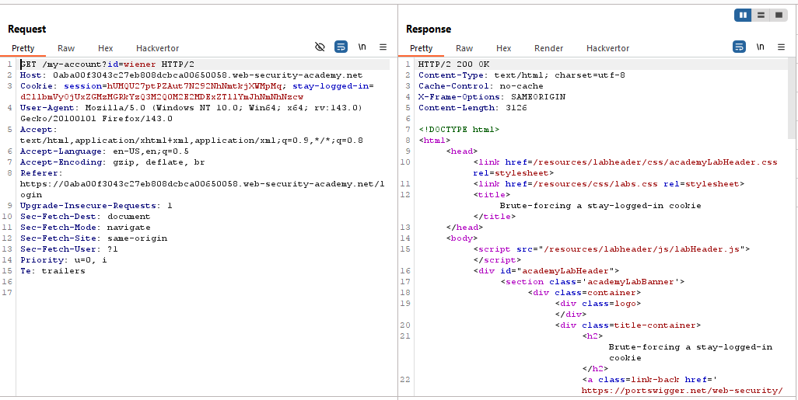

- The `stay-logged-in` cookie value after Base64 decoding, it appears to be your username + password md5 hashed, for instance:

  - The issued stay-logged-in cookie:
    `d2llbmVyOjUxZGMzMGRkYzQ3M2Q0M2E2MDExZTllYmJhNmNhNzcw`
  - The value after Base64 decoding:
    `wiener:51dc30ddc473d43a6011e9ebba6ca770` - Try to configure the hashed value for this value `51dc30ddc473d43a6011e9ebba6ca770`, it'll be the password `peter`.

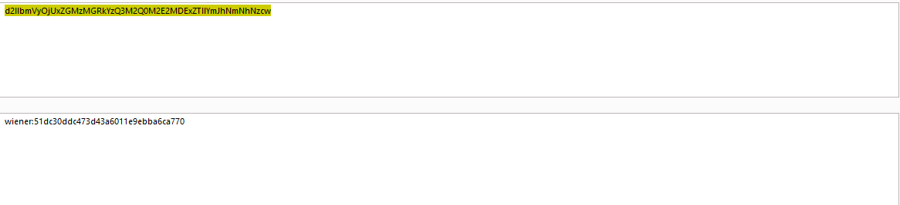
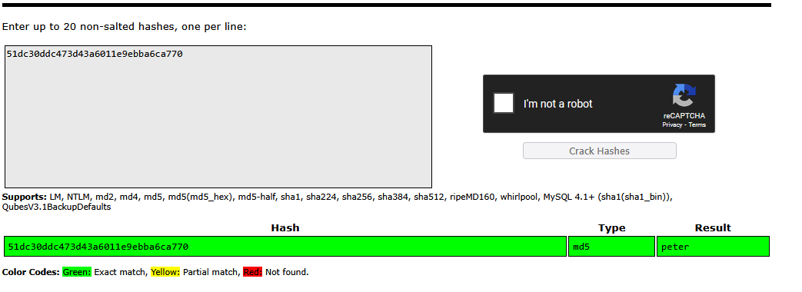

- On the other hand, the application checks if this cookie exist and valid to authorize you to access your account page.
  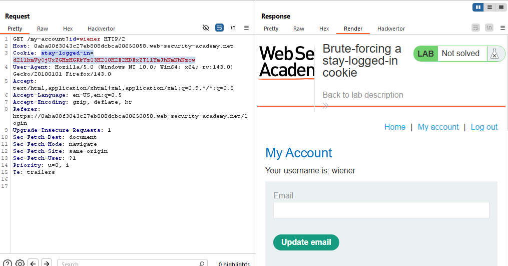

- I've the victim's username `carlos`.

- Therefore, I'll brute force the `stay-logged-in` cookie (change the value of the id parameter to carlos instead ot wiener):

  1. Use a wordlist of known passwords as the payloads.
  2. Add rules for Payload Processing:
     1. Hash the password using MD5.
     2. Add `carlos:` as a prefix.
     3. encode the resulted value `carlos:hashed_password` using Base64.

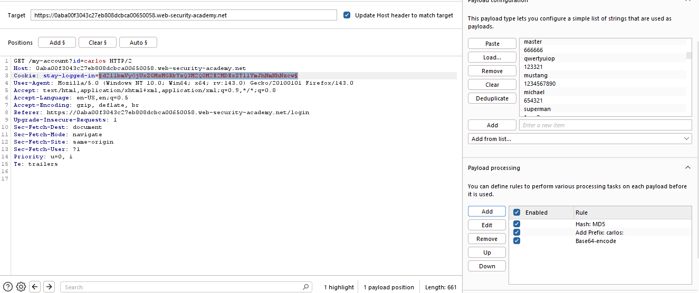

- You'll notice that there is a valid cookie that will be redirected to Carlos's Account page.
  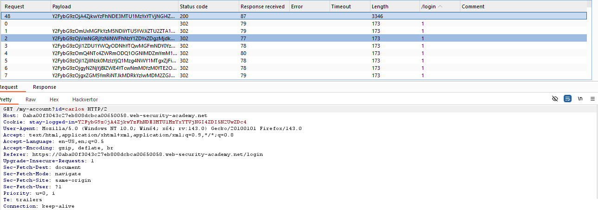
  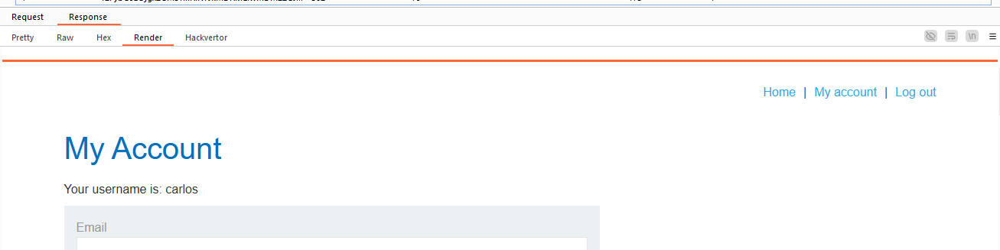

- Therefore, copy this cookie and use it in your browser, and access Carlos's account page `/my-account?id=carlos`.

- You've accessed Carlos's Account Page, and the lab is solved.
  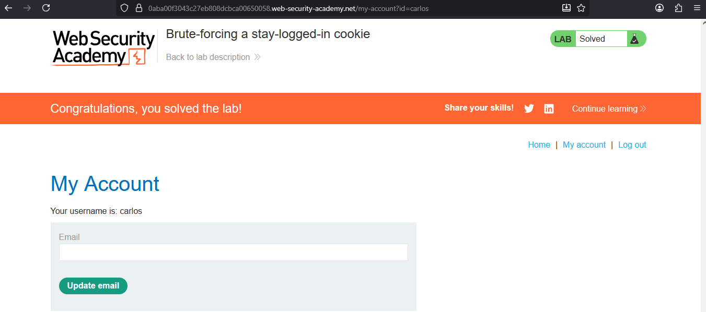

---
