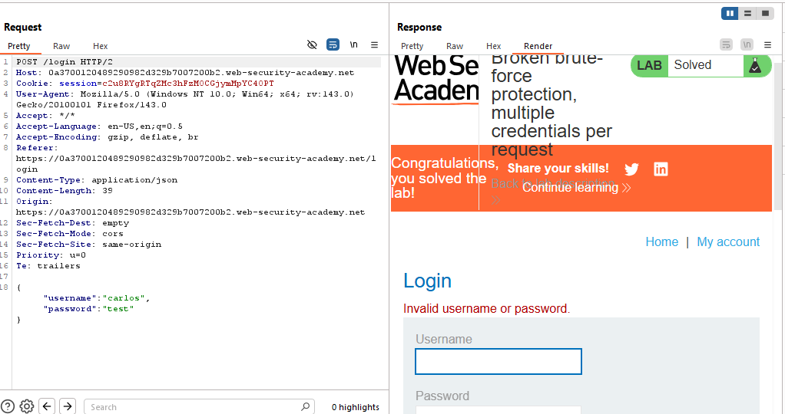
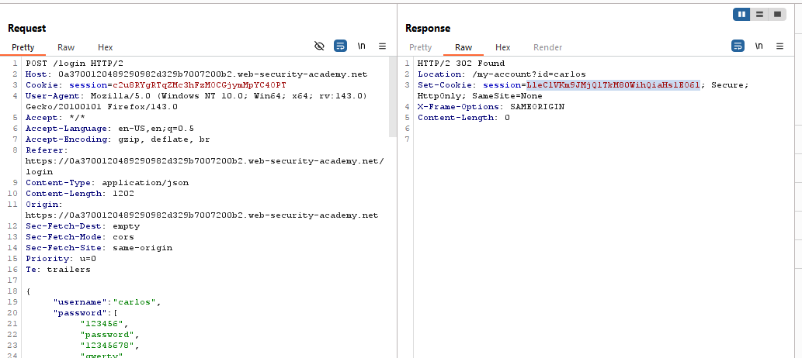
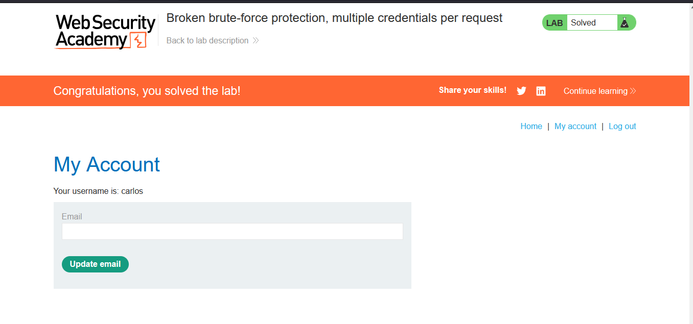

# Lab: Broken brute-force protection, multiple credentials per request

> Lab Objective: brute-force Carlos's password, then access his account page.

- Send a login request using this credentials `carlos:test`, then capture the request.

- You'll notice that you've received `Invalid username or password.`, but the credentials are sent in JSON format.
  

- Therefore, try to send multiple passwords for the same user in the same request in this form:

```json
{
"username":"carlos",
"password":[
    "123456",
    "password",
    "12345678",
    ...
    ]
}
```

- You'll notice that you've been redirected to Carlos's account page.
  

- Therefore, copy the issued cookie and paste it into your browser, then access this endpoint `/my-account?id=carlos`.

- You'll notice that you're able to access Carlos's account page, and the lab is solved.
  

---
