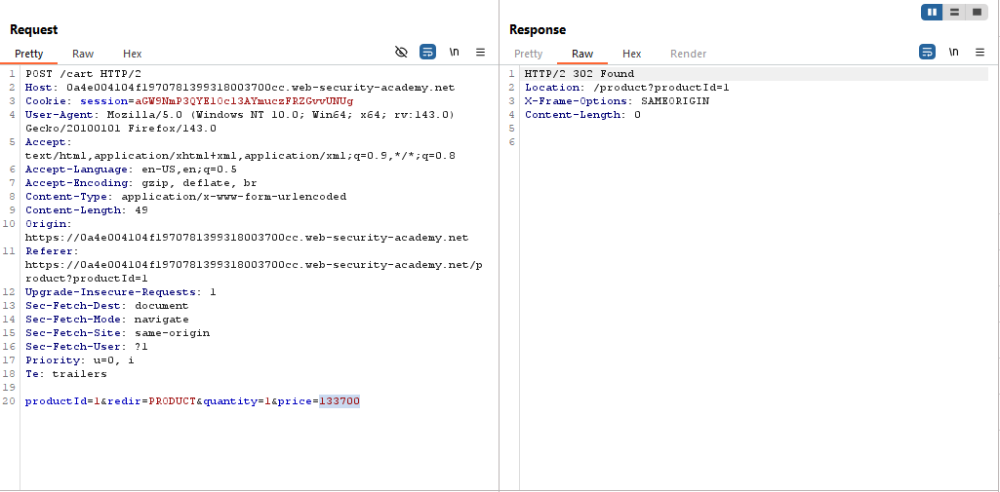
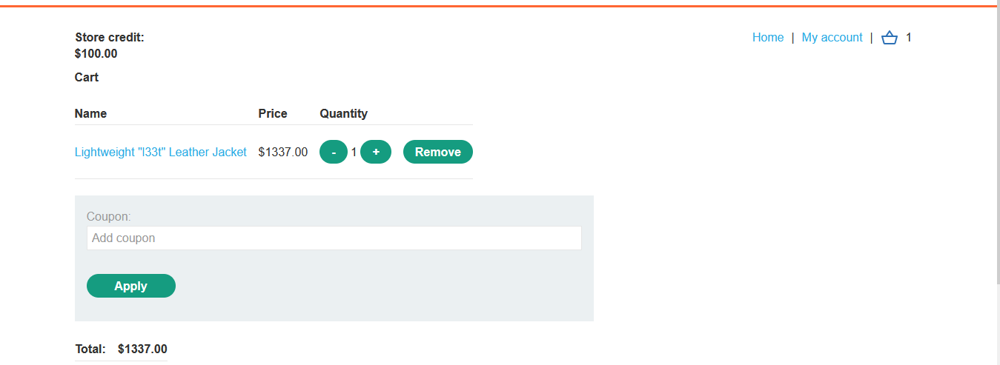
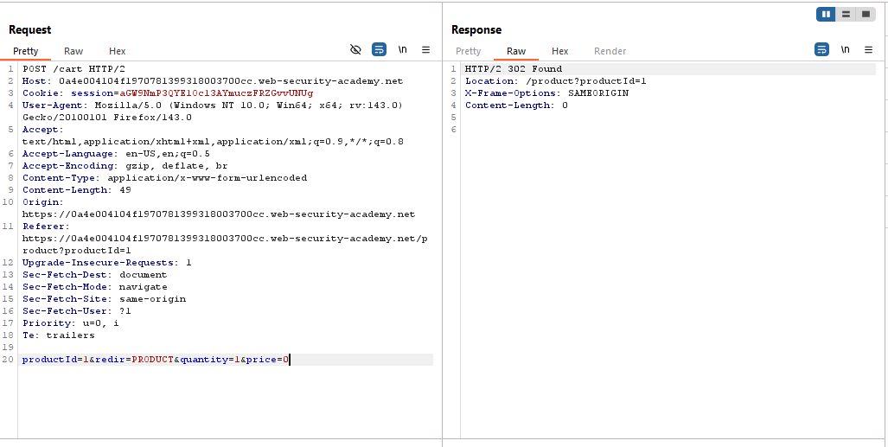
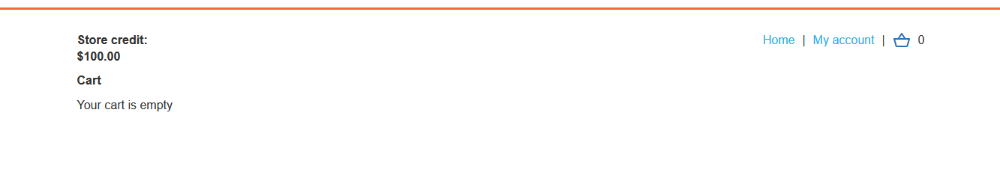
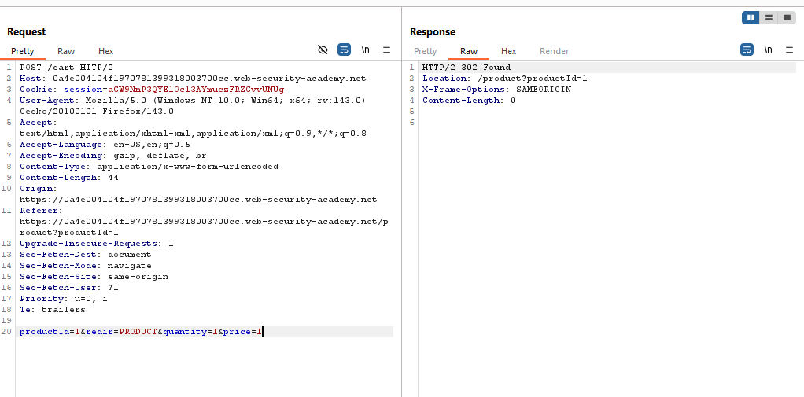
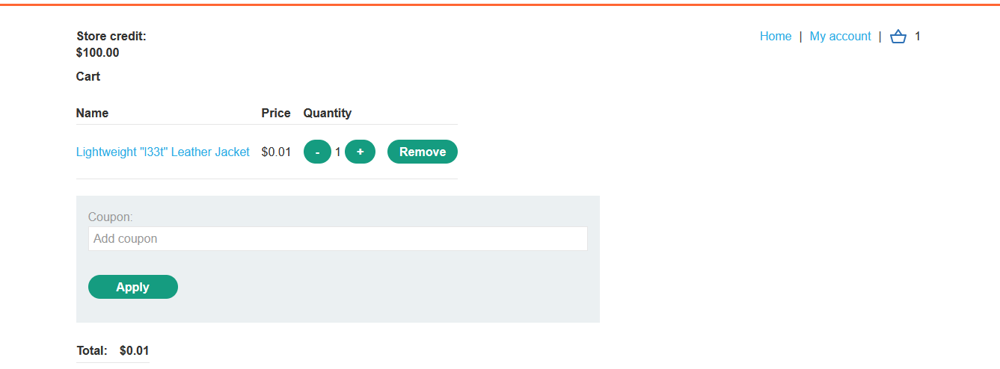
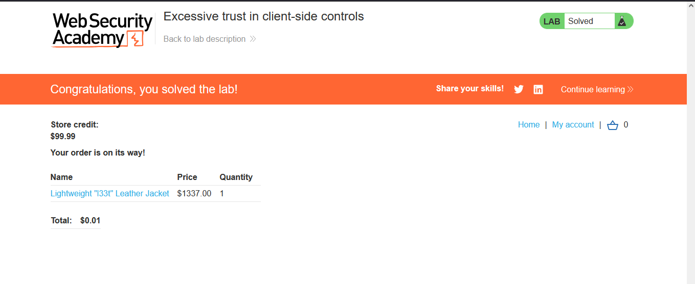

# Lab: Excessive trust in client-side controls

> Lab Objective: buy a "Lightweight l33t leather jacket".

- Login using provided credentials `wiener:peter`.

- Then visit `Lightweight "l33t" Leather Jacket` Product page, and add 1 piece of this product to the cart and intercept this request.

- You'll notice that the price of the product is sent within the request via POST data.
  

- If you've sent a normal behavior without manipulation, the product will be added to the cart with it's normal price.
  

- But return to the add to cart request and change the product price to 0, then view your cart.
  

- When viewing your cart, you'll notice that the product wasn't added.
  

- Return to add to cart request again, and change the price to 1.
  

- View you cart, and you'll notice that the price of the product has changed to $0.01.
  

- Place order for this amount of money, you'll notice that the order is placed with $0.01 and the lab is solved.
  

---
