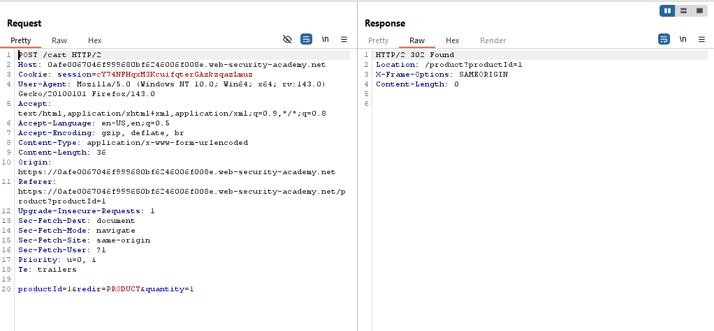
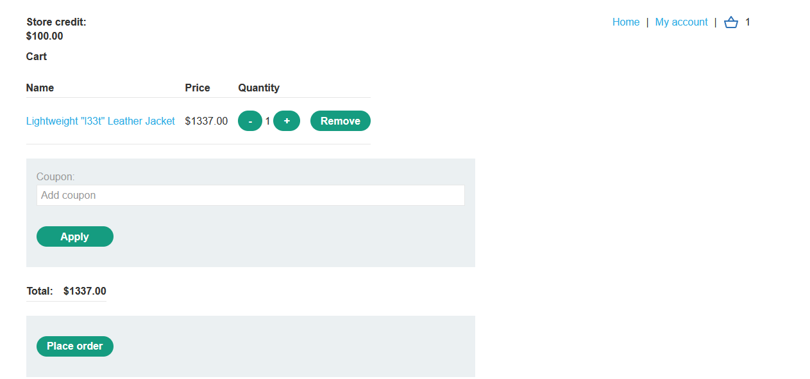
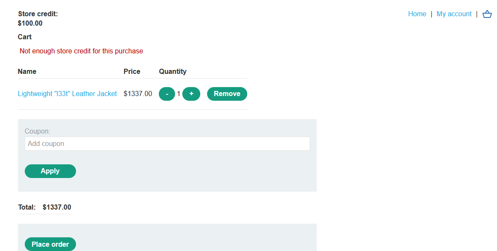
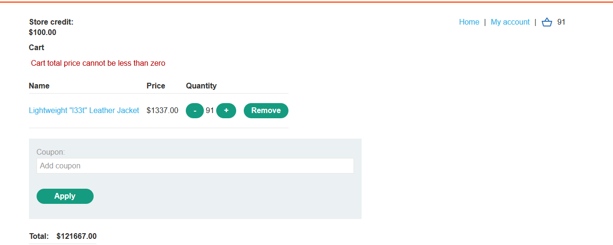
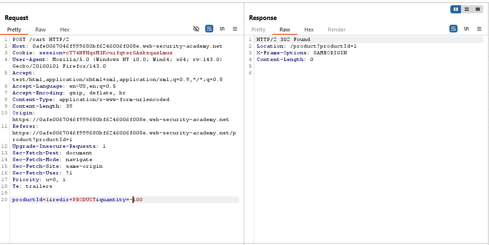
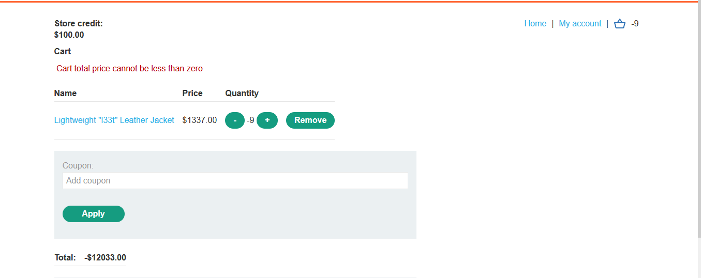
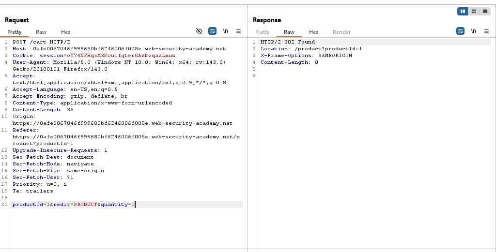
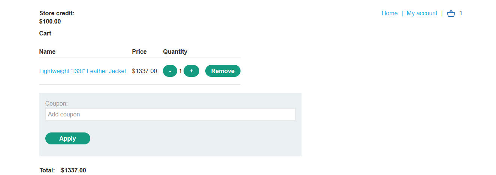
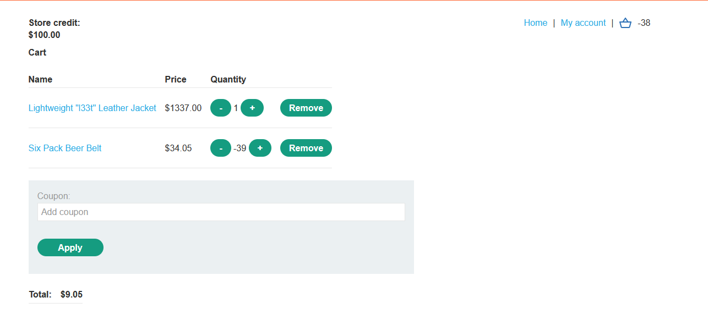
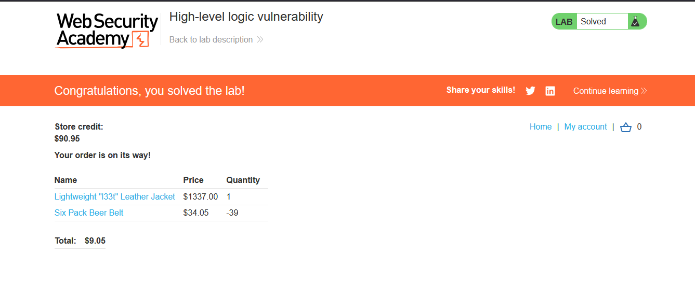

# Lab: High-level logic vulnerability

> Lab Objective: buy a "Lightweight l33t leather jacket".

- Login using provided credentials `wiener:peter`, then inspect normal behavior for purchase process.

- Normal Process:

  - Visit product page.
  - Add it to cart.
    
  - View Your cart.
    
  - Place order (even you don't have enough balance).
    

- When adding arbitrary big numbers, it's accepted.
  

- Try adding negative amount, it's also accepted.
  
  

- Therefore:

  - Add 1 jacket.
    
    
  - then add another product with negative numbers until total price is less than your balance.
    

- Currently, the total price is $9.05, try to place an order, and it's placed successfully, and the lab is solved.
  
