# Lab: Inconsistent security controls

> Lab Objective: access the admin panel and delete the user carlos.

- When you try to access the admin interface `/admin`, you're not authorized to access it.
  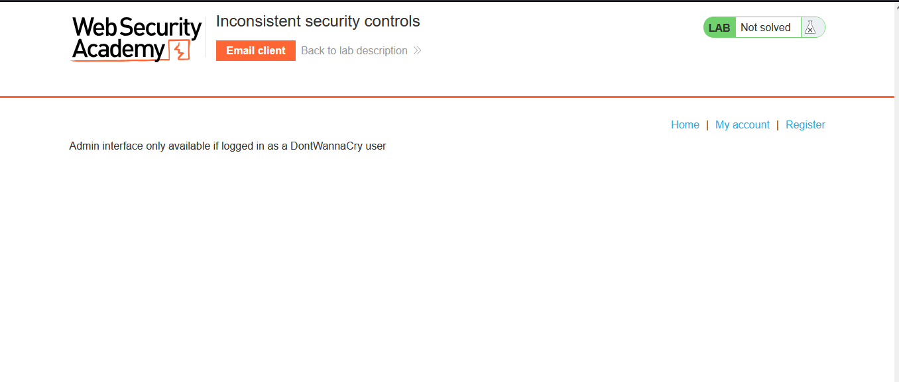

- Try to register an account you control, but in the email part add `@dontwannacry.com`.
  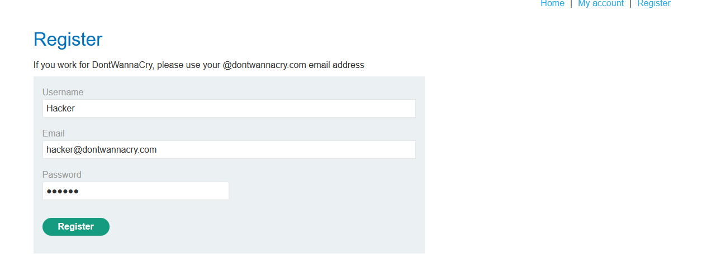

- But I have to check my email, and it's not actually mine (and it doesn't exist).
  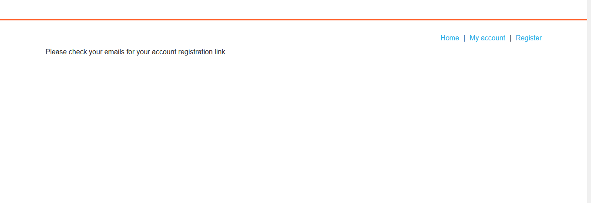

- But when using a real email (provided by portswigger), it actually worked.
  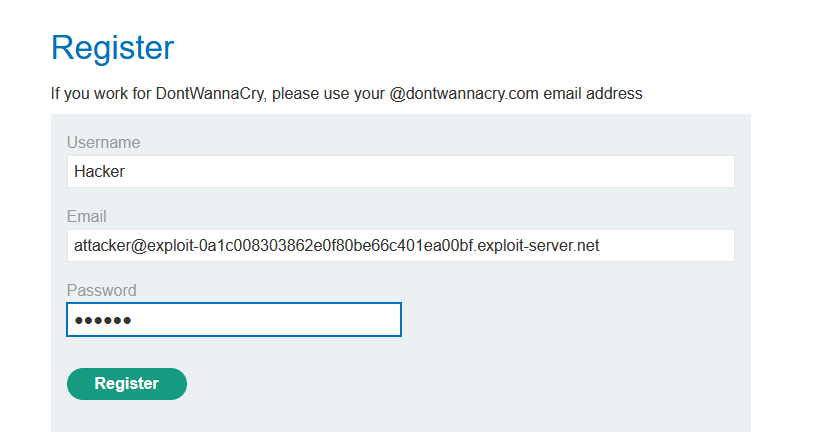
  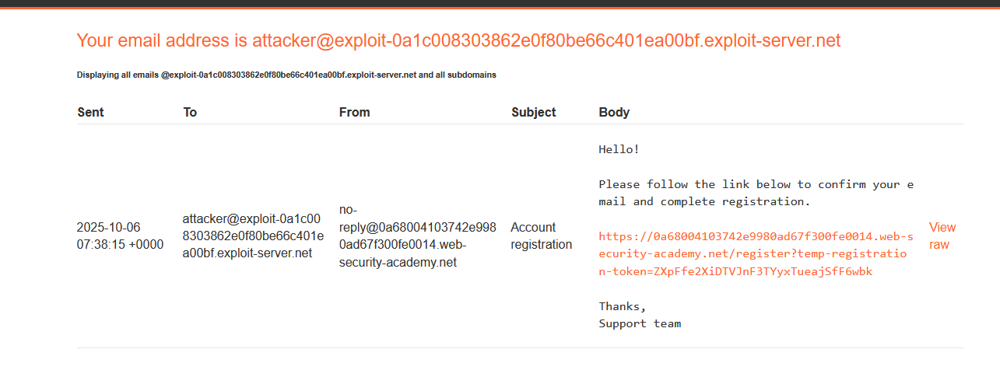

- Just click the link sent to you via your email, and the registration process will be completed.
  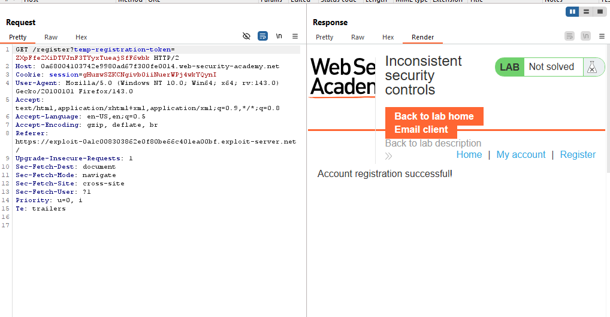

- Login using registered credentials `Hacker:123456`.

- You'll notice that there is an Update Email functionality.
  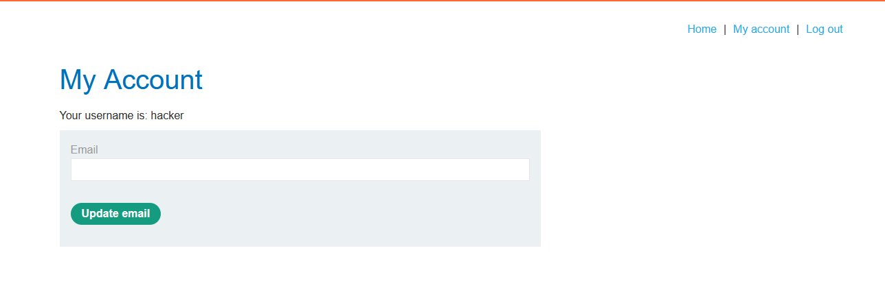

- Try to update your email to `attacker@dontwannacry.com`
  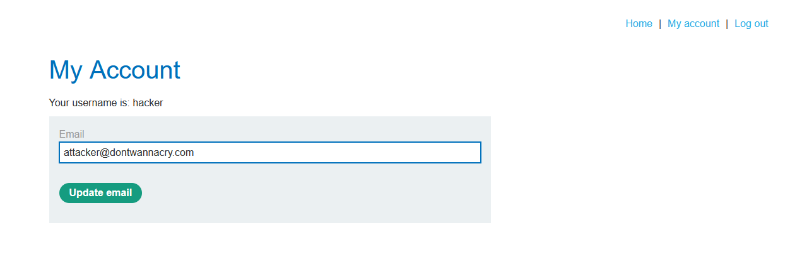

- You'll notice that the email is changed successfully, and the admin panel is shown in your account page.
  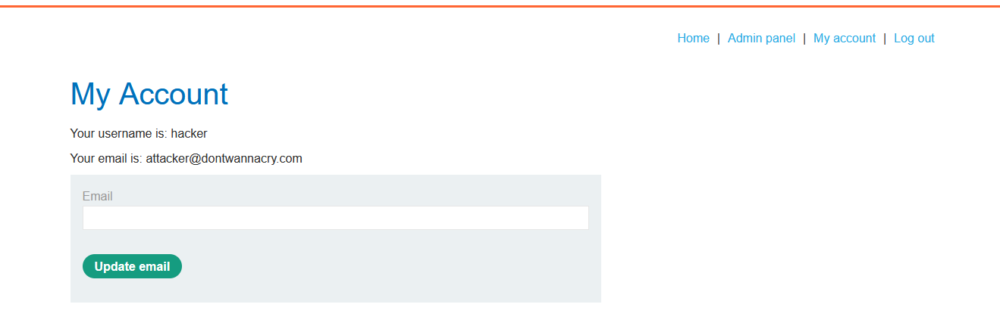

- Access the Admin Panel.
  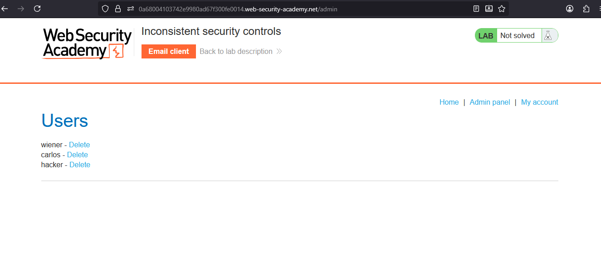

- Delete the user carlos, and the lab is solved.
  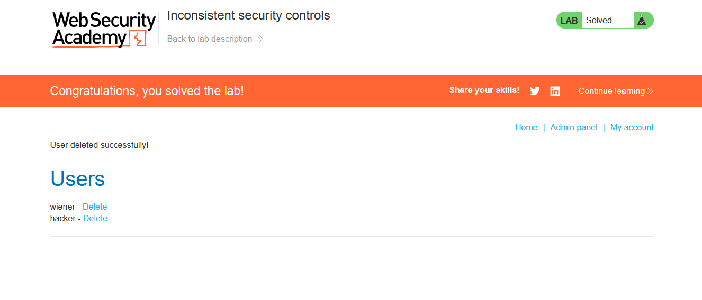

---
