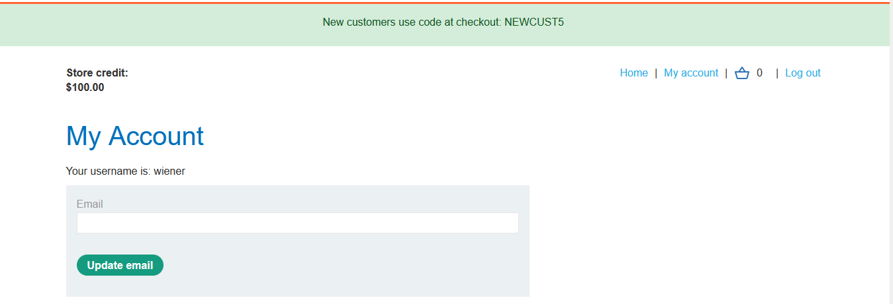
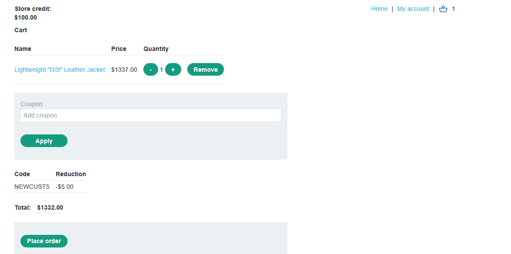
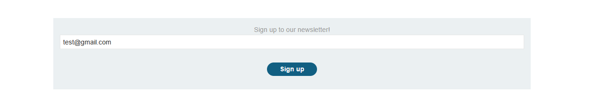
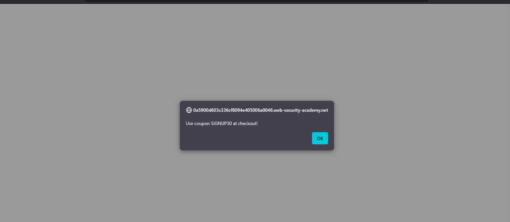
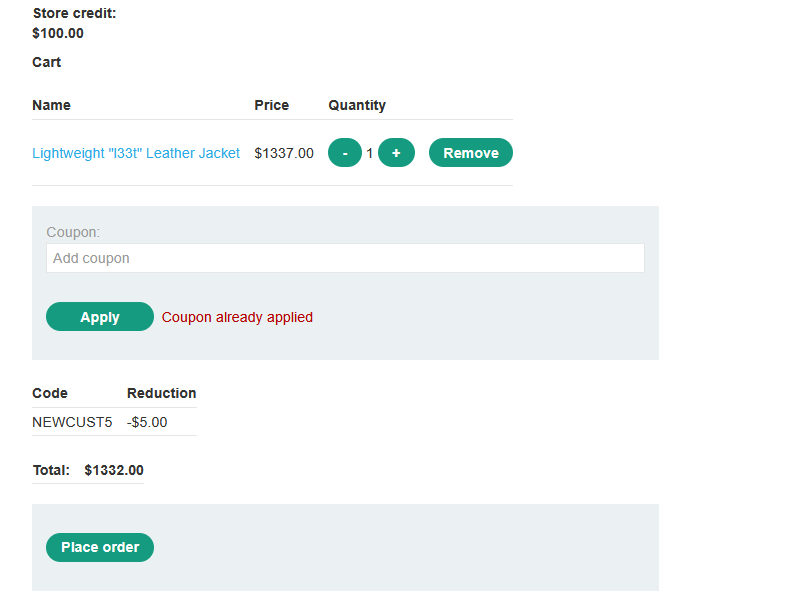
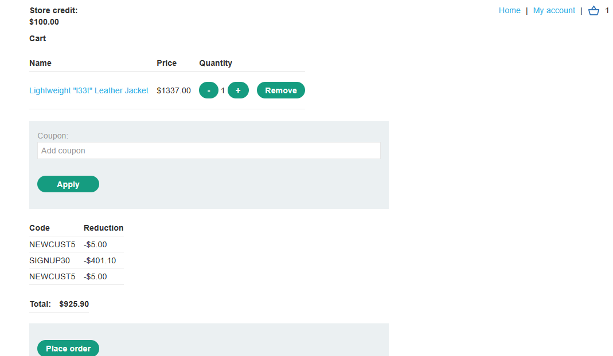
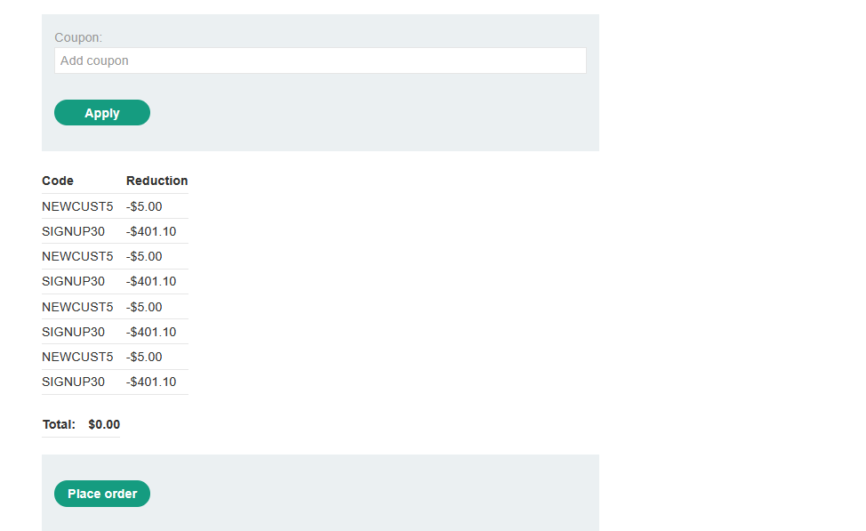
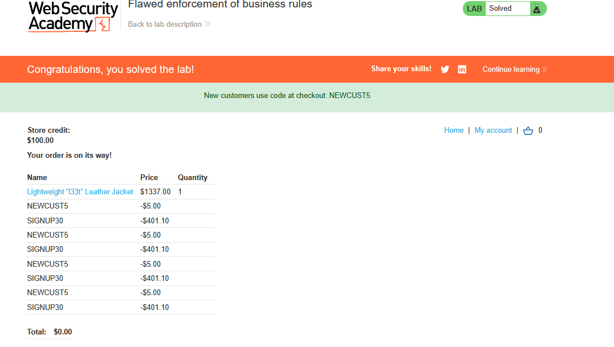

# Lab: Flawed enforcement of business rules

> Lab Objective: exploit the flaw in purchasing workflow to buy a "Lightweight l33t leather jacket".

- Login using provided credentials `wiener:peter`, you'll notice that there is a discount coupon for new customers (which is `NEWCUST5`).
  

- Add a product and apply the coupon code.
  

- Sign to the newsletter at the footer of the page, and you'll gain another coupon `SIGNUP30`.
  
  

- If you tried to apply the same coupon twice, it'll be rejected
  

- But if you apply `NEWCUST5`, then `SIGNUP30`, then `NEWCUST5` again, it'll be aplied twice normally
  

- Therefore, alternate between them until you reach Zero dollars.
  

- Place Order, and the lab is solved.
  

---
