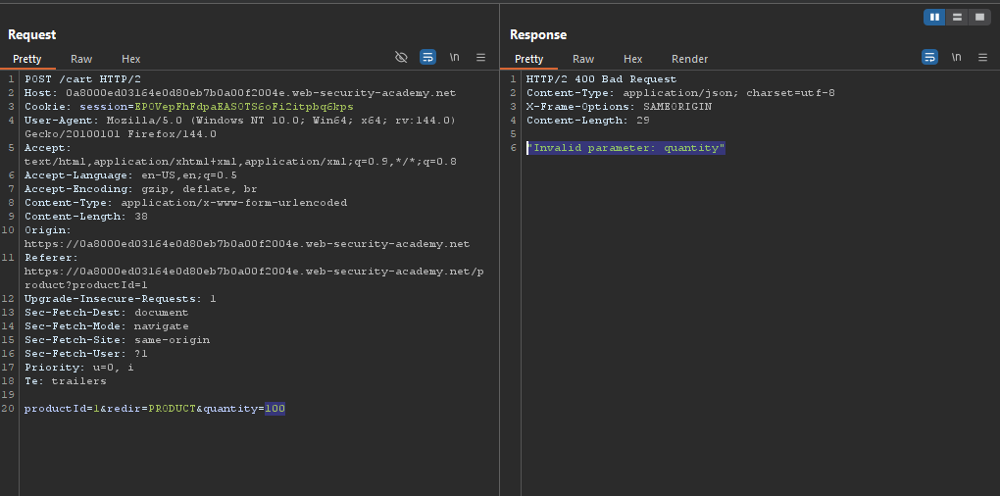
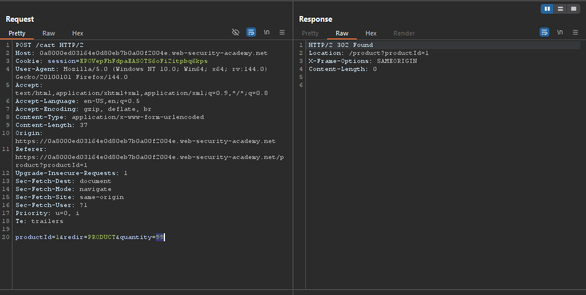
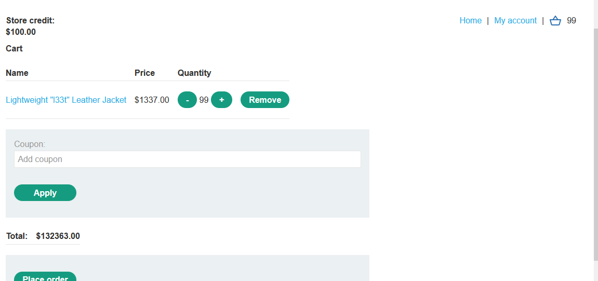
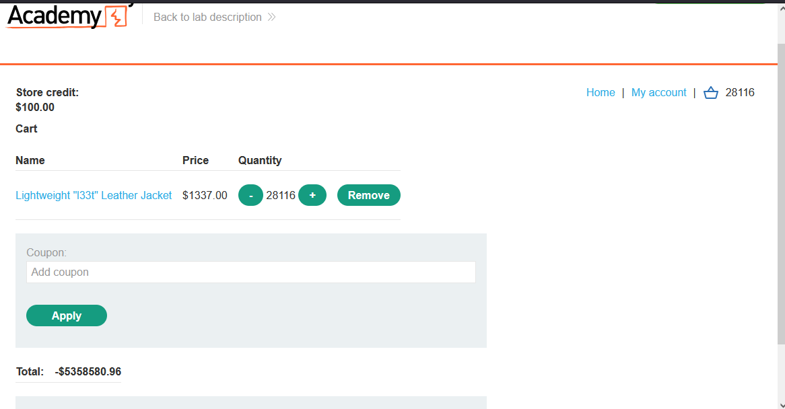
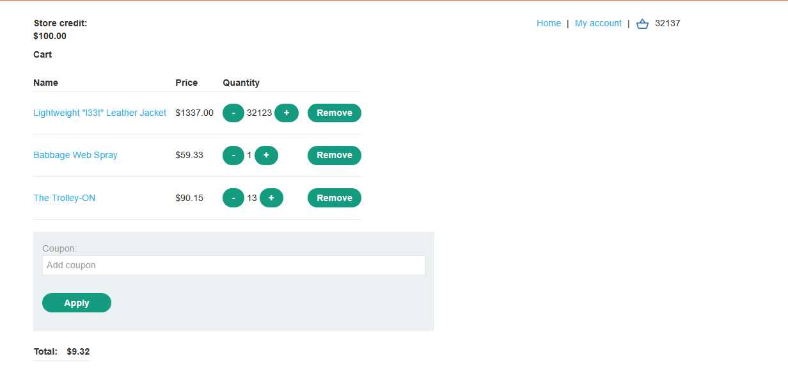
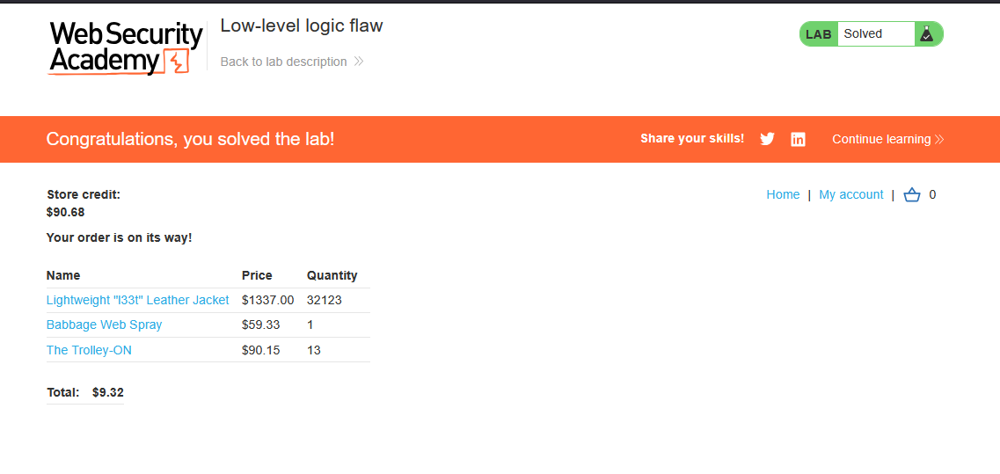

# Lab: Low-level logic flaw

> Lab Objective: buy a "Lightweight l33t leather jacket" by exploiting the logic flaw in purchasing workflow.

- Login using provided credentials `wiener:peter`.

- Add Item to the cart, and intercept the add request.

- You'll notice that you're not able to:
  - Have a negative Quantity.
  - Add a quantity more than or equal to 100.

- Note quantity 99 is acceptable.
  
  

- Therefore, send this request to the repeater, and generate 300 requests.

- You'll notice 2 things:

  - Any quantity is acceptable (99 at a time).
  - After a certain price, it became a negative number.

  

- Send request by request until the price is relatively small, you can use add another products.
  

- Place an order for this products, and the lab is solved.
  

---
