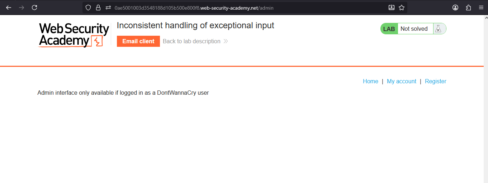
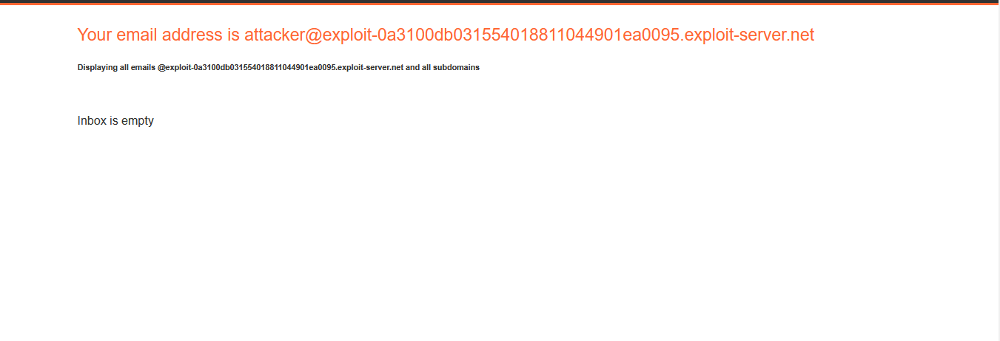
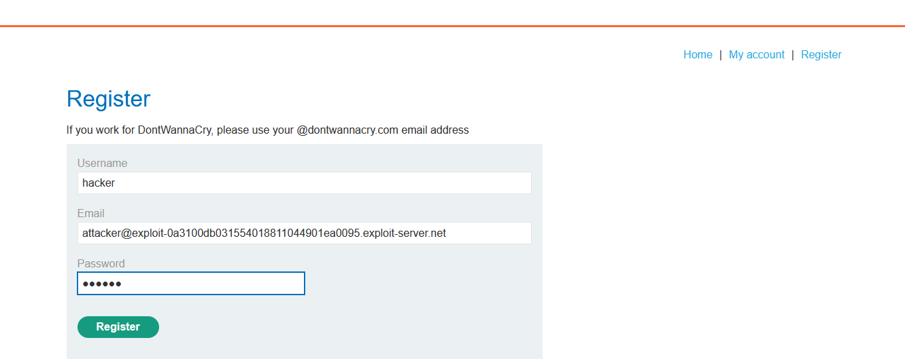
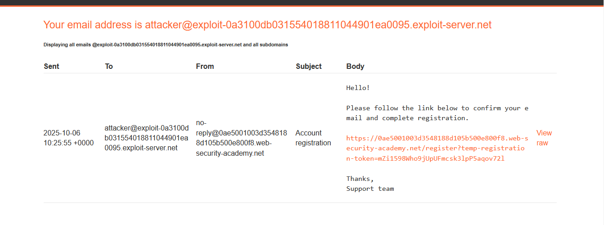
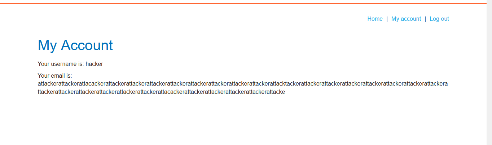
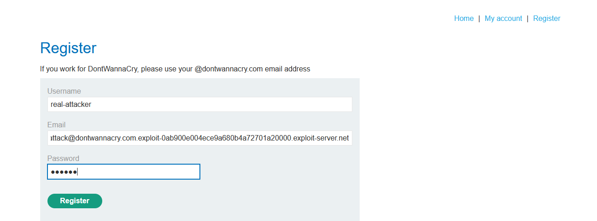
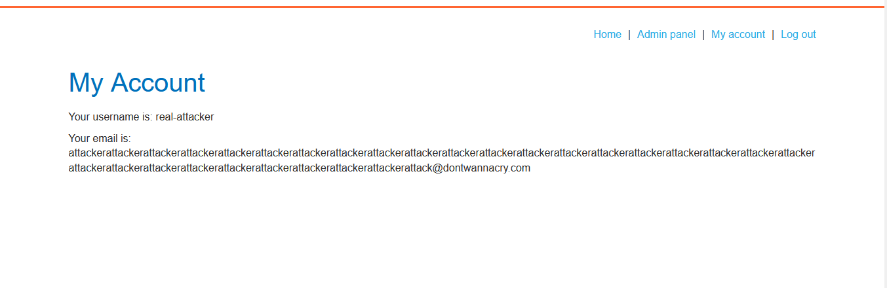
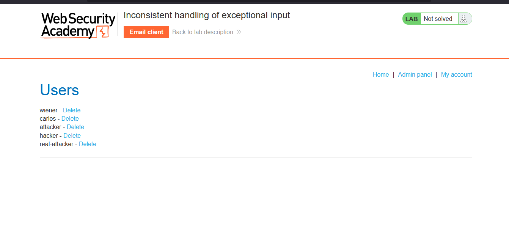

# Lab: Inconsistent handling of exceptional input

> Lab Objective: access the admin panel and delete the user carlos.

- When you try to access the admin panel, you'll notice that only DontWannaCry users are allowed to access the admin panel.
  

- When accessing email client in the lab banner, you'll notice that:
  - Portswigger provided you with an email (which is `attacker@YOUR-EMAIL-ID.web-security-academy.net`).
  - It also states that it will display all emails for `@YOUR-EMAIL-ID.web-security-academy.net` and all included subdomains.



- Register a new account:

  - Provide Credentials.
    
  - Check your email client, and click on the sent link, therefore the account registration is successful.
    

- When using a very email, for instance:

```
attackerattackerattacackerattackerattackerattackerattackerattackerattackerattackerattackerattacktackerattackerattackerattackerattackerattackerattackerattackerattackerattackerattackerattackerattackerattackerattacackerattackerattackerattackerattackerattackerattacker@exploit-0ab900e004ece9a680b4a72701a20000.exploit-server.net
```

- Then registering normally, you'll receive the verification email in your email client, but when logging in, you'll notice that your email is truncated into exactly 255 characters:
  

- Therefore, register again but in the email field make `your-string@dontwannacry.com` is exactly 255 characters followed by `.YOUR-EMAIL-ID.web-security-academy.net`.

- The email will be:

```
attackerattackerattackerattackerattackerattackerattackerattackerattackerattackerattackerattackerattackerattackerattackerattackerattackerattackerattackerattackerattackerattackerattackerattackerattackerattackerattackerattackerattackerattack@dontwannacry.com.exploit-0ab900e004ece9a680b4a72701a20000.exploit-server.net
```

- When registering with the new email.
  

- Then logging in, and you'll notice that email is suitable, and admin panel is accessible.
  

- Access the admin panel.
  

- Then delete the user carlos, and the lab is solved.
  

---
