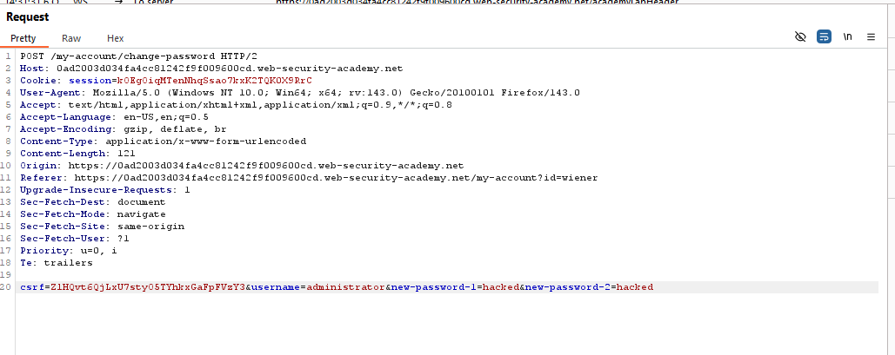

# Lab: Weak isolation on dual-use endpoint

> Lab Objective: access the administrator account and delete the user carlos.

- Login using provided credentials `wiener:peter`.

- Change your password, and inspect the request made.
  

- When re-change the password but intercepting the request and remove the `current-password` parameter entirely with it's value.

- You'll notice that the password was changed successfully.

- Therefore, do the same step but with administrator as the usernames and hacked as the password.
  

- Login using admin credentials `administrator:hacked`, and you're able to access the admin account page.
  

- Access the admin panel.
  

- Delete the user carlos and the lab is solved.
  

---
