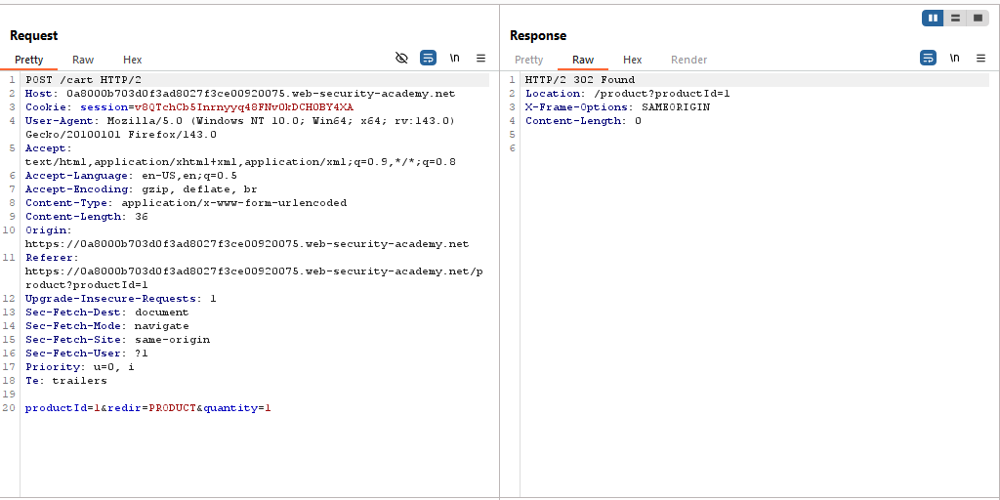
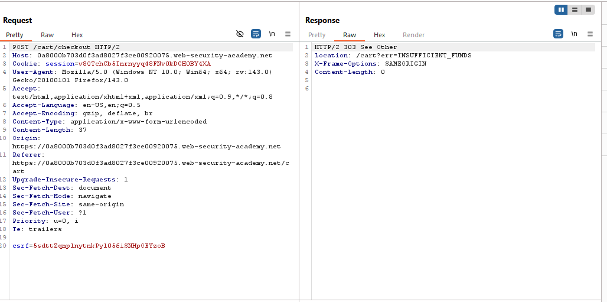
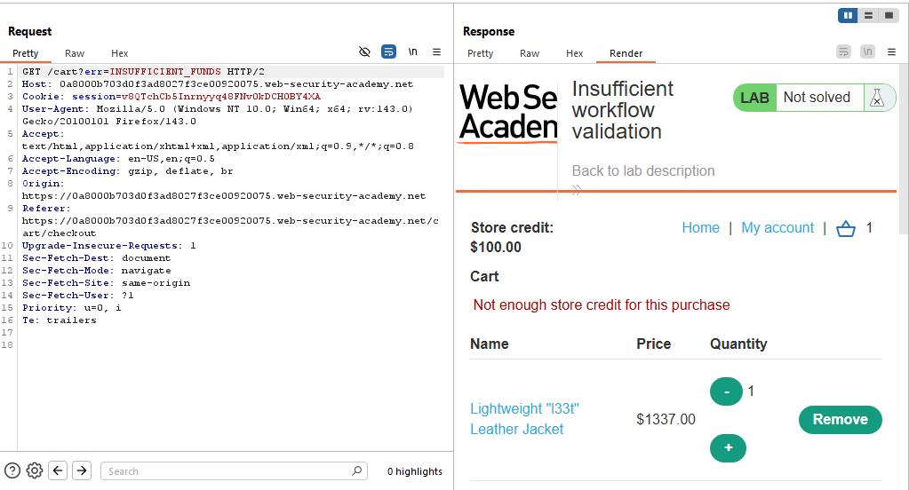
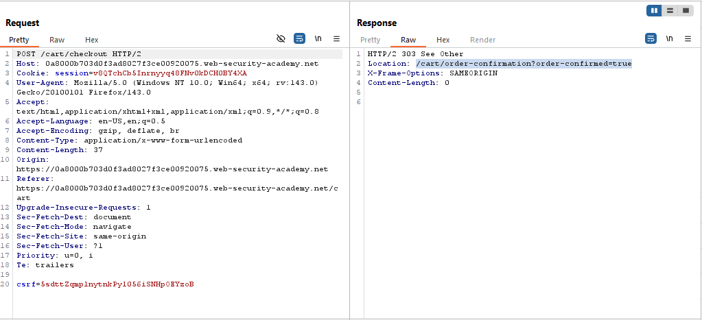
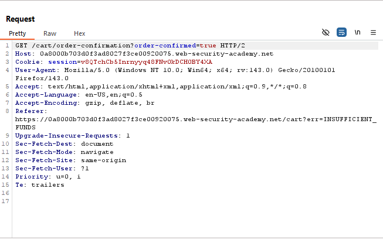
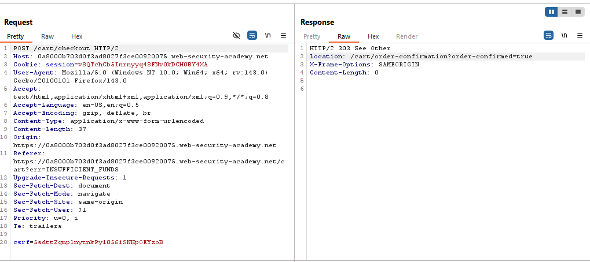
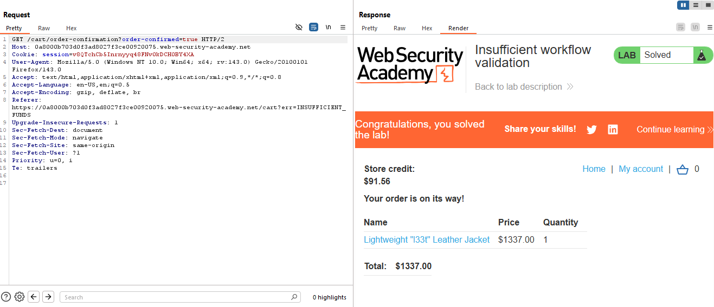

# Lab: Insufficient workflow validation

> Lab Objective: exploit this flaw to buy a "Lightweight l33t leather jacket".

- Login using provided credentials `wiener:peter`.

- Normal Purchase Process:

  - Visit Product page, then add it to cart.
    
  - View your cart then place an order.
    
  - Then, follow redirection.
    

- When successfully purchasing a product, you be redirected to `/cart/order-confirmation?order-confirmed=true` instead of `/cart?err=INSUFFICIENT_FUNDS`.
  

- Then a GET request will be sent to `/cart/order-confirmation?order-confirmed=true`.
  

- Add 1 Product of `Lightweight "l33t" Leather Jacket` to your cart.

- Then place an order, but intercept the request with Burp (right click > intercept response to this request), when the response is intercepted replace `/cart?err=INSUFFICIENT_FUNDS` with `/cart/order-confirmation?order-confirmed=true` then forward the response.
  

- You'll notice that there's a GET request sent to `/cart/order-confirmation?order-confirmed=true`, indicating successful purchase, and the lab is solved.
  

---
