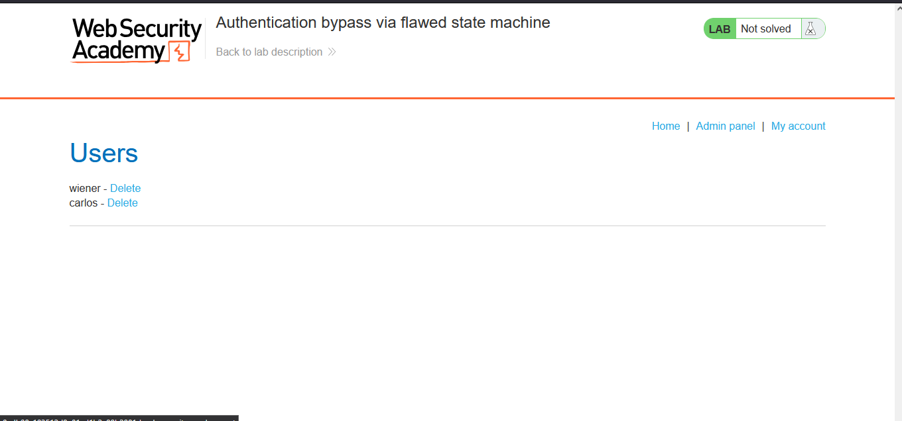

# Lab: Authentication bypass via flawed state machine

> Lab Objective: exploit login process flaw to bypass the lab's authentication, access the admin interface, and delete the user carlos.

- Login using provided credentials `wiener:peter`, then inspect the login process.

- Normal Login Process:

  - Login using username & password, if valid you'll be redirected to `/role-selector`:
    
  - In `/role-selector` endpoint, you'll choose your role either a user or Content Author.
    
  - Your choice will be sent in a POST request to the same endpoint via POST data.
    
  - Finally, you'll be redirected to home page `/`.

- Intercept the request when you enter your credentials `username:password`, then intercept the response to that request.

- When the response to the login request is intercepted, replace the redirection from `/role-selector` to `/admin`, and forward the response.
  

- You'll notice that there's a GET request made to `/admin`, and the response to that request is the admin panel.
  
  

- Delete the user carlos.
  

- You'll notice that the user carlos is deleted and the lab is solved.
  
  

---
