# Lab: Infinite money logic flaw

> Lab Objective: exploit the flaw in purchasing workflow to buy a "Lightweight l33t leather jacket".

- Login using provided credentials `wiener:peter`.

- Signup for newsletter and you'll get a 30% discount via `SIGNUP30` coupon.
  

- You'll notice that you can buy a gift card for $10 and it will redeem $10 into your balance.

- Add 1 Gift card to your card then apply the coupon.
  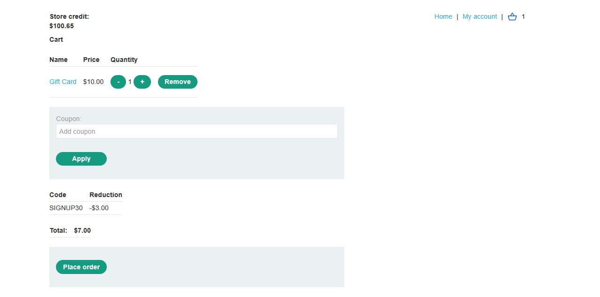

- Then place an order.
  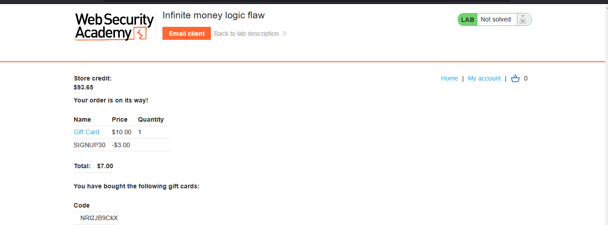

- Take the gift card code and redeem it from My Account page, and you'll notice that your balance has increased by $3.
  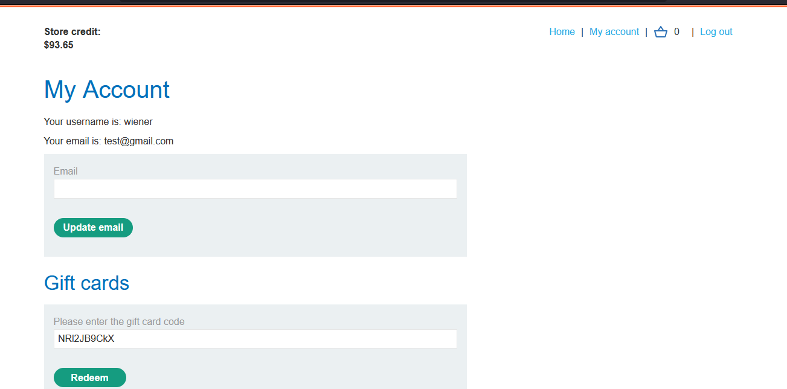
  

- Repeat this process again, and you'll notice that it succeeded.
  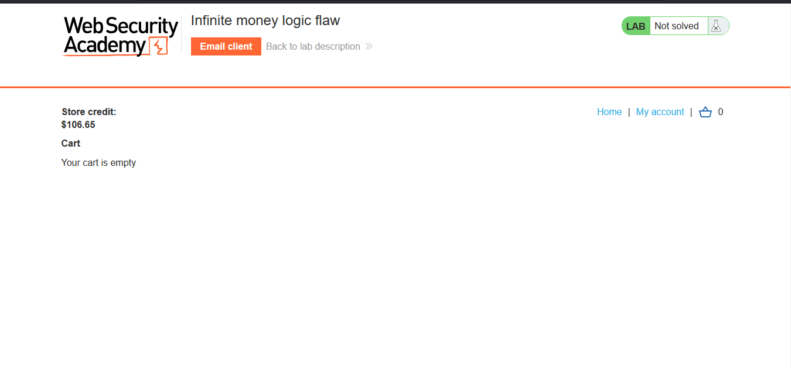

- All you need to repeat is the following 4 requests:

  - Add 1 Gift Card to your cart.
    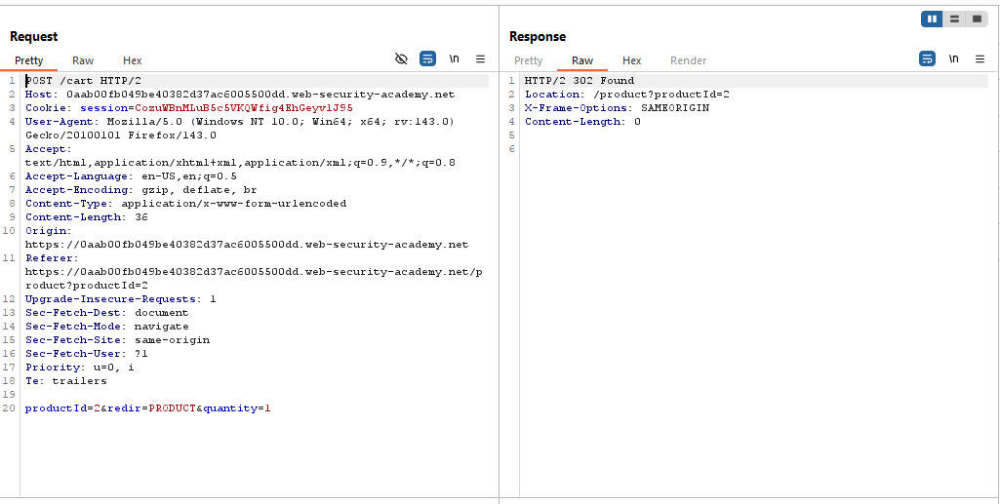
  - Apply the coupon.
    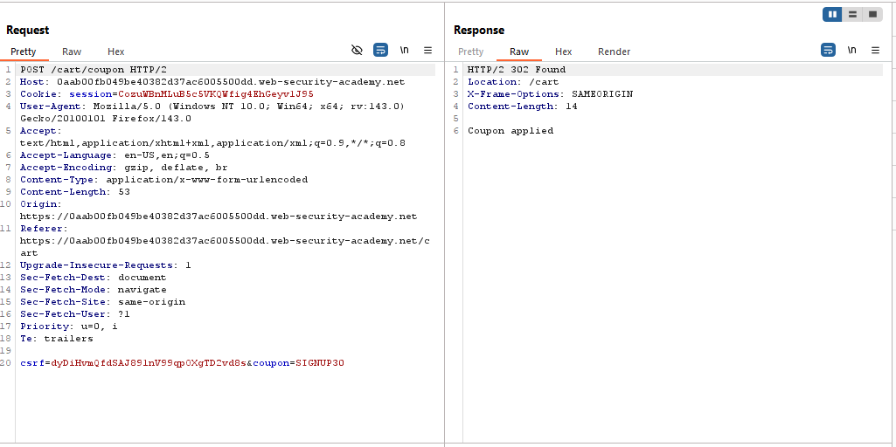
  - Perform checkout, and follow redirection to retrieve the gift card code.
    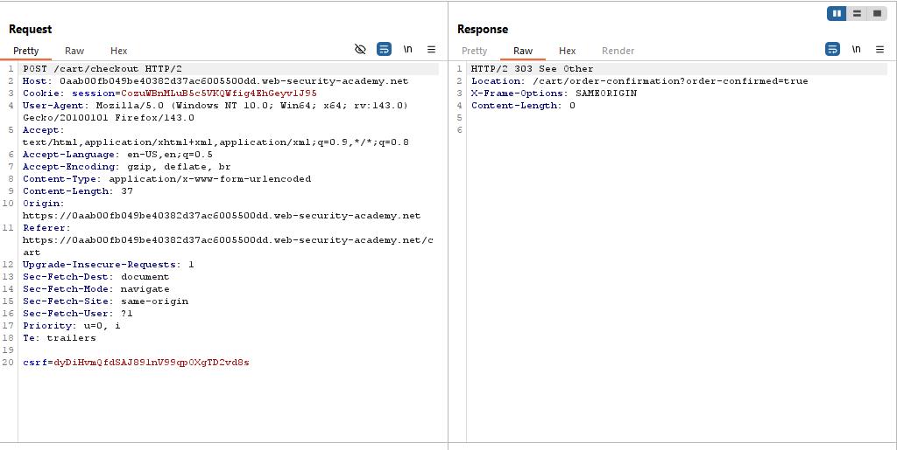
    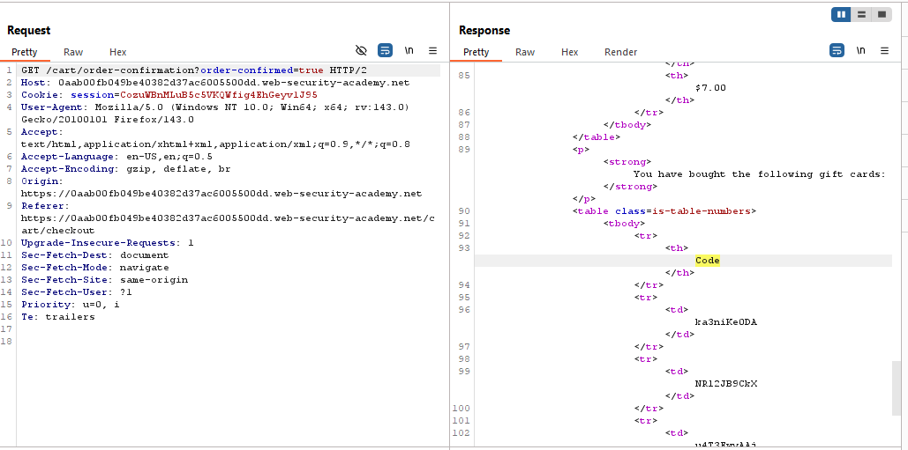
  - Add the code in the request that redeems the gift card.
    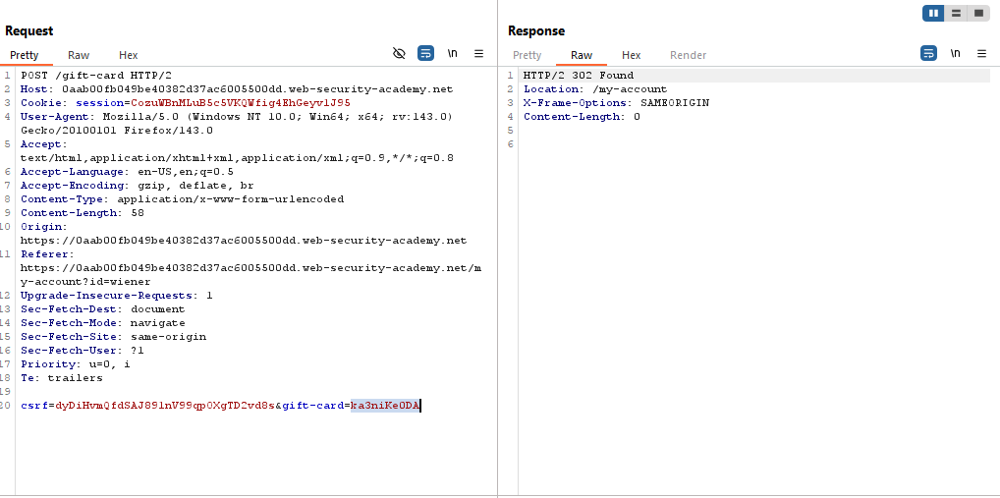

- Repeat this process using Burp Macro or a python script until you have enough money to buy the specified Jacket.
  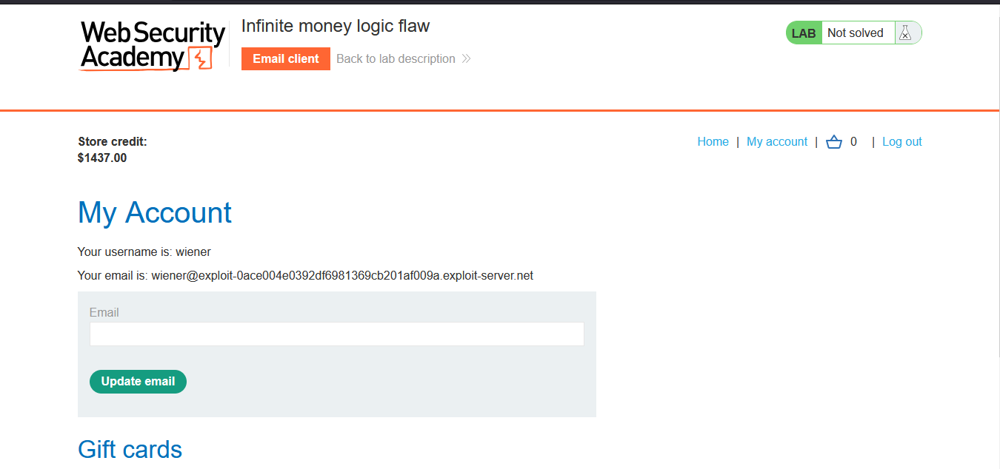

- Add the jacket to your cart.
  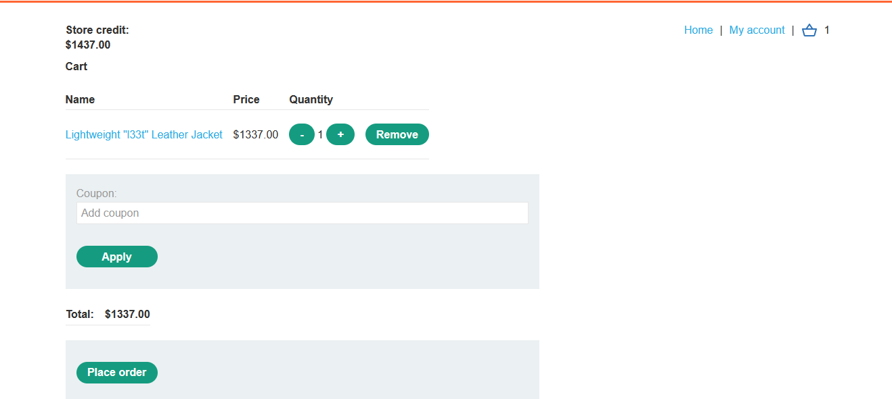

- Place an order, and the lab is solved.
  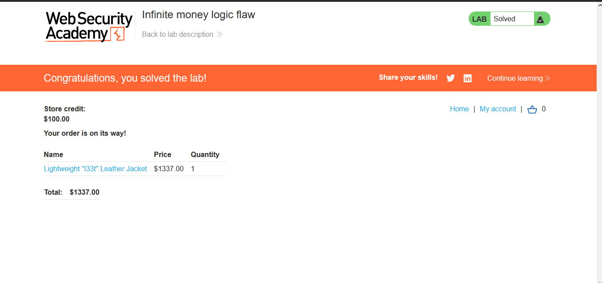

---
