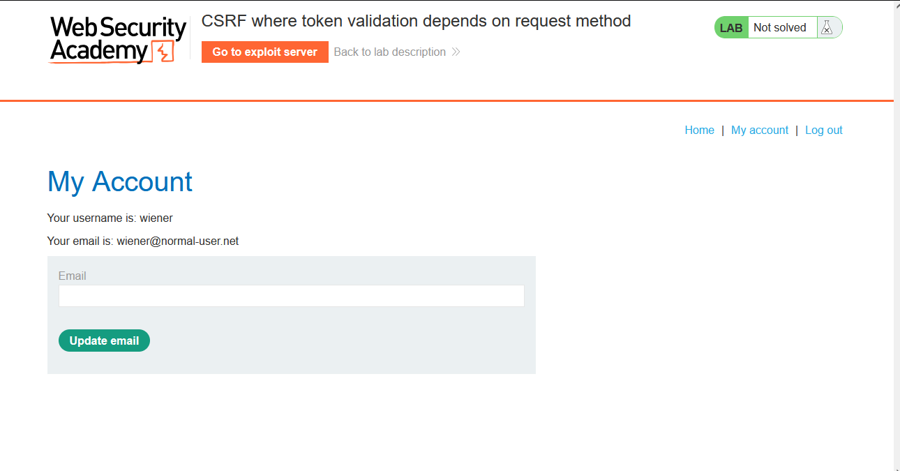
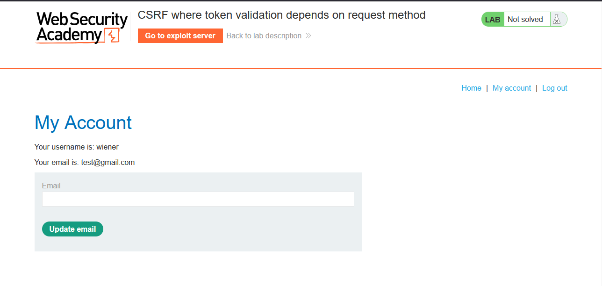
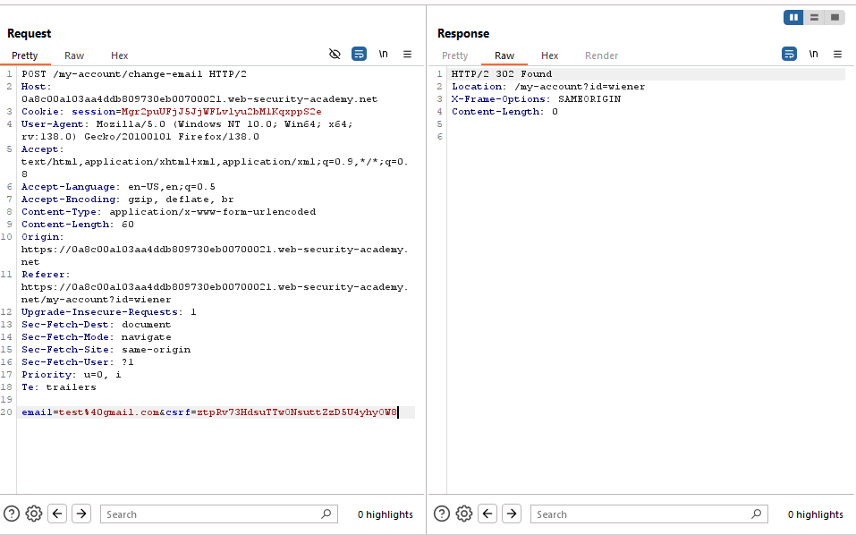
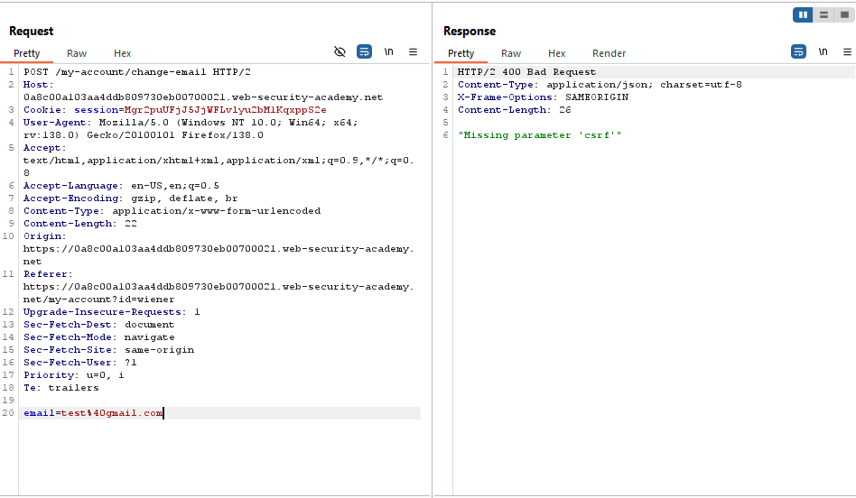
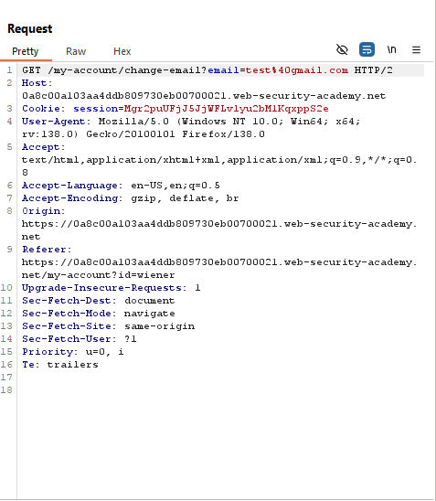
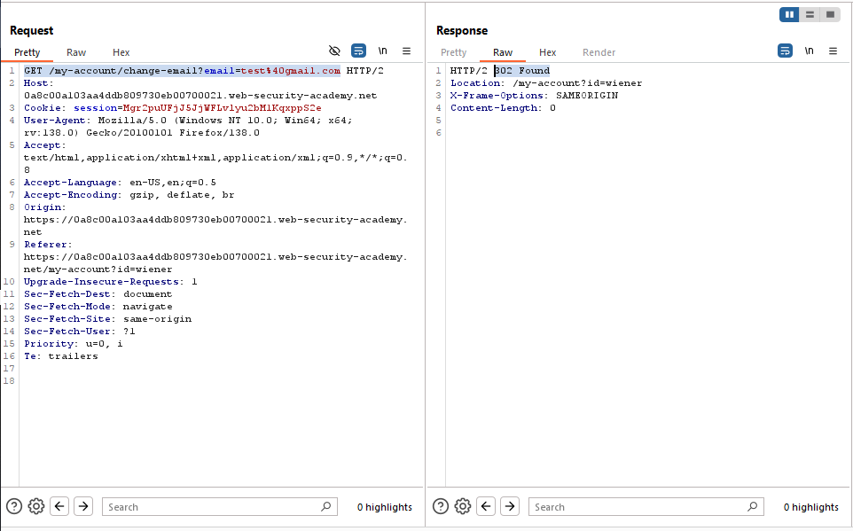
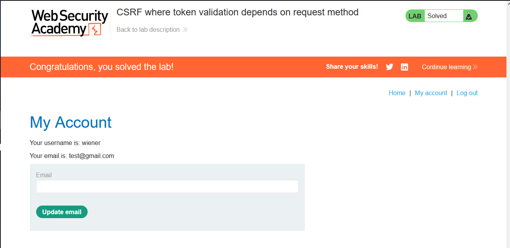

# Lab: CSRF where token validation depends on request method

> Lab Objective: use your exploit server to host an HTML page that uses a CSRF attack to change the viewer's email address.
> Note: My Login Credentials is `wiener:peter`

- Firstly, I'll login using my login credentials `wiener:peter` (as a normal user), then try to change my email.
  

- Then I'll change my email to `test@gmail.com`
  

- When viewing the request in Burp Suite, I've found that the application users a CSRF Token.

  - Normal Response to a normal email change request is `302 Found`
    
  - I've tried several trials to bypass the CSRF Token, by:
    - Removing the value and leave the parameter as it is (like this `&csrf=`).
    - Removing the csrf parameter and it's value.
    - Changing the value to any arbitrary value.
  - But all of them yields to `400 Bad Request`
    

- I'll try to change the Request Method from POST to GET, utilizing the fact that:

  - The server will check the csrf parameter and it's associated value when the Request Method is POST.
  - But when changing the Request Method to GET, the server won't check them.

- Therefore, I'll change the Request Method from POST to GET, and send the request.
  

- The response to that request is `302 Found` which is the same as sending a normal POST Request with the right CSRF Token.
  

- Therefore, The crafted payload will be:

```html
<body>
  <form
    method="GET"
    action="https://0a8c00a103aa4ddb809730eb00700021.web-security-academy.net/my-account/change-email"
  >
    <input type="email" name="email" value="changed-email@test.com" hidden />
  </form>
  <script>
    document.forms[0].submit();
  </script>
</body>
```

- I'll host the previous payload on a Website I control (Portswigger Exploit Server in this case), and I'll induce the victim to visit the Web Page, and when the victim visits it his email will get changed to `changed-email@test.com`.

- And Finally The Lab is Solved.
  

---
