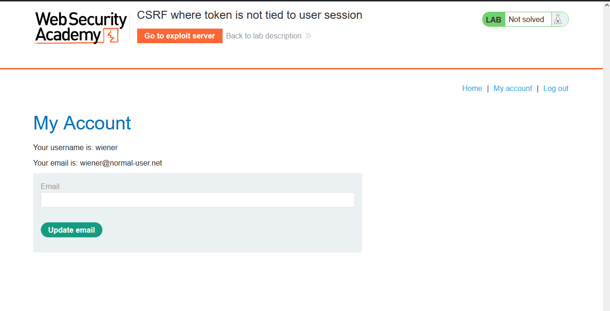
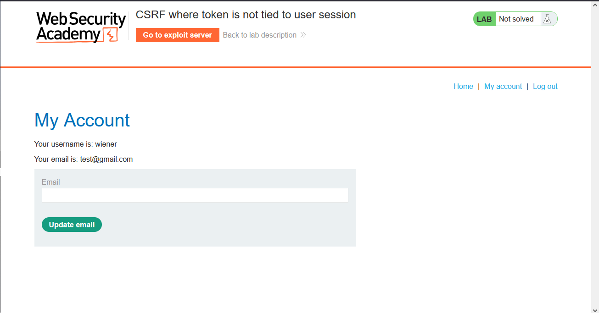
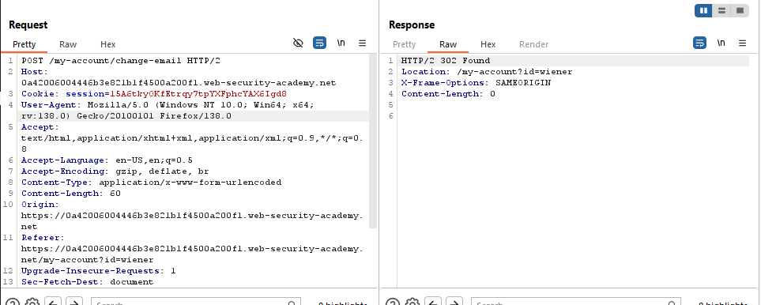
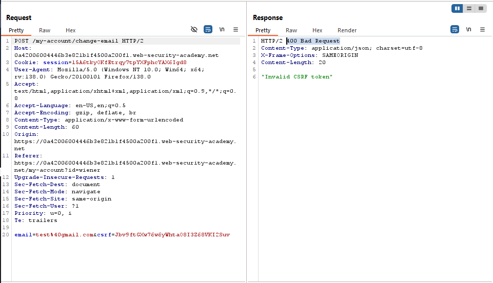
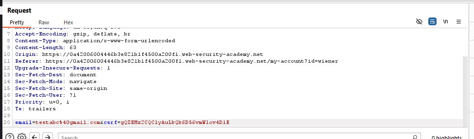
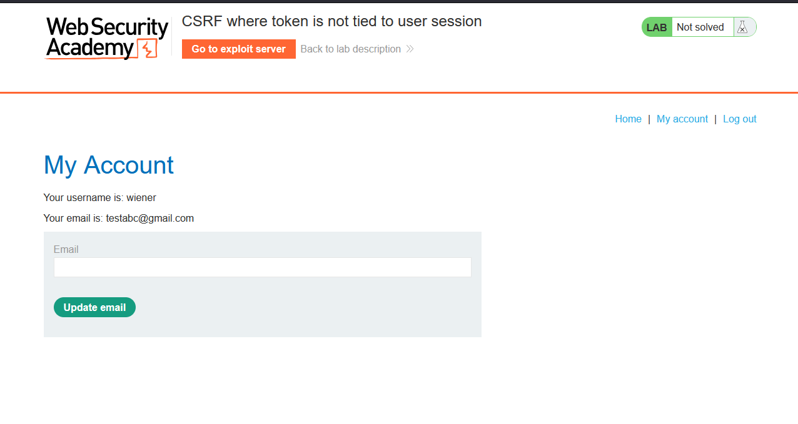
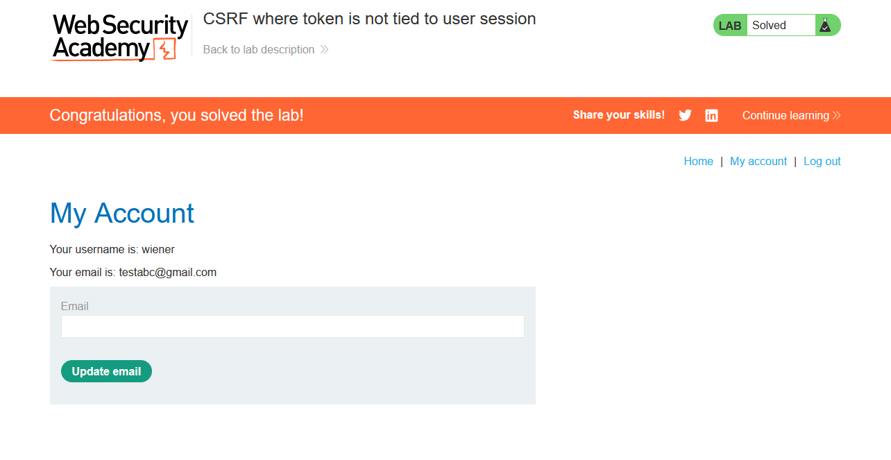

# Lab: CSRF where token is not tied to user session

> Lab Objective: use your exploit server to host an HTML page that uses a CSRF attack to change the viewer's email address.
> Note: Login Credentials for two accounts are `wiener:peter` & `carlos:montoya`

- Firstly, I'll login using my credentials `wiener:peter`
  

- Then I'll change the email of this account to `test@gmail.com`
  

- When viewing the request in Burp Suite, The valid response is `302 Found`, and I've noticed that he uses a CSRF Token.
  

- When trying to send the same request again, te response results in `400 Bad Request`
  

- Since the application users a CSRF token, I'll try the following:

  - Remove the Value and leave the CSRF parameter as it is, which results in `400 Bad Request`
  - Remove the csrf parameter and it's value, Which results in `400 Bad Request`.
  - Change the request method from POST to GET (with removing the CSRF token), Which results in `405 Method Not Allowed`.

- Since I've the credentials for a Second Account, therefore I'll get the CSRF token from the Second Account and use it in the email change request for the first account.

- I'll change the email of the first account to `testabc@gmail.com`, and I'll use the CSRF token of the second account, to see if the csrf token is not associated with a certain session cookie and the server just checks the validity of the csrf token.

- Request for Change Email of the first account.
  

- The Email of the first account has changed with the use of the csrf token of the second account successfully.
  

- Therefore, the csrf token is not associated with a certain session cookie and the server just checks the validity of the csrf token.

- The crafted payload will use a valid CSRF form one of the two accounts.
- The Payload:

```html
<body>
  <form
    method="POST"
    action="https://0a42006004446b3e821b1f4500a200f1.web-security-academy.net/my-account/change-email"
  >
    <input name="email" value="changed-email@test.com" hidden />
    <input name="csrf" value="el6Mp5mhg57eielg2w0YeHS1MLHj7SU1" hidden />
  </form>
  <script>
    document.forms[0].submit();
  </script>
</body>
```

- Then add the payload to the `exploit server` then `store` then `Deliver exploit to victim`

- Finally the lab is solved.
  

---
