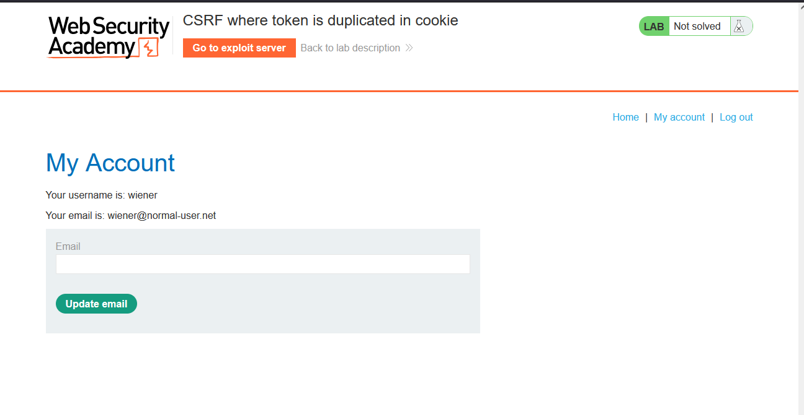
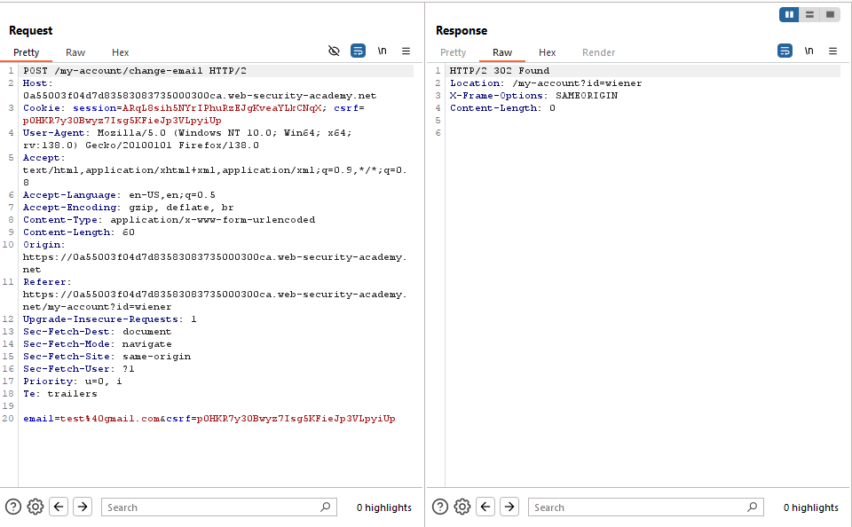

# Lab: CSRF where token is duplicated in cookie

> Lab Objective: use your exploit server to host an HTML page that uses a CSRF attack to change the viewer's email address.
> Note: My Login Credentials are `wiener:peter`

- Firstly, I'll login with my credentials `wiener:peter`.
  

- Then change the email to `test@gmail.com`.
  

- While viewing the Request through Burp Suite, I've noticed that the application uses a **_CSRF Parameter_** and a **_CSRF Cookie_**, also **_they have the same value_**.
  

- After Several trials to bypass the csrf token (like, removing only the value, or remove the parameter and it's value), all of the trials results in `400 Bad Request`, therefore CSRF Parameter and CSRF Cookie are tied to each other.
  

- But I've tried to make the values of both CSRF Parameter and CSRF Cookie any arbitrary value like `testabc`.

- You'll notice that the request results in `302 Found`.
  

- Therefore, I'll try to find a place in the application where I can set the csrf cookie for the victim in order to exploit the CSRF.

- In the home page when you search for `test`, then view the request in Burp Suite, You'll see that the value is reflected in the response headers.
  

- To Set my own cookie in the victim browser through this place, I'll use the following term as search term:

```
test;%0d%0aSet-Cookie:csrf=myOwnValueForCSRFCookie;SameSite=None
```

- Therefore, the crafted payload will be:

```html
<body>
  <form
    method="POST"
    action="https://0a55003f04d7d83583083735000300ca.web-security-academy.net/my-account/change-email"
  >
    <input name="email" value="changed-email@gmail.com" />
    <input name="csrf" value="myOwnValueForCSRFCookie" />
  </form>
  
</body>
```

- Finally, the lab is solved successfully.
  

---
